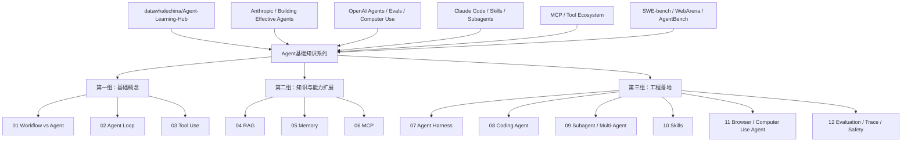
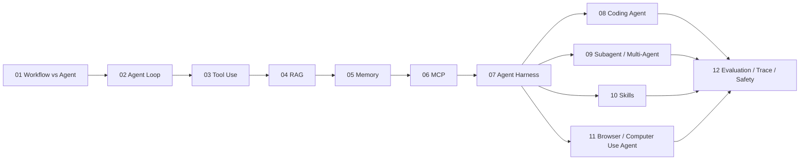
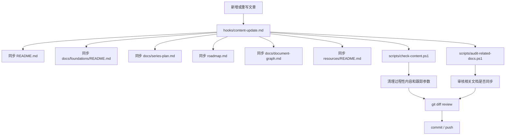

# Document Graph

这个文档用图的方式整理 `Learning_Agent` 仓库的内容结构、来源路线和后续维护关系。

## 来源路线

这套 `Agent基础知识` 系列最初围绕 [datawhalechina/Agent-Learning-Hub](https://github.com/datawhalechina/Agent-Learning-Hub) 的学习路线展开，再结合 Anthropic、OpenAI、Claude Code、MCP、SWE-bench、WebArena 等资料补充扩展。

## 文章依赖关系

## 仓库维护关系

## 文章文件映射

| 序号 | 主题 | 文件 |
| --- | --- | --- |
| 01 | Workflow vs Agent | [01-workflow-vs-agent.md](foundations/01-workflow-vs-agent.md) |
| 02 | Agent Loop | [02-agent-loop.md](foundations/02-agent-loop.md) |
| 03 | Tool Use | [03-tool-use.md](foundations/03-tool-use.md) |
| 04 | RAG | [04-rag.md](foundations/04-rag.md) |
| 05 | Memory | [05-memory.md](foundations/05-memory.md) |
| 06 | MCP | [06-mcp.md](foundations/06-mcp.md) |
| 07 | Agent Harness | [07-agent-harness.md](foundations/07-agent-harness.md) |
| 08 | Coding Agent | [08-coding-agent.md](foundations/08-coding-agent.md) |
| 09 | Subagent / Multi-Agent | [09-subagent-multi-agent.md](foundations/09-subagent-multi-agent.md) |
| 10 | Skills | [10-skills.md](foundations/10-skills.md) |
| 11 | Browser / Computer Use Agent | [11-browser-computer-use-agent.md](foundations/11-browser-computer-use-agent.md) |
| 12 | Evaluation / Trace / Safety | [12-evaluation-trace-safety.md](foundations/12-evaluation-trace-safety.md) |

