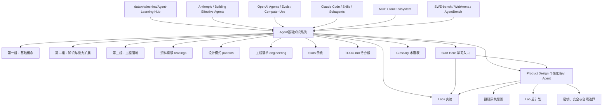
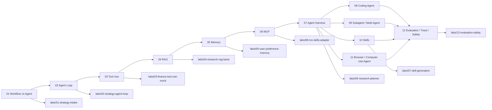
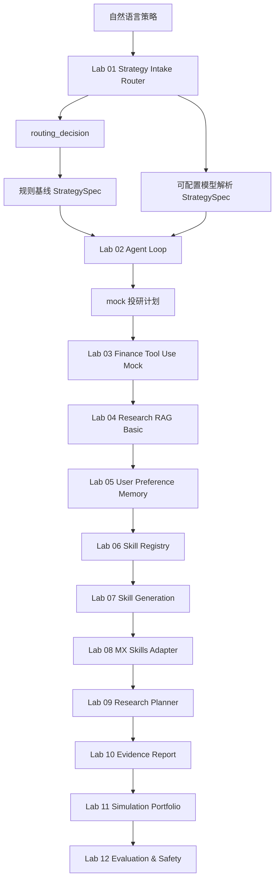
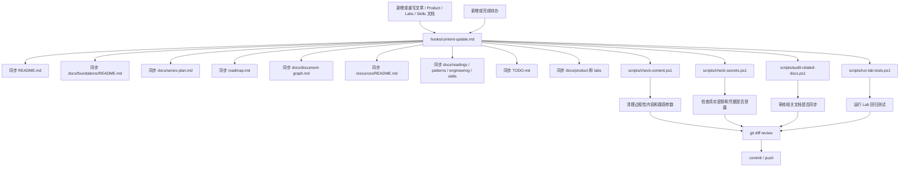

# Document Graph

这个文档用图的方式整理 `Learning_Agent` 仓库的内容结构、来源路线和维护关系。

## 来源路线

这套 `Agent基础知识` 系列最初围绕 [datawhalechina/Agent-Learning-Hub](https://github.com/datawhalechina/Agent-Learning-Hub) 的学习路线展开，再结合 Anthropic、OpenAI、Claude Code、MCP、SWE-bench、WebArena 等资料补充扩展。

## 文章依赖关系

## 投研 Lab 主线

## 仓库维护关系

## 文章文件映射

| 序号 | 主题 | 文件 |
| --- | --- | --- |
| 01 | Workflow vs Agent | [01-workflow-vs-agent.md](foundations/01-workflow-vs-agent.md) |
| 02 | Agent Loop | [02-agent-loop.md](foundations/02-agent-loop.md) |
| 03 | Tool Use | [03-tool-use.md](foundations/03-tool-use.md) |
| 04 | RAG | [04-rag.md](foundations/04-rag.md) |
| 05 | Memory | [05-memory.md](foundations/05-memory.md) |
| 06 | MCP | [06-mcp.md](foundations/06-mcp.md) |
| 07 | Agent Harness | [07-agent-harness.md](foundations/07-agent-harness.md) |
| 08 | Coding Agent | [08-coding-agent.md](foundations/08-coding-agent.md) |
| 09 | Subagent / Multi-Agent | [09-subagent-multi-agent.md](foundations/09-subagent-multi-agent.md) |
| 10 | Skills | [10-skills.md](foundations/10-skills.md) |
| 11 | Browser / Computer Use Agent | [11-browser-computer-use-agent.md](foundations/11-browser-computer-use-agent.md) |
| 12 | Evaluation / Trace / Safety | [12-evaluation-trace-safety.md](foundations/12-evaluation-trace-safety.md) |

## 扩展层映射

| 层级 | 目录 | 作用 |
| --- | --- | --- |
| 学习入口 | [start-here.md](start-here.md) | 给第一次进入仓库的人三条学习路径和可运行命令。 |
| 术语表 | [glossary.md](glossary.md) | 统一 Agent、Workflow、RAG、Memory、Trace、Guardrails 等核心术语。 |
| 资料精读 | [readings/](readings/) | 拆解官方文档、论文、工程博客和开源项目。 |
| 设计模式 | [patterns/](patterns/) | 沉淀可复用 Agent 模式和适用边界。 |
| 工程清单 | [engineering/](engineering/) | 管理权限、trace、eval、安全、成本等上线检查项。 |
| 产品设计 | [product/](product/) | 定义个性化投研 Agent 系统愿景、Lab 总计划、密钥安全和财经输出边界。 |
| 实践实验 | [../labs/](../labs/) | 承接基础文章，补最小可运行实验。 |
| Skill 示例 | [../skills/](../skills/) | 把重复流程沉淀成 `SKILL.md` 示例。 |
| Codex 规则 | [../AGENTS.md](../AGENTS.md) | 为后续 Codex 修改 Product、Labs、Skills 和文档结构提供持久规则。 |
| Codex Skills | [../.agents/skills/](../.agents/skills/) | 提供 Lab 实现和文档同步的可复用 Codex 工作流。 |
| 待办机制 | [../TODO.md](../TODO.md) | 维护当前阶段任务、优先级、产出和验收标准。 |

## 产品主线映射

| 文档 | 作用 |
| --- | --- |
| [product/README.md](product/README.md) | 个性化投研 Agent 产品案例入口，说明投研只是贯穿案例，并给出阅读顺序和财经输出边界。 |
| [product/personalized-investment-research-agent.md](product/personalized-investment-research-agent.md) | 定义个性化投研 Agent 系统愿景、边界、架构和 Skill 固化思路。 |
| [product/lab-plan.md](product/lab-plan.md) | 把 12 篇基础文章映射成 12 个投研 Labs。 |
| [product/security-and-secrets.md](product/security-and-secrets.md) | 定义 Hermes 注入密钥、`.env.example`、提交前检查和财经输出边界。 |
| [product/AGENTS.md](product/AGENTS.md) | 产品文档修改规则，约束产品定位、Lab 计划同步和财经输出边界。 |
| [../labs/README.md](../labs/README.md) | Labs 入口，说明投研主线和统一要求。 |
| [../labs/AGENTS.md](../labs/AGENTS.md) | Labs 修改规则，要求 mock-first、demo、tests 和可观察输出。 |
| [../labs/01-strategy-intake/README.md](../labs/01-strategy-intake/README.md) | 第一个可运行 Lab，把自然语言投研策略解析成 `StrategySpec` 和 `routing_decision`，支持规则基线和可配置模型解析模式。 |
| [../labs/01-strategy-intake/AGENTS.md](../labs/01-strategy-intake/AGENTS.md) | Lab 01 持久规则，约束 `StrategySpec`、`routing_decision` 和四类样例。 |
| [../labs/02-strategy-agent-loop/README.md](../labs/02-strategy-agent-loop/README.md) | 第二个可运行 Lab，把 `StrategySpec` 放进最小 Agent Loop。 |
| [../labs/02-strategy-agent-loop/AGENTS.md](../labs/02-strategy-agent-loop/AGENTS.md) | Lab 02 持久规则，约束 Agent Loop 和 structured trace。 |
| [../labs/shared/investment_research_case/README.md](../labs/shared/investment_research_case/README.md) | 共享案例材料结构。 |
| [../labs/shared/testing/README.md](../labs/shared/testing/README.md) | 统一 Lab 测试入口说明。 |
| [../scripts/run-lab-demo.ps1](../scripts/run-lab-demo.ps1) | 统一 demo 运行封装。 |
| [../scripts/run-lab-web.ps1](../scripts/run-lab-web.ps1) | 统一本地 web demo 运行封装。 |
| [../scripts/run-lab-tests.ps1](../scripts/run-lab-tests.ps1) | 统一 Lab 回归测试封装。 |
