# Agent基础知识 01| 不要一上来就造 Agent，先分清 Workflow 和 Agent

> 从 Anthropic《Building Effective Agents》看 Agent 系统的第一性原理

---

学习 Agent 最容易犯的错误，是一上来就想搭一个复杂系统：多 Agent、Planner、Memory、Tool、RAG、反思、自我进化……概念堆得很满，但最后可能连最基本的问题都没回答清楚：

> **这个任务真的需要 Agent 吗？**

`Agent-Learning-Hub` 在 Stage 0 里把第一件事写得很明确：先区分 chatbot、workflow、agent、multi-agent，并且要理解什么时候不该用 agent——如果任务可预测、流程稳定、普通脚本能解决，那么 Agent 反而会增加不确定性。

Anthropic 的《Building Effective Agents》也强调了同一个原则：成功的 Agent 系统往往不是靠复杂框架堆出来的，而是从简单、可组合的模式开始；它还把 workflow 和 agent 做了一个非常清晰的区分：workflow 是 LLM 和工具沿着预定义代码路径执行，agent 则是 LLM 动态决定流程和工具使用。([Anthropic](https://www.anthropic.com/engineering/building-effective-agents "Building Effective AI Agents \ Anthropic"))

---

## 1. Agent 不是越复杂越好

很多人学习 Agent 的路径是这样的：

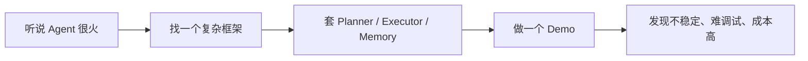

但更合理的路线应该是：

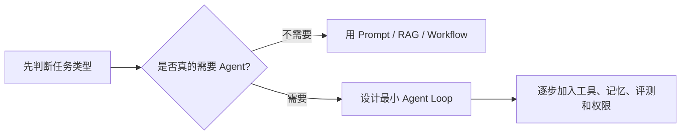

也就是说，学习 Agent 的第一步不是“怎么造一个 Agent”，而是：

> **怎么判断什么时候不该造 Agent。**

如果一个任务本来只需要一段 SQL、一个脚本、一个定时调度，就没必要强行让 Agent 自主探索。Agent 的优势是灵活，但它的代价也很明显：更贵、更慢、更难测试、更难复现，还可能跑偏。

---

## 2. Workflow 和 Agent 的核心区别

可以先记一个非常简单的区分：

|类型|执行路径由谁决定|典型特征|
|---|---|---|
|Workflow|代码决定|路径固定、结果稳定、容易调试|
|Agent|模型决定|路径动态、适合探索、但更不可控|

画成图就是：

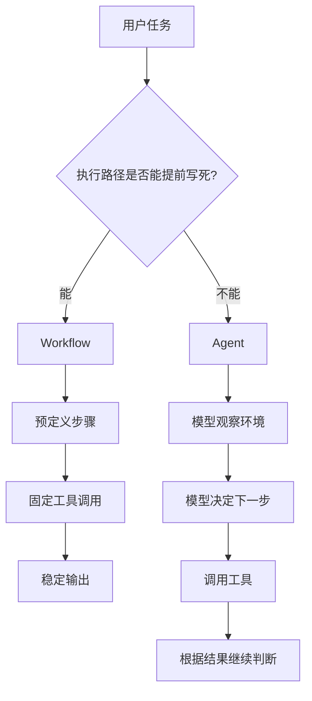

一句话总结：

> **Workflow 是“我已经知道怎么做，只是让系统自动执行”；Agent 是“我不知道完整路径，需要模型边看边决定”。**

---

## 3. 什么任务适合 Workflow？

如果一个任务满足下面几个条件，就应该优先考虑 Workflow：

```text
输入稳定
步骤稳定
规则明确
可以提前写死流程
需要可重复执行
需要稳定上线
```

比如数据开发里的 ETL：

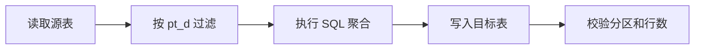

这类任务不应该让 Agent 每天自由发挥。

因为它的价值不在于“智能探索”，而在于：

```text
稳定
准时
可复现
可监控
可回滚
```

比如这些任务更适合 Workflow：

|任务|为什么|
|---|---|
|每天跑开发者关键指标 SQL|固定周期、固定 SQL、固定结果表|
|按 pt_d 生成漏斗聚合表|业务口径确定后流程稳定|
|删除某天的话单文件|命令明确，不需要智能判断|
|定时生成日报数据|数据源和处理流程固定|

Agent 在这里不是主执行者，而是辅助排查者。

比如：

```text
Workflow 负责每天稳定跑；
Agent 负责在失败时帮你查为什么失败。
```

---

## 4. 什么任务适合 Agent？

Agent 适合的问题，通常有几个特征：

```text
任务目标明确
但中间路径不明确
需要根据反馈调整步骤
需要使用工具观察环境
需要处理异常和不完整信息
```

比如：

> 为什么“传包 → 提审”的数量很少？

这个问题不能靠固定流程直接回答。它可能涉及：

```text
SQL 过滤条件
pt_d 是否对齐
事件时间字段
提审事件是否缺失
阶段状态判断逻辑
上游数据质量
```

Agent 的工作方式更像这样：

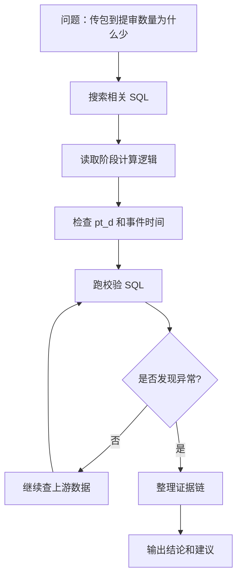

这就是 Agent 的典型价值：

> 它不是直接执行一个固定流程，而是在不确定环境里逐步缩小问题范围。

---

## 5. 不要直接跳到“全自动 Agent”

Anthropic 的文章里还总结了几种比完整 Agent 更简单的 agentic workflow，例如 Prompt Chaining、Routing、Orchestrator-Workers、Evaluator-Optimizer。它的核心思路是：不要一开始就上全自动 Agent，而是从简单模式开始，复杂度不够时再升级。([Anthropic](https://www.anthropic.com/engineering/building-effective-agents "Building Effective AI Agents \ Anthropic"))

### 5.1 Prompt Chaining：提示词链

适合任务能拆成固定步骤的时候。

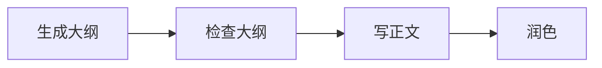

比如写技术文章：

```text
先生成结构
再检查逻辑
再写正文
最后润色语言
```

这不需要 Agent 自由探索，用 Workflow 就够了。

---

### 5.2 Routing：路由

适合输入有不同类型，需要分发到不同处理逻辑。

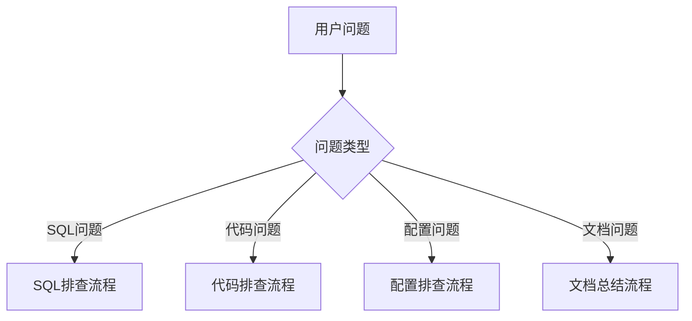

比如公司内部 Agent 可以先判断：

```text
这是日志问题？
这是配置问题？
这是代码改动问题？
这是数据口径问题？
```

然后再进入不同的处理模板。

---

### 5.3 Orchestrator-Workers：调度者-执行者

适合复杂任务，但子任务不能提前完全确定。Anthropic 对这个模式的定义是：中央 LLM 动态拆解任务、分发给 worker，再综合结果；它和普通并行处理的区别在于，子任务不是预先写死的，而是根据输入动态决定。([Anthropic](https://www.anthropic.com/engineering/building-effective-agents "Building Effective AI Agents \ Anthropic"))

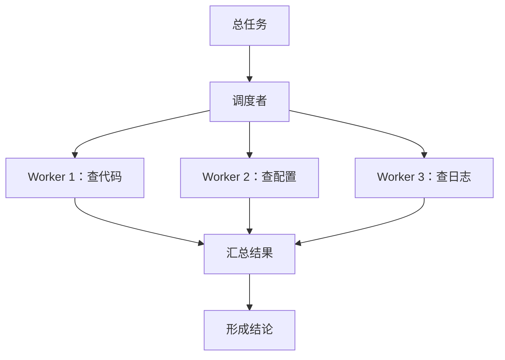

这个模式很像我们平时用高智能模型规划，再让本地 Agent 到项目里查证据。

---

### 5.4 Evaluator-Optimizer：评估者-优化者

适合有明确评价标准、可以反复改进的任务。Anthropic 提到，这种模式适合“有清晰评价标准，并且反复改进能带来价值”的场景。([Anthropic](https://www.anthropic.com/engineering/building-effective-agents "Building Effective AI Agents \ Anthropic"))

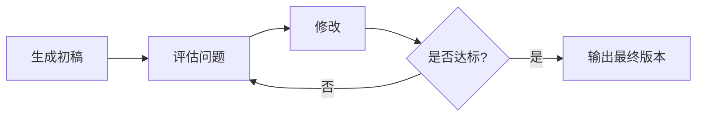

比如：

```text
代码 Review
文章润色
SQL 口径校验
提示词优化
```

这些任务不一定需要完全开放的 Agent，但很适合“生成—检查—修正”的循环。

---

## 6. 到底什么时候才真正需要 Agent？

可以用下面这张图判断：

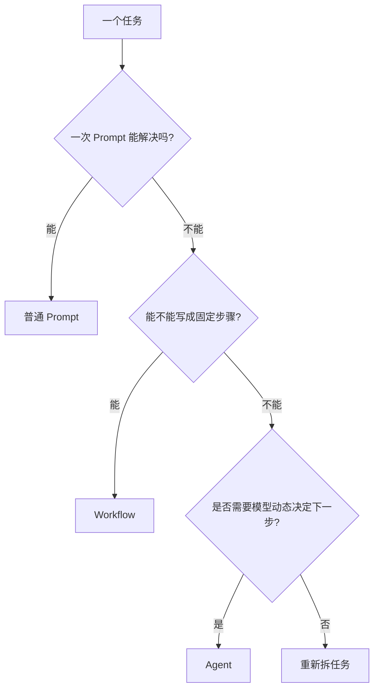

OpenAI 的 Agent 指南也有类似观点：Agent 适合传统确定性规则难以处理的复杂、模糊任务；如果用例不满足这些条件，确定性方案可能就够了。([OpenAI](https://openai.com/business/guides-and-resources/a-practical-guide-to-building-ai-agents/ "A practical guide to building agents | OpenAI"))

所以，不要一上来就问：

```text
我要不要做 Agent？
```

更好的问题是：

```text
这个任务能不能用更简单的方式解决？
```

只有当 Prompt、RAG、Workflow 都不够时，再考虑 Agent。

---

## 7. 对工程场景的启发

放到真实工作里，可以这样分：

|场景|更适合|
|---|---|
|固定 SQL 入湖|Workflow|
|定时跑批|Workflow|
|报表生成|Workflow + LLM 文案|
|配置问题排查|Agent|
|代码链路定位|Agent|
|日志异常分析|Agent|
|插件鸿蒙化可行性判断|Agent + Checklist|
|代码 Review|Agent + Evaluator|
|大型代码修改|Coding Agent + 测试反馈|

最实用的架构不是“全 Agent 化”，而是：

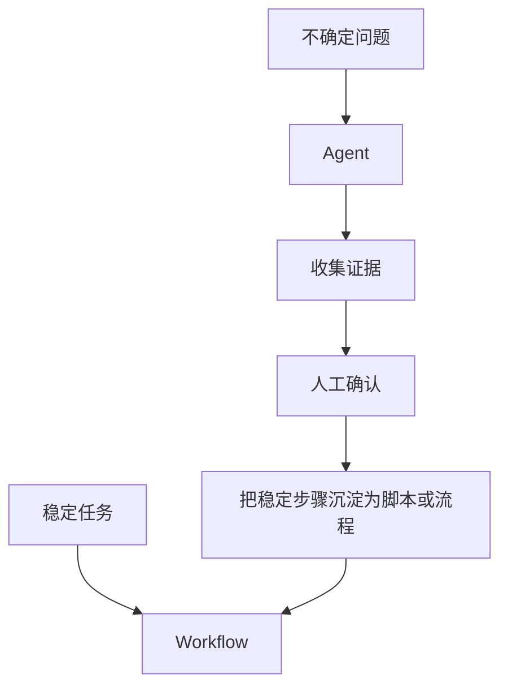

也就是说：

> Agent 负责探索未知，Workflow 负责固化已知。

---

## 8. 写给本地 Agent 的提示词应该怎么变？

理解了这个边界后，给本地 Agent 的指令就不能太泛。

不要这样写：

```text
帮我修好这个问题。
```

这会让 Agent 过度自由，容易乱查、乱改、乱猜。

更好的写法是：

```text
请先做问题定位，不要修改代码。

目标：
分析“传包到提审数量偏少”的原因。

边界：
1. 只关注当前项目目录；
2. 不要扩展到外层微服务；
3. 不要直接修改代码；
4. 每个结论必须给文件路径、SQL 片段或数据证据；
5. 没有证据的地方标记为“需确认”。

执行步骤：
1. 先找相关阶段计算 SQL；
2. 再检查 pt_d、event_time、event_rank_asc 等过滤条件；
3. 再找上游事件来源；
4. 最后给出可能原因、证据链和建议校验 SQL。
```

这其实就是把 Agent 从“自由探索”变成“受控探索”。

---

## 9. 这一篇的核心结论

第一篇最重要的结论只有一句：

> **不要为了 Agent 而 Agent。先用最简单的方法解决问题，只有当任务路径无法提前写死时，才需要 Agent。**

可以用这张图总结：

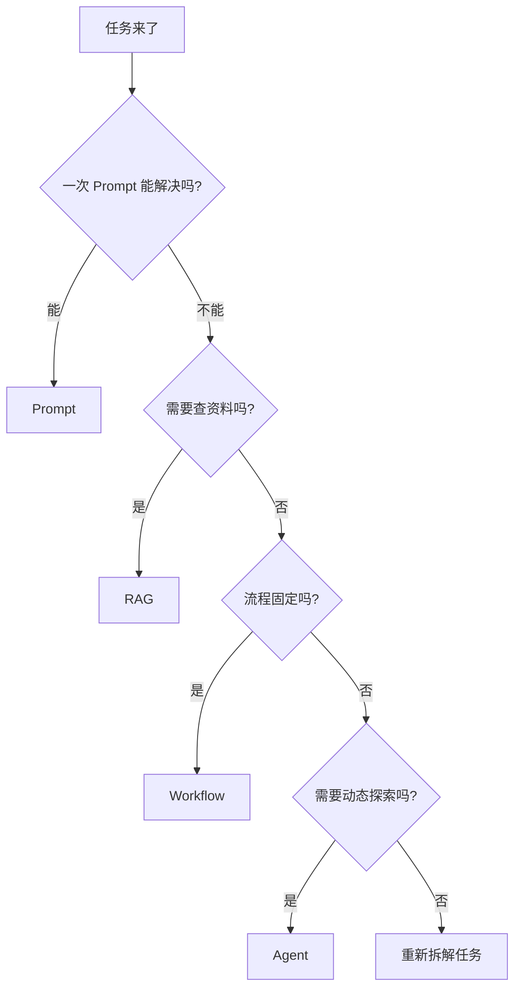

Anthropic 在总结部分也强调，成功不是构建最复杂的系统，而是为需求构建正确的系统：从简单 prompt 开始，用评测优化，只有当简单方案不够时再增加多步骤 agentic system。([Anthropic](https://www.anthropic.com/engineering/building-effective-agents "Building Effective AI Agents \ Anthropic"))

所以这一系列的第一篇，先立住一个基本原则：

> **Agent 的价值不是替代所有自动化，而是处理那些 Workflow 难以覆盖的不确定任务。**
