# Agent基础知识 02| Agent Loop：模型是怎么“边看边干活”的

> 从 OpenAI Agent Guide 和 Function Calling 看 Agent 如何在“观察—判断—行动”的循环中完成任务
---

上一篇我们讲了一个很重要的边界：

> Workflow 负责确定性流程，Agent 负责不确定性探索。

那接下来就要回答一个更核心的问题：

> **Agent 为什么能探索？它到底是怎么一步一步行动的？**

答案就是：

> **Agent Loop。**

`Agent-Learning-Hub` 在 Stage 1 里给出的学习目标也很具体：会定义工具函数，会解析模型的 tool call / function call，会执行工具，并把工具结果喂回模型，同时要给 agent loop 加最大步数、超时和错误处理。

---

## 1. 普通 Chatbot 和 Agent 的区别

普通 Chatbot 大多数时候是这样的：

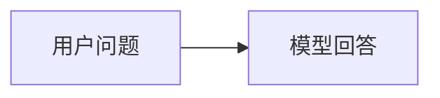

用户问，模型答。

但 Agent 不是一次性回答，而是循环：

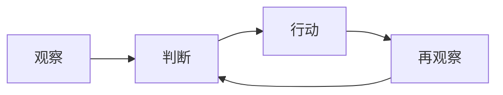

这就是常说的：

```text
Observe → Think → Act → Observe
```

更具体一点：

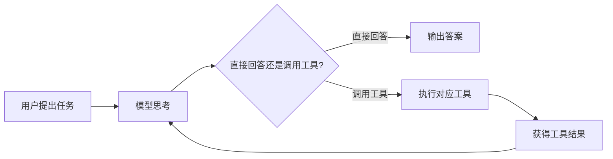

所以 Agent 的关键不是“会说话”，而是：

> **它能根据当前信息，决定下一步要不要行动、怎么行动、行动后是否继续。**

---

## 2. Agent 的最小组成：模型、工具、指令

OpenAI 的 Agent 指南把最基础的 Agent 拆成三个核心组件：Model、Tools、Instructions。Model 负责推理和决策，Tools 是 Agent 可以使用的外部函数或 API，Instructions 则定义行为规则和护栏。([OpenAI](https://openai.com/business/guides-and-resources/a-practical-guide-to-building-ai-agents/ "A practical guide to building agents | OpenAI"))

也就是说，一个 Agent 不是单独的模型，而是：

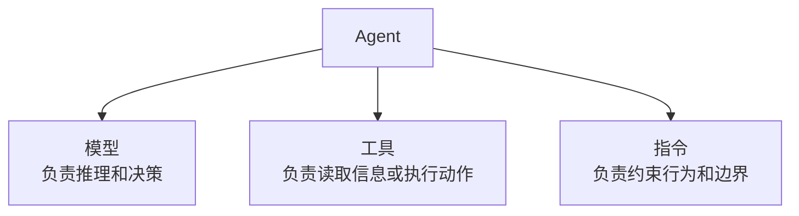

这三个组件缺一不可。

只有模型，没有工具，它只是 Chatbot。  
只有工具，没有指令，它容易乱用工具。  
只有指令，没有循环，它不能根据结果继续推进。

---

## 3. Agent Loop 是怎么运行的？

可以用一个排查任务来理解。

假设我们问：

> 为什么“传包 → 提审”的数量很少？

如果只是 Chatbot，它可能根据经验猜：

```text
可能是 SQL 过滤条件有问题；
可能是 pt_d 没对齐；
可能是事件时间用错了；
可能是提审事件缺失。
```

这些猜测不一定错，但没有证据。

Agent 的工作方式应该是：

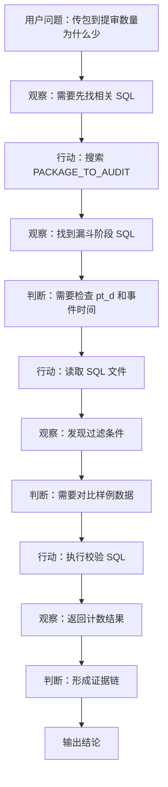

这就是 Agent Loop 的价值：

> 它不是直接给答案，而是边查边调整方向。

---

## 4. Agent Loop 的核心伪代码

最小 Agent 的逻辑可以写成这样：

```python
messages = [
    {"role": "user", "content": "帮我查一下为什么传包到提审数量很少"}
]

for step in range(max_steps):
    response = call_llm(
        messages=messages,
        tools=[search_file, read_file, run_sql]
    )

    if response.is_final_answer:
        print(response.content)
        break

    tool_call = response.tool_call

    tool_result = execute_tool(
        name=tool_call.name,
        arguments=tool_call.arguments
    )

    messages.append(response)
    messages.append({
        "role": "tool",
        "name": tool_call.name,
        "content": tool_result
    })
```

它本质上就三件事：

```text
1. 问模型下一步做什么；
2. 如果模型要调用工具，就执行工具；
3. 把工具结果再交给模型判断。
```

OpenAI Function Calling 文档也把工具调用描述成一个多步骤过程：先带着工具定义请求模型，模型返回 tool call，应用侧执行工具，再把工具结果回传给模型，最后模型继续返回答案或新的工具调用。([OpenAI平台](https://platform.openai.com/docs/guides/function-calling "Function calling | OpenAI API"))

---

## 5. 为什么说工具不在模型里面？

这是理解 Agent Loop 的关键。

模型并不会真的去读文件、跑 SQL、执行命令。它只是说：

```text
我需要调用 read_file 工具，参数是 xxx.sql。
```

真正执行工具的是 Agent 宿主程序。

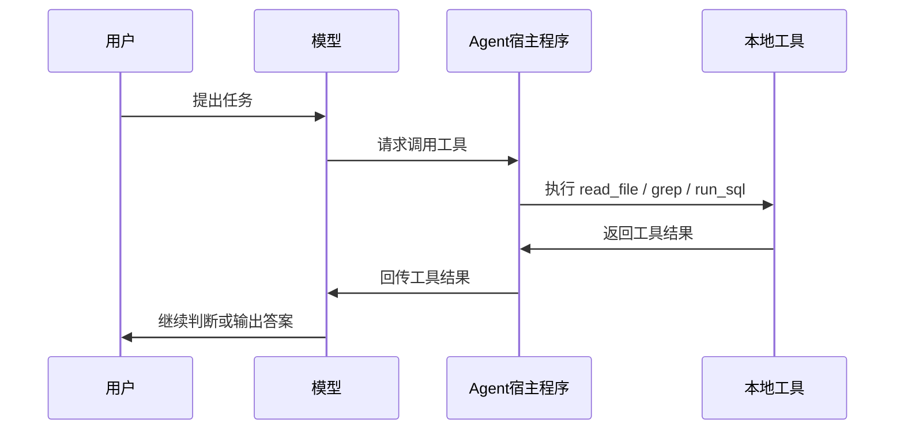

Claude 的 Tool Use 文档也明确说，工具根据执行位置可以分成 client tools 和 server tools：client tools 在你的应用里执行，模型返回结构化调用，应用执行后回传 `tool_result`；server tools 则由 Anthropic 的基础设施执行。([Claude API Docs](https://docs.anthropic.com/en/docs/agents-and-tools/tool-use/overview "Tool use with Claude - Claude API Docs"))

这对理解本地 Agent 很重要：

> **模型决定做什么，宿主程序负责真正做。**

---

## 6. 为什么 Agent Loop 需要停止条件？

Agent 不能无限循环。

如果没有限制，它可能一直查、一直搜索、一直觉得还不够。

所以最小 Agent 必须有这些控制：

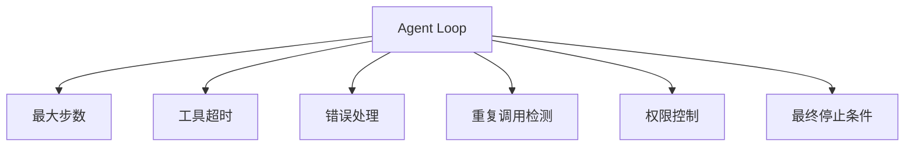

比如：

```python
max_steps = 8
tool_timeout = 30
```

然后规定：

```text
如果 8 步内还不能得到结论，就输出当前发现和未确认点。
```

Anthropic 在讲 Agent 时也提到，Agent 执行时需要从环境获得真实反馈，例如工具结果或代码执行结果；同时也应该有检查点、人工反馈和最大迭代次数这类停止条件来维持控制。([Anthropic](https://www.anthropic.com/engineering/building-effective-agents "Building Effective AI Agents \ Anthropic"))

一个可靠 Agent 不一定每次都能完成任务，但它至少应该：

```text
不乱跑
不死循环
不瞎编
不越权
能交代已经查了什么
能说明还缺什么证据
```

---

## 7. 一个简单问题和一个 Agent 问题的区别

比如用户问：

> 502 是什么报错？

这不需要 Agent Loop。

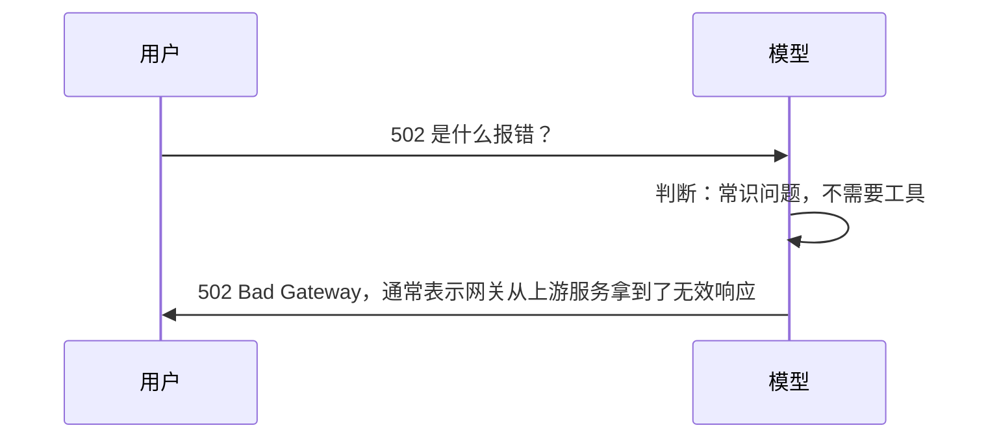

但如果用户问：

> 我们这个服务为什么报 502？

这就不同了。

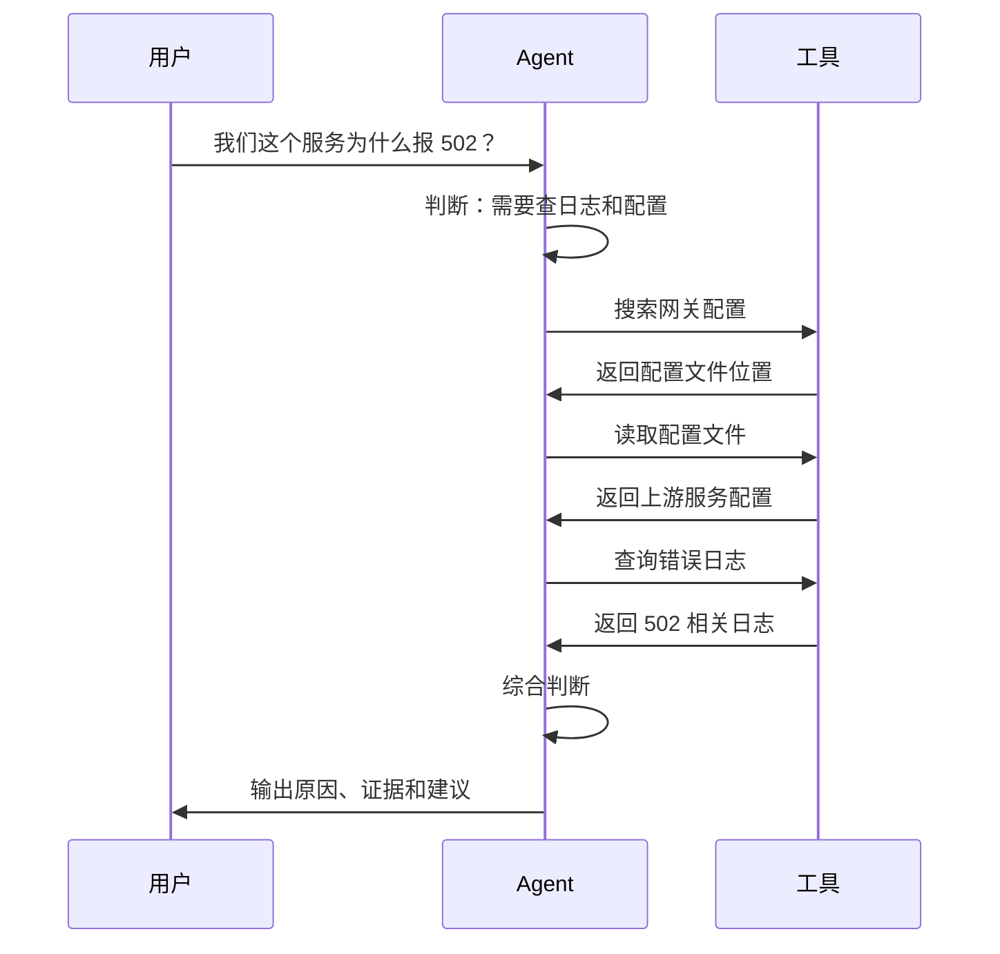

区别就在于：

```text
“502 是什么”是知识问答；
“为什么我们服务报 502”是环境排查。
```

前者用 Chatbot 就够了，后者需要 Agent。

---

## 8. Agent Loop 和 Workflow 的关系

上一篇说过：Workflow 负责确定性，Agent 负责不确定性。

现在把 Agent Loop 放进去，可以画成这样：

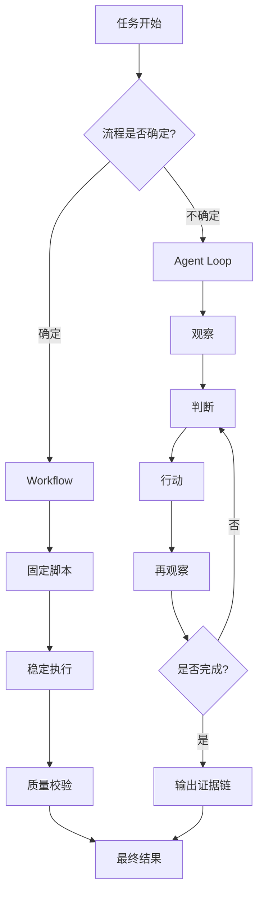

所以，真实系统里不是二选一，而是组合使用：

```text
Workflow 跑稳定流程；
Agent 排查异常、探索未知、生成方案；
人工负责关键决策；
脚本负责最终固化。
```

---

## 9. 给本地 Agent 的提示词怎么写？

理解 Agent Loop 后，我们就知道，提示词不能只是“帮我搞定”。

而要告诉它：

```text
你可以怎么观察；
你可以调用什么工具；
你什么时候应该停止；
你输出什么样的证据。
```

比如：

```text
请按 Agent Loop 的方式排查问题，不要直接给结论。

目标：
定位“传包到提审数量偏少”的原因。

要求：
1. 先观察已有信息，列出可能原因；
2. 再选择最优先的 1～2 个方向查证；
3. 每一步只能在当前项目目录内搜索或读取文件；
4. 每次工具调用后，总结新发现；
5. 不允许直接修改代码；
6. 最多执行 8 步；
7. 如果证据不足，输出“已确认 / 未确认 / 下一步建议”。
```

这个提示词本质上是在给 Agent Loop 加边界。

---

## 10. 这一篇的核心结论

Agent Loop 可以总结成一句话：

> **Agent 不是一次性回答问题，而是在“观察—判断—行动—再观察”的循环中逐步逼近答案。**

最小 Agent 至少要具备这些能力：

```text
1. 能和模型对话；
2. 能让模型决定是否调用工具；
3. 能执行工具；
4. 能把工具结果喂回模型；
5. 能控制最大步数、超时和错误；
6. 能在合适的时候停止；
7. 能输出有证据的答案。
```

最后用一张图总结：

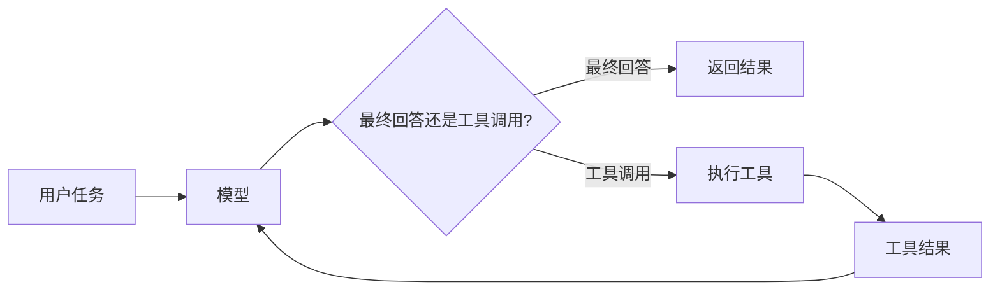

这一节最重要的一句话是：

> **Agent 的本体不是模型，而是“模型 + 工具 + 指令 + 循环控制”。**

