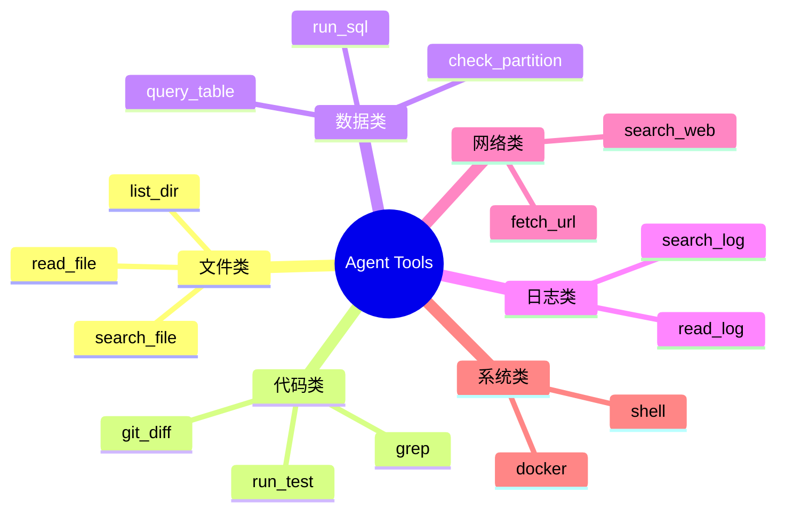
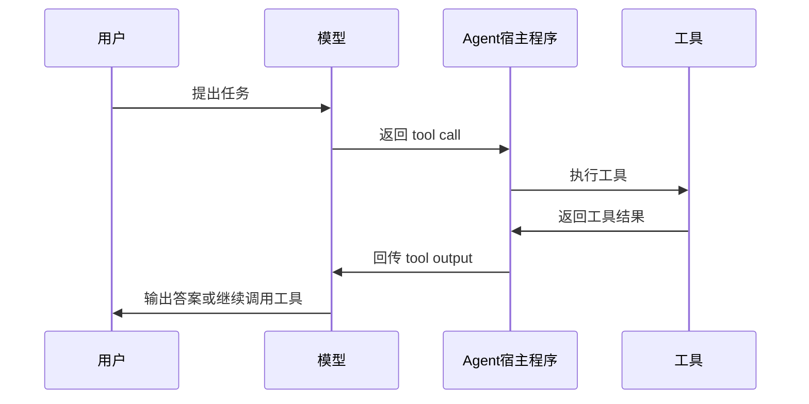
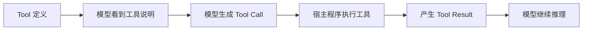
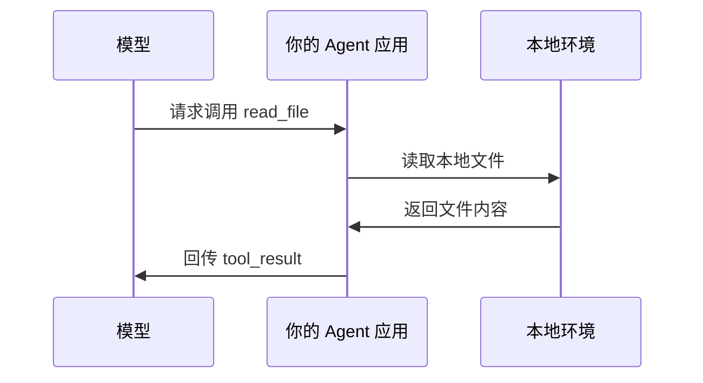
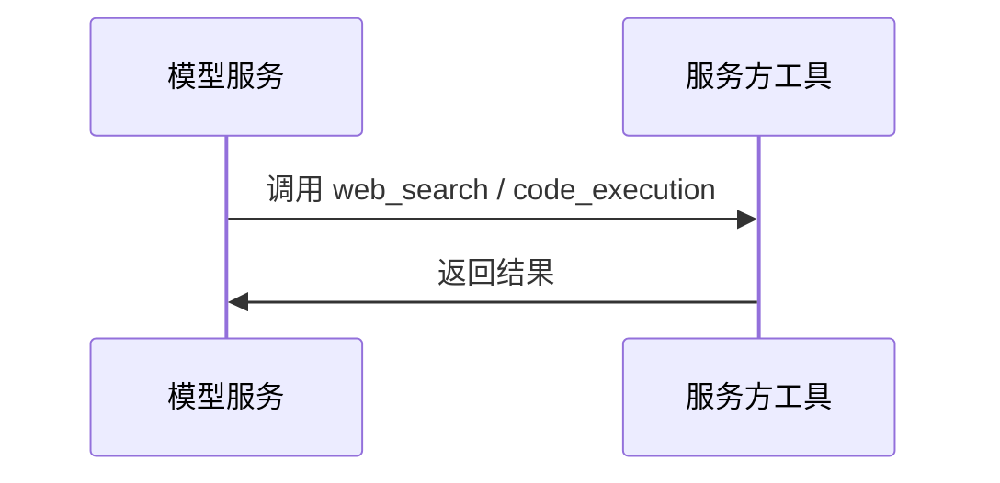
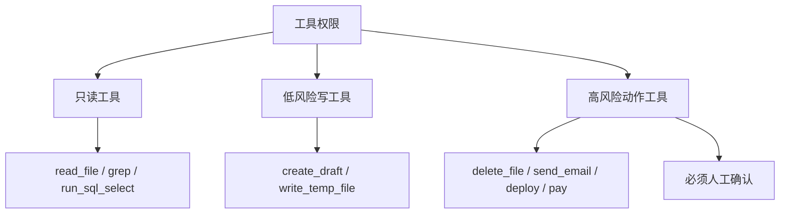
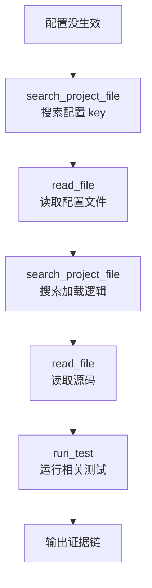
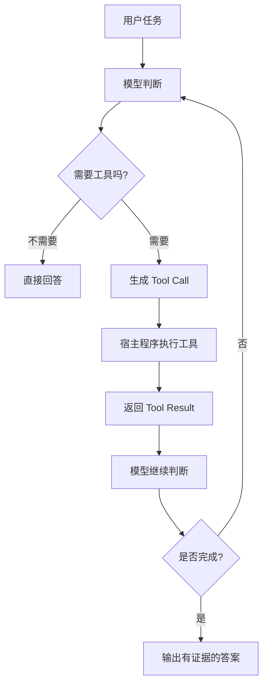

# Agent基础知识 03| Tool Use：工具不是插件，而是 Agent 的手脚

> 从 Function Calling 和 Claude Tool Use 看模型、宿主程序与外部工具如何协同

---

前两篇我们分别讲了：

```text
01：什么时候该用 Agent，什么时候该用 Workflow
02：Agent Loop 是怎么运转的
```

这一篇讲 Agent 真正开始“能干活”的关键：

> **Tool Use。**

没有工具的 Agent，本质上还是一个更会推理的 Chatbot。  
有了工具，它才开始能查文件、搜代码、跑 SQL、读日志、执行测试、访问外部系统。

`Agent-Learning-Hub` 在 Stage 2 里也把这一点放得很靠前：Agent 要会把搜索、数据库、文件、浏览器、代码执行接成工具，并且要处理工具失败、空结果、重复调用和幻觉引用。

---

## 1. 工具不是“模型能力”，而是“模型可调用的动作空间”

OpenAI Function Calling 文档里说，function calling，也就是 tool calling，可以让模型连接外部系统，访问训练数据之外的信息，也能使用应用侧提供的数据和动作。([OpenAI平台](https://platform.openai.com/docs/guides/function-calling "Function calling | OpenAI API"))

这句话翻译成工程语言就是：

> 模型自己不会读数据库、不会改文件、不会发请求。  
> 但你可以把这些能力包装成工具，让模型决定什么时候调用。

比如：

```text
read_file：读取文件
grep：搜索关键词
run_sql：执行 SQL
run_test：运行测试
git_diff：查看代码改动
search_web：搜索网页
send_email：发送邮件
```

这些工具共同构成了 Agent 的动作空间。



工具越多，Agent 能做的事情越多。  
但工具越多，也越容易选错、乱用、成本升高。

所以 Tool Use 的重点不是“工具越多越好”，而是：

> **给 Agent 提供刚好够用、边界清楚、结果可验证的工具。**

---

## 2. 工具调用到底是怎么发生的？

工具调用不是模型自己执行代码，而是一个多方配合的过程。

OpenAI 的文档把 tool calling flow 拆成五步：带工具定义请求模型、模型返回 tool call、应用侧执行代码、把 tool output 回传模型、模型返回最终回答或继续调用工具。([OpenAI平台](https://platform.openai.com/docs/guides/function-calling "Function calling | OpenAI API"))

画成图就是：



比如用户问：

> 帮我查一下为什么传包到提审数量偏少。

模型可能返回：

```json
{
  "tool": "search_file",
  "arguments": {
    "keyword": "PACKAGE_TO_AUDIT"
  }
}
```

Agent 宿主程序看到后，才真的去执行搜索。搜索结果回来后，再交给模型继续判断。

所以这里有一个重要结论：

> **模型负责决策，宿主程序负责执行。**

---

## 3. Tool、Function、Tool Call、Tool Result 分别是什么？

这几个词经常混在一起，但最好分清楚。

|概念|含义|
|---|---|
|Tool|Agent 可以使用的一类能力|
|Function|一种结构化工具，通常用 JSON Schema 定义参数|
|Tool Call|模型提出的“我要调用某工具”的请求|
|Tool Result|工具执行后的结果，回传给模型继续判断|

OpenAI 文档里也说明，function 是一种特定类型的 tool，通常由 JSON Schema 定义；function definition 允许模型把结构化参数传给应用侧，由应用侧代码访问数据或执行动作。([OpenAI平台](https://platform.openai.com/docs/guides/function-calling "Function calling | OpenAI API"))

可以这样理解：



---

## 4. 为什么工具要结构化？

如果模型只是输出一句：

```text
我需要查一下文件。
```

程序不知道该执行什么。

但如果输出：

```json
{
  "name": "read_file",
  "arguments": {
    "path": "/project/sql/funnel_stage.sql"
  }
}
```

程序就能明确执行。

所以工具定义通常要包含：

```text
工具名
工具描述
参数 schema
参数说明
返回格式
使用边界
错误情况
```

一个不好的工具定义可能是：

```text
工具名：search
描述：搜索东西
参数：keyword
```

模型会困惑：

```text
搜索哪里？
搜文件还是搜网页？
是否区分大小写？
返回多少条？
搜不到怎么办？
```

更好的工具定义应该像这样：

```text
工具名：search_project_file

用途：
在当前项目目录内搜索关键词，不访问外层微服务工程。

参数：
- keyword：要搜索的关键词，必填
- file_type：可选，例如 sql / py / yaml / java
- max_results：最多返回多少条，默认 20

返回：
- 文件路径
- 行号
- 命中的代码片段

边界：
- 不允许搜索当前项目目录以外的文件
- 如果没有结果，返回空列表，不要猜测
```

这就像给一个初级开发写函数文档。

Anthropic 在工具工程建议中也强调，工具定义要像高质量文档一样清楚，包括示例、边界、输入格式和易错点；他们还提到，在构建 coding agent 时，优化工具本身甚至比优化整体 prompt 更重要。([Anthropic](https://www.anthropic.com/engineering/building-effective-agents "Building Effective AI Agents \ Anthropic"))

---

## 5. Client Tools 和 Server Tools

Claude Tool Use 文档有一个很重要的区分：工具主要差异在于代码在哪里执行。Client tools 在你的应用里执行，Claude 返回 `tool_use`，你的代码执行操作后回传 `tool_result`；Server tools 则运行在 Anthropic 的基础设施中，例如 web_search、code_execution、web_fetch、tool_search。([Claude API Docs](https://docs.anthropic.com/en/docs/agents-and-tools/tool-use/overview "Tool use with Claude - Claude API Docs"))

可以画成两种模式。

### 5.1 Client Tools：工具在你的应用里执行



典型例子：

```text
read_file
grep
run_sql
run_test
git_diff
shell
```

这些都和你的本地环境、公司项目、数据库权限有关，所以必须由你的应用侧执行。

---

### 5.2 Server Tools：工具由模型服务方执行



这种模式下，你不用自己实现工具执行逻辑，但工具边界取决于平台提供的能力。

---

## 6. 工具的三种类型

OpenAI 的 Agent 指南把工具大致分成三类：Data、Action、Orchestration。Data 工具用于获取上下文，Action 工具用于执行动作，Orchestration 工具则是把其他 Agent 当成工具来调度。([OpenAI](https://openai.com/business/guides-and-resources/a-practical-guide-to-building-ai-agents/ "A practical guide to building agents | OpenAI"))

我们可以用中文理解成：

|工具类型|作用|例子|
|---|---|---|
|数据工具|获取信息|查数据库、读 PDF、搜索网页、读文件|
|动作工具|改变外部系统状态|发邮件、更新记录、创建工单、删文件|
|编排工具|调用其他 Agent|调 research agent、review agent、translation agent|

对于工程场景，最需要警惕的是 Action 工具。

因为数据工具大多只是读：

```text
读文件
查 SQL
搜日志
看 diff
```

动作工具会改变系统状态：

```text
删除文件
修改代码
发邮件
提交 PR
执行发布
付款
```

所以工具权限应该分层。



这也是为什么真实 Agent 系统不能只关注“能不能调用工具”，还要关注“哪些工具必须加审批”。

---

## 7. 工具设计里的常见坑

### 7.1 工具描述太模糊

比如：

```text
search：搜索内容
```

模型很难知道它和 `grep`、`web_search`、`query_doc` 的区别。

更好的写法是：

```text
search_project_file：
只在当前项目目录中搜索文件内容，适合查找代码、SQL、配置项。
不适合搜索网页或数据库内容。
```

---

### 7.2 参数太难写

Anthropic 在工具工程建议中举过类似问题：有些格式对模型来说很难，比如要求模型手写复杂 diff、精确计算行号、在 JSON 里转义大量代码，都会增加错误率。([Anthropic](https://www.anthropic.com/engineering/building-effective-agents "Building Effective AI Agents \ Anthropic"))

所以工具参数应该尽量自然。

不太好的设计：

```json
{
  "diff_patch": "...需要模型自己写完整 patch..."
}
```

更好的设计：

```json
{
  "path": "/abs/path/to/file.py",
  "old_text": "原始文本",
  "new_text": "替换文本"
}
```

或者进一步限制为：

```json
{
  "path": "/abs/path/to/file.py",
  "operation": "replace_block",
  "anchor": "def target_function",
  "new_block": "..."
}
```

核心原则是：

> **让工具参数贴近模型熟悉的表达方式，减少格式负担。**

---

### 7.3 工具边界不清楚

比如一个工具叫：

```text
run_sql
```

那它能不能执行 `INSERT`？能不能 `DROP`？能不能查生产库？有没有超时？有没有行数限制？

不清楚的话就很危险。

更好的做法是拆开：

```text
run_select_sql：只允许 SELECT
run_etl_sql：执行 ETL，需要审批
explain_sql：只分析 SQL，不执行
```

这样 Agent 更不容易误操作。

---

### 7.4 搜不到就乱猜

工具返回空结果时，差的 Agent 会说：

```text
没有找到，所以不存在。
```

好的 Agent 应该说：

```text
当前关键词没有搜到结果，但不能证明不存在。
建议换关键词、查配置项、查调用链或查上游表。
```

这就要求工具结果和指令里都明确：

```text
空结果只是当前搜索条件下没有命中，不等于事实不存在。
```

---

## 8. 结合代码排查场景看 Tool Use

比如让 Agent 排查：

> 为什么某个配置没有生效？

它需要的工具不是一个“万能工具”，而是一组清晰工具：



工具调用过程可能是：

```text
第 1 步：搜索配置 key
第 2 步：找到 yaml 配置
第 3 步：搜索配置类
第 4 步：找到配置绑定逻辑
第 5 步：检查默认值覆盖
第 6 步：给出结论
```

这比“帮我看看配置为啥没生效”要可控得多。

---

## 9. 给本地 Agent 的 Tool Use 提示词模板

可以这样写：

```text
请使用工具进行证据驱动的排查，不要直接猜测。

目标：
定位 XXX 问题的原因。

工具使用要求：
1. 优先使用只读工具：search_project_file、read_file、git_diff；
2. 需要验证数据时，可以使用 run_select_sql；
3. 不允许使用写入、删除、提交、发布类工具；
4. 每次调用工具后，必须总结“新发现”和“下一步判断”；
5. 如果工具返回空结果，不要直接判定不存在，需要换关键词或说明证据不足；
6. 每个最终结论必须附带文件路径、行号、SQL 结果或日志片段；
7. 最多执行 8 步，超过后输出当前进展和未确认点。
```

这个提示词的重点不是让 Agent “更努力”，而是让它：

```text
少猜
少乱跑
有证据
可复盘
可停止
```

---

## 10. 这一篇的核心结论

Tool Use 可以总结成一句话：

> **工具不是 Agent 的外挂插件，而是 Agent 进入真实环境的手脚。**

但工具设计不是简单地把 API 暴露给模型，而是要认真设计：

```text
工具名是否清楚
工具描述是否明确
参数是否容易填写
返回结果是否可判断
失败情况是否可处理
权限边界是否清楚
是否需要人工确认
```

最后用一张图总结：



这一节最重要的一句话是：

> **模型决定调用什么工具，但工具执行、权限控制、结果校验，都属于 Agent 工程系统的一部分。**