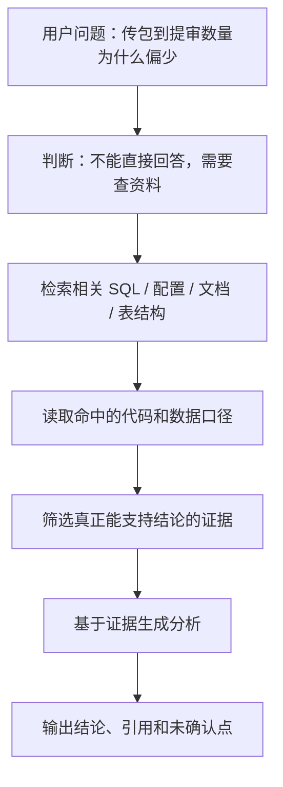
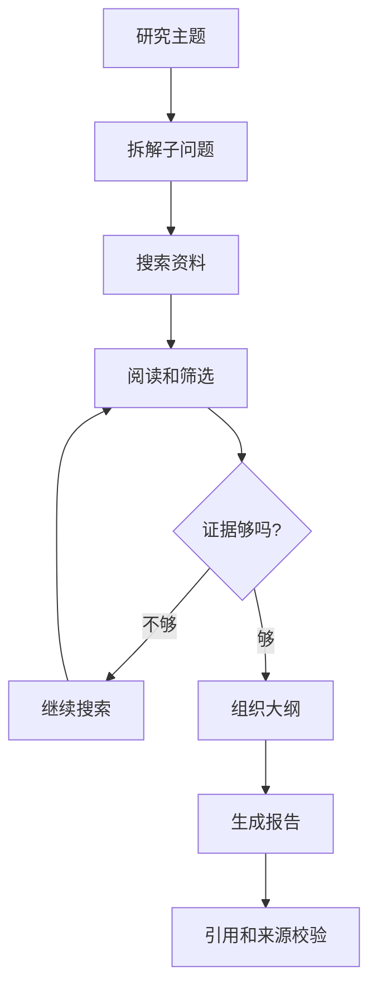
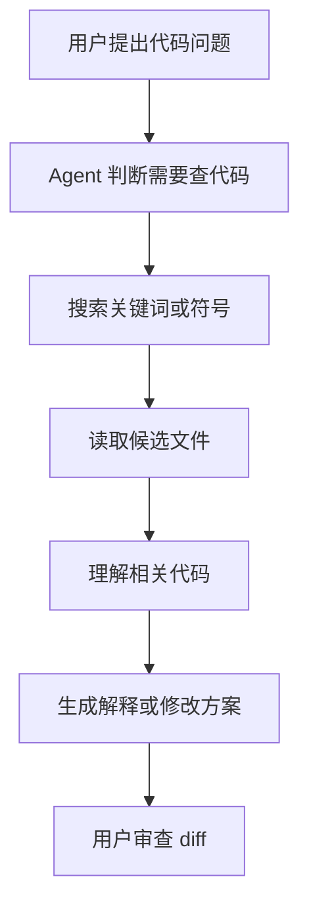
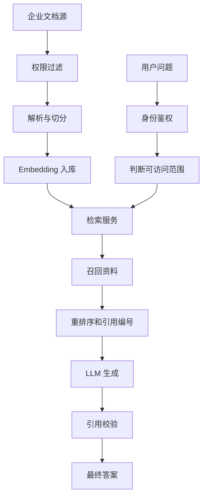
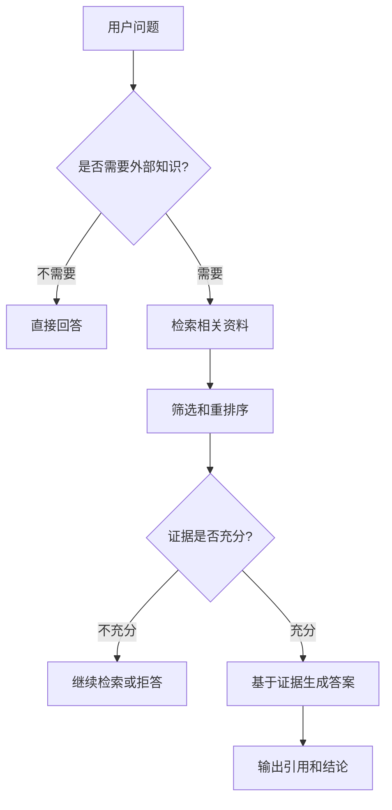

# Agent基础知识 04| RAG：让 Agent 基于资料回答，而不是靠感觉

> 从 RAG、Deep Research 和 Coding Agent 看 Agent 如何基于证据回答问题

前面几篇我们已经讲过：

```text
Workflow：路径由代码决定。
Agent：路径由模型根据环境反馈动态决定。
Tool Use：让 Agent 能调用外部工具。
```

但这里还有一个问题：

> Agent 能调用工具之后，怎么知道应该看哪些资料？
> 如果资料很多，它怎么找到真正相关的内容？
> 如果资料不够，它会不会开始胡编？

这就是 **RAG** 要解决的问题。

---

## 一、先看一个真实问题：Agent 为什么不能直接回答？

假设你问一个普通大模型：

```text
我们项目里“传包到提审”的数量为什么偏少？
```

如果它没有看到你的项目代码、SQL、表结构和数据样例，它大概率只能根据经验猜：

```text
可能是 SQL 过滤条件有问题；
可能是 pt_d 没对齐；
可能是事件时间字段用错了；
可能是上游提审事件缺失；
可能是阶段状态判断逻辑有问题。
```

这些话听起来都对，但本质上只是“合理猜测”。

因为模型没有看到：

```text
SQL 文件在哪里；
上游表是什么；
字段名是什么；
pt_d 怎么过滤；
event_code 怎么定义；
event_time 和 process_time 哪个参与计算；
历史数据到底长什么样。
```

所以它不能直接下结论。

一个可靠的 Agent 应该这样做：



这张图里：

`用户问题` 是任务入口。
`判断不能直接回答` 是模型意识到自己缺少项目上下文。
`检索相关资料` 是 RAG 的核心动作。
`读取代码和数据口径` 是把检索结果变成可验证证据。
`筛选证据` 是防止把一堆“看起来相关但不能回答问题”的内容塞给模型。
`基于证据生成分析` 才是语言模型真正发挥作用的地方。
最后输出时，必须区分“已经有证据支持的结论”和“仍需确认的假设”。

关键变化是：

> 不使用 RAG 时，Agent 是“我觉得可能是……”。
> 使用 RAG 后，Agent 应该是“我查到了这些证据，所以判断是……”。

---

## 二、为什么会出现 RAG？

RAG 不是凭空出现的。它是为了解决大模型在真实工程场景中的三个核心问题。

---

### 1. 模型知识是静态的

**大语言模型**，也就是 LLM，英文是 Large Language Model。

它是什么？

> LLM 是一种通过大量文本训练出来的模型，可以根据上下文预测并生成语言。

为什么会出现？

因为传统程序很难处理开放式自然语言任务，比如总结文章、改写文字、回答问题、生成代码。LLM 通过大规模训练，获得了强大的语言理解和生成能力。

它解决什么问题？

它让机器可以用接近人类语言的方式理解问题和生成答案。

不用它会怎样？

没有 LLM，我们做自然语言交互通常要靠规则、模板、关键词匹配，能力很有限。

但是，LLM 有一个很大的限制：

> 模型训练完成后，它的参数基本固定。它不会自动知道你昨天改了哪个接口，也不会知道公司今天更新了什么安全规范。

比如你问：

```text
我们最新的接口鉴权逻辑是什么？
```

模型可能能解释“鉴权是什么”，但它不知道你们项目最新的实现。

RAG 出现的第一个原因就是：

> 让模型在回答前能够访问外部知识，而不是只靠训练时学到的静态知识。

RAG 的核心思想正是让 LLM 在生成答案前检索外部数据源，从而使用训练数据之外的信息。([维基百科][1])

---

### 2. 模型容易幻觉

**幻觉**，英文一般叫 hallucination。

它是什么？

> 幻觉是指模型生成了看起来合理、语气自信，但实际错误或没有依据的内容。

为什么会出现？

因为 LLM 的目标不是“查证事实”，而是根据上下文生成最可能的文本。当它缺少资料时，它仍然可能补全一个“像答案的答案”。

它解决不了什么问题？

LLM 本身不能保证每句话都有真实来源。它可能编造不存在的接口、参数、论文、法律条文、日志字段。

不用控制会怎样？

比如模型可能说：

```text
请检查 enableAuditSubmitFilter 参数。
```

听起来像真的，但项目里可能根本没有这个参数。

RAG 解决的是：

> 给模型提供可检索、可引用的事实材料，减少它凭空编造的空间。

但要注意，RAG 不是幻觉的“根治药”。即使有 RAG，模型仍然可能误读资料、混合过期信息，或者在证据不足时强行回答。RAG 可以降低幻觉，但不能天然消灭幻觉。([维基百科][1])

所以一个好的 RAG 系统必须要求模型：

```text
没有证据就说没有证据；
证据不足就标记为“需确认”；
关键结论必须引用来源；
不能把推测写成事实。
```

---

### 3. 上下文窗口再大也不够用

**上下文窗口**，英文是 context window。

它是什么？

> 上下文窗口是模型一次调用时能看到的最大 token 数。

**token** 可以简单理解为模型处理文本的基本单位，中文里大致可以类比成字、词或子词片段。

为什么会出现上下文窗口？

因为模型计算注意力时，需要处理输入中的所有 token。输入越长，计算成本越高、速度越慢、注意力越容易被噪声干扰。

它解决什么问题？

上下文窗口让模型可以在一次回答里参考用户问题、历史对话、文档片段和工具结果。

不用它会怎样？

模型完全没有短期记忆，只能处理一句孤立输入。

但上下文窗口不是无限的。即便模型支持很长上下文，也不应该把所有资料都塞进去。

原因很简单：

```text
资料越多，成本越高；
资料越杂，模型越容易看花；
资料越长，关键信息越容易被淹没；
资料越旧，越可能误导模型。
```

这和数据库查询一样。

你不会每次查一个用户都全表扫描，而是会建索引、加过滤条件、只取相关数据。

RAG 也是这个思路：

> 不要把所有资料都塞给模型。
> 先检索，只把最相关的资料给模型。

---

## 三、RAG 到底是什么？

**RAG** 全称是 **Retrieval-Augmented Generation**，中文通常翻译为 **检索增强生成**。

这个词可以拆成三部分：

```text
Retrieval：检索，先去外部资料里找相关内容。
Augmented：增强，把找来的资料补充给模型。
Generation：生成，模型基于资料组织答案。
```

所以 RAG 本质上不是某一个工具，也不是某一个数据库，而是一种系统设计模式：

> 在模型回答之前，先从外部知识库中检索相关资料，再让模型基于这些资料回答。

更直白地说：

```text
不用 RAG：
模型只靠自己的训练记忆回答。

使用 RAG：
模型先查资料，再基于资料回答。
```

RAG 常用于企业知识库问答、代码库问答、客服机器人、法规检索、论文问答和 Deep Research 等场景。RAG 的价值是让模型使用训练数据之外的外部知识，尤其是内部资料、专有文档和最新信息。([维基百科][1])

---

## 四、RAG 和普通搜索有什么区别？

很多人会问：

> RAG 不就是搜索吗？

不是。

普通搜索一般是：

```text
用户输入关键词
  ↓
搜索引擎返回网页或文档列表
  ↓
用户自己阅读和判断
```

RAG 是：

```text
用户提出自然语言问题
  ↓
系统检索相关资料
  ↓
系统筛选和组织资料
  ↓
模型基于资料生成答案
  ↓
答案带引用和解释
```

区别在于：

| 对比项  | 普通搜索    | RAG         |
| ---- | ------- | ----------- |
| 输入   | 关键词为主   | 自然语言问题      |
| 输出   | 文档列表    | 组织后的答案      |
| 阅读责任 | 用户自己读   | 模型辅助读       |
| 推理能力 | 搜索引擎弱   | LLM 负责总结和推理 |
| 引用要求 | 用户自己判断  | 系统应保留来源     |
| 适合场景 | 找网页、找文档 | 基于资料回答复杂问题  |

所以 RAG 可以理解成：

> 搜索系统 + 阅读理解系统 + 生成系统。

---

## 五、RAG 的核心概念逐个解释

这一节很关键。不要急着搭框架，先把核心组件搞清楚。

---

### 1. Chunk：为什么要把资料切成小块？

**Chunk** 可以翻译成“文本块”或“知识片段”。

它是什么？

> Chunk 是从原始资料中切出来的一小段内容。

为什么会出现？

因为原始资料通常太长。比如一份 80 页的接口文档、一整个 Java 项目、一批 SQL 文件，都不能直接丢给模型。

Chunk 解决什么问题？

它把大资料拆成可以检索、可以引用、可以放进模型上下文的小单元。

不用 Chunk 会怎样？

如果不切分，系统只能把整篇文档作为一个单位处理，会导致：

```text
检索不准；
上下文太长；
引用不清楚；
模型难以定位关键段落。
```

怎么实现？

最简单的方式是按固定长度切，比如每 500 个 token 切一段。但固定切分很容易切断语义。

比如一个 SQL 被切成两段：

```text
第一段：select ...
第二段：where pt_d = ...
```

如果模型只看到第一段，它就可能漏掉最重要的过滤条件。

所以更好的切分方式是按结构切：

| 资料类型             | 更适合的切分方式                    |
| ---------------- | --------------------------- |
| Markdown 文档      | 按标题、段落、列表切                  |
| Java / Python 代码 | 按类、函数、方法切                   |
| SQL 文件           | 按 CTE、子查询、阶段逻辑切             |
| 日志               | 按时间窗口、trace_id、request_id 切 |
| PDF              | 按章节、段落、表格切                  |

Chunk 的本质不是“把文本切短”，而是：

> 把资料切成模型能理解、检索能命中、引用能定位的最小知识单元。

---

### 2. Embedding：为什么要把文本变成向量？

**Embedding** 可以理解为“向量表示”。

它是什么？

> Embedding 是把文本、代码、图片等内容转成一组数字向量。

为什么会出现？

计算机不能直接理解“这段话和那段话语义相近”。它需要把文本转成数字，然后才能计算相似度。

Embedding 解决什么问题？

它让系统可以根据语义相似度找资料，而不是只靠关键词。

比如用户问：

```text
应用提审数量为什么少？
```

文档里写的是：

```text
PACKAGE_TO_AUDIT 阶段转化率异常。
```

这两个句子没有完全相同的关键词，但语义相关。向量检索可以把它们匹配起来。

不用 Embedding 会怎样？

如果只靠关键词检索，遇到同义词、缩写、业务别名，就容易漏掉资料。

比如这些词可能指向同一个业务阶段：

```text
传包
上传包体
PACKAGE_UPLOAD
package metadata
包体元数据
```

关键词检索不一定能全部命中，Embedding 能提供语义层面的补充。

怎么实现？

一般流程是：

```text
文本 → Embedding 模型 → 向量 → 向量数据库
```

用户问题也做同样处理：

```text
问题 → Embedding 模型 → 问题向量 → 查相似向量
```

---

### 3. Vector DB：为什么需要向量数据库？

**Vector DB**，也就是向量数据库。

它是什么？

> 向量数据库是专门存储和检索向量的数据库。

为什么会出现？

普通数据库擅长精确查询，比如：

```sql
where app_id = 'xxx'
```

但不擅长查：

```text
哪些文档在语义上和这个问题最接近？
```

向量数据库解决什么问题？

它支持按照向量距离快速查找相似内容。

不用它会怎样？

如果资料很少，可以直接暴力计算相似度。但资料达到几十万、几百万段后，暴力计算会非常慢。

常见方案包括：

```text
Milvus
Pinecone
Weaviate
pgvector
Elasticsearch vector search
```

后端工程师可以把向量数据库理解成：

> 一种为“相似度查询”优化过的索引系统。

---

### 4. Retriever：检索器到底负责什么？

**Retriever** 可以翻译为“检索器”。

它是什么？

> Retriever 是 RAG 系统中负责“根据问题找资料”的组件。

为什么会出现？

因为“找资料”不是简单查向量数据库。它可能包括关键词改写、权限过滤、时间过滤、向量检索、关键词检索、图检索、结果合并等步骤。

Retriever 解决什么问题？

它把复杂检索逻辑封装成一个统一接口。

比如：

```python
docs = retriever.retrieve(query="传包到提审数量为什么少")
```

不用 Retriever 会怎样？

检索逻辑会散落在业务代码里，很难维护，也很难替换策略。

Retriever 可以有多种实现：

```text
纯向量检索
关键词检索
混合检索
多轮检索
图检索
Agentic RAG
```

所以 Retriever 不是固定算法，而是一个工程抽象。

---

### 5. Rerank：为什么检索完还要重排序？

**Rerank** 是“重排序”。

它是什么？

> Rerank 是对初步检索出来的结果再次排序，把真正相关的内容排到前面。

为什么会出现？

向量检索召回的 Top 10 不一定都能回答问题。有些内容只是语义相近，但不能作为证据。

比如用户问：

```text
传包到提审数量为什么少？
```

系统检索到一篇“应用提审流程介绍”。它和问题相关，但不一定能解释数量偏少的原因。

Rerank 解决什么问题？

它提高最终给模型的上下文质量。

不用 Rerank 会怎样？

模型可能拿到一堆“看起来相关但不能回答问题”的资料，最后生成错误结论。

实现方式包括：

```text
使用 cross-encoder 模型重排序；
使用 LLM 判断文档与问题的相关性；
结合时间、来源、权限、关键词命中数排序。
```

---

### 6. Citation：为什么回答必须带引用？

**Citation** 是引用来源。

它是什么？

> Citation 是回答中标明某个结论来自哪段资料、哪个文档、哪个网页或哪个文件位置。

为什么会出现？

因为 RAG 的价值不是只让模型回答，而是让回答可验证。

Citation 解决什么问题？

它让用户可以检查模型有没有正确使用资料。

不用 Citation 会怎样？

用户无法判断答案到底是来自文档，还是模型自己编出来的。

对于代码分析，引用可以是：

```text
文件路径 + 行号
```

对于知识库问答，引用可以是：

```text
文档标题 + 段落位置
```

对于网页研究，引用可以是：

```text
网页来源 + 发布时间
```

2025 年的 TREC RAG Track 已经把 attribution verification，也就是引用归因验证，作为评估 RAG 系统的重要部分之一，这说明“回答是否有依据”已经成为 RAG 评测的核心指标。([arXiv][2])

---

## 六、RAG 的完整工作流程

RAG 一般分成两个阶段：

```text
离线阶段：提前处理资料，建索引。
在线阶段：用户提问时，检索资料并生成回答。
```

---

### 1. 离线阶段：把资料变成可检索的知识库


这张图的数据流是：

`原始资料` 可能是 Markdown、PDF、代码、SQL、网页、数据库记录。
`解析` 是把不同格式变成统一文本。
`清洗` 是去掉页眉、页脚、乱码、无效日志等噪声。
`切分 Chunk` 是把长文本拆成知识单元。
`生成 Embedding` 是把每个 Chunk 转成向量。
`写入索引库` 是把原文、向量、来源、元数据一起存储。

为什么要离线处理？

因为文档解析和向量化成本较高，不适合每次用户提问时都临时做。提前建好索引，在线查询才足够快。

---

### 2. 在线阶段：用户提问时动态找资料


这里的节点含义是：

`用户问题` 是自然语言输入。
`问题理解` 判断是否需要外部资料。
`生成查询` 可以直接用用户问题，也可以由模型改写成更适合检索的查询。
`检索候选资料` 从索引库中取出相关 Chunk。
`重排序` 筛掉不够相关的资料。
`组装 Prompt` 把问题、资料、引用 ID、回答要求组合成模型输入。
`LLM 生成答案` 基于资料输出解释。
`引用校验` 检查答案中有没有没有来源的关键结论。
`最终回答` 给用户。

为什么这样设计？

因为这样能把系统分层：

```text
资料处理可以独立优化；
检索策略可以独立替换；
模型可以独立替换；
引用校验可以独立做规则；
评测也可以分阶段进行。
```

这和后端系统分层很像：

```text
Controller → Service → Repository → DB
```

RAG 不是“一个模型解决一切”，而是一条工程管线。

---

## 七、RAG 在 Agent 里的作用

普通 RAG 和 Agentic RAG 的区别很重要。

---

### 1. 普通 RAG：问一次，检索一次，回答一次

普通 RAG 通常是：

```text
用户提问
  ↓
系统检索
  ↓
模型回答
```

适合：

```text
企业 FAQ；
文档问答；
简单客服；
政策查询；
API 文档解释。
```

不适合：

```text
复杂代码排查；
多文档交叉验证；
需要逐步追问的研究任务。
```

---

### 2. Agentic RAG：边查边判断，必要时继续查

**Agentic RAG** 是 RAG 和 Agent Loop 的结合。

它是什么？

> Agentic RAG 是让模型自己决定何时检索、检索什么、是否继续检索、证据是否足够的一种 RAG 方式。

为什么会出现？

因为复杂问题往往不是一次检索能解决的。

比如：

```text
传包到提审数量为什么偏少？
```

第一次检索可能找到 SQL。
看了 SQL 后，模型发现还需要上游表。
查了上游表后，又发现需要看事件 code 定义。
最后还要跑样例 SQL 验证。

这就需要多轮检索和决策。

Agentic RAG 解决什么问题？

它让 RAG 从固定流程变成动态探索。

不用它会怎样？

系统只能检索一次，很容易停在浅层信息上。

2025 年金融领域的 Agentic RAG 研究就使用模块化代理来做 query reformulation、sub-query decomposition、acronym resolution 和 context reranking，用来处理金融领域中的术语密集、缩写复杂问题；结果相较标准 RAG 提升了检索精度和相关性，但代价是延迟增加。([arXiv][3])

---

### 3. Deep Research：多轮 RAG + 规划 + 交叉验证

**Deep Research** 可以理解为加强版 Agentic RAG。

它是什么？

> Deep Research 是让 Agent 围绕一个开放研究问题，进行多轮搜索、阅读、交叉验证、写作和引用整理的过程。

为什么会出现？

因为很多问题不是查一篇资料就能回答。

比如：

```text
2025 年到 2026 年 Agent Memory 有哪些关键进展？
```

这个问题需要：

```text
搜论文；
看框架；
比较不同方案；
判断哪些是最新进展；
组织成文章；
给引用。
```

不用 Deep Research 会怎样？

普通搜索可能只能给你一堆链接。普通 RAG 可能只检索几段内容，覆盖不全。

OpenAI 的 Deep Research 于 2025 年推出，它面向复杂多步骤互联网研究任务，可以自主浏览并生成带引用的研究报告；同时外部评测也指出，这类系统仍需要关注事实性、引用质量和覆盖广度。([Axios][4])

Deep Research 的流程可以画成：



这个图里：

`拆解子问题` 是 Planning。
`搜索资料` 是 Retrieval。
`阅读和筛选` 是 Rerank 和 Evidence Selection。
`证据够吗` 是 Evaluation。
`组织大纲` 是 Writing Planning。
`引用校验` 是 Grounding。

所以 Deep Research 的本质不是“搜索更久”，而是：

> 让 Agent 把 RAG 从一次检索升级为多轮证据链构建。

---

### 4. Coding Agent：代码库里的 RAG 是怎么工作的？

代码场景下的 RAG 更具体。

比如你问 Cursor 或 Claude Code：

```text
这个项目的鉴权逻辑在哪里？
```

Agent 不可能直接知道。

它需要：

```text
搜索 auth / token / permission / interceptor；
读取候选文件；
理解类和方法关系；
继续追调用链；
最后回答文件路径和关键逻辑。
```

这就是代码库 RAG。

Claude Code 的公开研究分析指出，Claude Code 这类 agentic coding tool 能运行 shell 命令、编辑文件、调用外部服务；其核心是一个模型调用工具并循环的 while-loop，但更大部分能力来自权限系统、上下文压缩、MCP、skills、hooks、subagent 和会话存储等运行环境。([arXiv][5])

这说明：

> 先进 Coding Agent 不是靠模型记住整个代码库，而是靠 Runtime 不断为模型检索正确上下文。

---

## 八、实际案例

### 1. Cursor 如何用 RAG 理解代码库

Cursor 是一个 AI coding agent 和开发环境，它使用大模型帮助开发者操作代码和完成端到端软件开发任务。([维基百科][6])

它的典型工作方式是：



这个流程就是代码版本的 RAG。

区别在于，它检索的不是企业文档，而是：

```text
源代码；
配置文件；
package.json；
路由表；
测试文件；
Git diff；
终端输出。
```

为什么 Cursor 要这样设计？

因为代码库很大，直接塞给模型不现实；而开发者问的问题通常又和项目局部相关，需要动态找上下文。

替代方案是什么？

可以直接让用户手动贴文件，但效率低，也容易漏文件。

优点：

```text
能动态找代码；
减少用户手动复制；
回答更接近真实项目。
```

缺点：

```text
检索错文件就会误导模型；
大项目中符号重名容易混淆；
如果没有测试和 diff 审查，可能改错代码。
```

适用场景：

```text
代码问答；
bug 定位；
配置排查；
小范围重构。
```

不适用场景：

```text
跨几十个模块的大型架构重写；
没有测试、没有文档、没有边界的模糊任务。
```

---

### 2. Claude Code 如何用 RAG 查文件、读日志、运行命令

Claude Code 这类 coding agent 的关键是工具链。

它可以：

```text
读文件；
搜索代码；
运行 shell；
编辑文件；
调用外部服务；
运行测试。
```

从 RAG 角度看，每次工具调用得到的结果，都是给模型补充上下文。

比如：

```text
用户：这个接口为什么 502？
Agent：
1. 搜索路由配置；
2. 读取网关配置；
3. 查上游服务名；
4. 读取日志；
5. 根据日志和配置分析原因。
```

这不是普通文本生成，而是：

```text
工具检索 → 证据补充 → 模型推理 → 再检索 → 再推理
```

为什么 Claude Code 要这样设计？

因为代码问题必须在真实环境中查证。模型光靠知识不能知道你机器上的日志和配置。

替代方案是什么？

用户手工把日志、配置、代码都贴给模型。

优点：

```text
更自动；
证据更完整；
能反复查证。
```

缺点：

```text
工具权限必须控制；
上下文容易膨胀；
需要日志和工具调用 trace；
错误命令可能带来风险。
```

适用场景：

```text
代码库排查；
自动化测试；
构建失败定位；
复杂项目理解。
```

---

### 3. OpenAI Deep Research 为什么像高级 RAG

Deep Research 类任务不是简单搜索，而是：

```text
理解问题；
拆解研究计划；
多轮检索；
阅读多个来源；
比较证据；
写成报告；
附带引用。
```

它比普通 RAG 多了三层能力：

```text
Planning：规划查什么；
Evaluation：判断证据是否充分；
Synthesis：整合多个来源。
```

为什么需要这些能力？

因为现实研究问题通常不是单一答案，而是需要覆盖多个角度。

例如：

```text
Agent Memory 在 2025-2026 年有哪些新进展？
```

需要查：

```text
论文；
开源框架；
产品实践；
评测基准；
安全风险；
工程趋势。
```

普通 top-k RAG 很可能只召回几段内容，覆盖不完整。

所以 Deep Research 更像：

> Agentic RAG + 多轮搜索 + 多源验证 + 报告生成。

2025 年的 Deep Research Bench 和 Mind2Web 2 等评测也开始关注 web research agents 的多步搜索、工具使用、遗忘、引用归因和长程任务表现，说明 Deep Research 已经从产品能力走向系统性评测。([arXiv][7])

---

### 4. 企业内部知识库 Agent 怎么设计？

企业内部 Agent 通常可以这样设计：



这个图里：

`企业文档源` 是 Confluence、Git、API 文档、wiki、工单系统。
`权限过滤` 保证不该看的资料不会进入用户可检索范围。
`解析与切分` 把文档处理成 Chunk。
`Embedding 入库` 建立检索索引。
`身份鉴权` 确认用户是谁。
`可访问范围` 决定这个用户能检索哪些资料。
`召回资料` 是初步检索。
`重排序和引用编号` 让结果更可靠、可引用。
`引用校验` 防止模型引用不存在的来源。
`最终答案` 才返回用户。

为什么这样设计？

企业 RAG 最容易出问题的不是“模型不会答”，而是：

```text
检索到了无权限资料；
引用了过期资料；
把制度草稿当正式制度；
回答没有来源；
用户无法验证。
```

所以企业 RAG 必须把权限、版本、引用、审计放在和检索同等重要的位置。

---

## 九、RAG 技术方案怎么选？

### 1. 简单向量 RAG

结构：

```text
文档切块 → Embedding → 向量库 → top-k 检索 → 模型回答
```

优点：

```text
实现简单；
适合快速验证；
成本相对低。
```

缺点：

```text
对复杂问题不够；
容易漏掉关键词型证据；
对长文档和多跳问题效果一般。
```

适合：

```text
FAQ；
内部文档问答；
简单知识库检索。
```

不适合：

```text
代码链路追踪；
法律/医学等高风险分析；
多文档交叉验证；
复杂研究报告。
```

---

### 2. 混合检索 RAG

结构：

```text
向量检索 + 关键词检索 + 元数据过滤 + rerank
```

优点：

```text
召回更稳定；
既能查语义，也能查精确词；
适合企业知识库。
```

缺点：

```text
实现复杂；
需要调权重；
评测成本更高。
```

适合：

```text
企业内部问答；
代码搜索；
配置排查；
客服知识库。
```

不适合：

```text
数据量很小的轻量应用。
```

---

### 3. Agentic RAG

结构：

```text
模型先规划 → 决定查什么 → 多轮检索 → 判断证据是否充分 → 回答
```

优点：

```text
适合复杂任务；
可以多轮查证；
更接近人类研究过程。
```

缺点：

```text
成本高；
延迟高；
失败路径更多；
需要更强的 Runtime 和评测。
```

适合：

```text
Deep Research；
代码排查；
审计分析；
复杂技术方案调研。
```

不适合：

```text
简单问答；
低延迟场景；
结果要求稳定但问题固定的场景。
```

---

### 4. Graph RAG

结构：

```text
实体抽取 → 关系建图 → 图检索 → 多跳推理 → 生成答案
```

优点：

```text
能处理实体关系；
适合多跳推理；
可解释性更强。
```

缺点：

```text
建图成本高；
实体抽取质量影响很大；
维护复杂。
```

适合：

```text
医学知识；
金融风控；
组织关系；
项目依赖；
复杂业务图谱。
```

不适合：

```text
文档少；
实体关系不重要；
团队没有图数据库经验。
```

---

### 5. 多模态 RAG

**多模态** 是指系统不仅处理文本，还处理图片、表格、PDF、截图、音频、视频等不同信息类型。

多模态 RAG 是什么？

> 它让模型可以检索和理解多种格式的资料。

为什么会出现？

因为真实资料不全是纯文本。技术文档里有架构图，论文里有表格，网页里有截图，代码排查里可能有监控图。

解决什么问题？

它让 Agent 不只会读文字，还能基于图表和界面信息回答问题。

不用它会怎样？

遇到“看图才能理解”的信息时，系统会漏掉关键证据。

适合：

```text
论文图表问答；
监控图分析；
UI 页面排查；
产品手册和流程图理解。
```

不适合：

```text
纯文本知识库；
结构很简单的 FAQ。
```

---

## 十、RAG 的常见踩坑

### 1. 以为接了向量库就是 RAG

很多人的第一版 RAG 是：

```text
把文档丢进向量库；
调用 top-k；
把结果给模型。
```

这只是最基础的 Naive RAG。

生产可用的 RAG 还需要：

```text
文档清洗；
权限控制；
Chunk 策略；
混合检索；
Rerank；
引用校验；
评测集；
监控和反馈。
```

---

### 2. Chunk 切分不合理

Chunk 太小，模型看不到完整上下文。
Chunk 太大，检索命中后塞进去一大堆无关内容。

比如 SQL 场景：

```text
select 部分、join 部分、where 部分、group by 部分
```

如果被切散，模型可能只看到结果字段，看不到过滤条件。

所以 Chunk 策略要按资料类型设计。

---

### 3. 检索结果相关但不能回答问题

“相关”不等于“能回答”。

一篇“提审流程介绍”文档和“提审数量偏少”相关，但它未必解释为什么数量偏少。

所以 RAG 需要判断：

```text
这段资料是否真的支持回答？
资料是否过期？
是否有冲突资料？
是否需要继续检索？
```

这也是 Agentic RAG 和 Deep Research 的核心价值。

---

### 4. 没有引用校验

如果答案没有引用，用户无法判断模型是否在编。

更危险的是，模型可能引用了资料 A，却说出资料 B 才支持的结论。

所以需要引用校验：

```text
答案中的关键结论必须能回溯到检索片段；
检索片段必须是用户有权限访问的；
引用必须能打开或定位。
```

---

### 5. 没有评测集

没有评测集的 RAG 系统，本质上靠感觉调参。

你可能问几个问题觉得：

```text
看起来还不错。
```

但换一批问题就崩了。

RAG 评测至少要覆盖：

```text
检索有没有找到正确资料；
生成有没有忠实使用资料；
引用是否正确；
成本和延迟是否可接受；
无答案时是否会拒答；
多轮问题是否保持上下文。
```

2025 年的 MTRAG benchmark 特别关注多轮 RAG 场景，包含后续轮次问题、不可回答问题、非独立问题和多领域任务，说明真实 RAG 系统不能只评测单轮问答。([arXiv][8])

---

### 6. 权限控制缺失

企业 RAG 最危险的问题之一是：

```text
用户问了一个普通问题；
系统检索到了他不该看的文档；
模型把敏感内容总结出来。
```

所以企业级 RAG 必须有权限控制：

```text
建索引时记录文档权限；
检索时按用户身份过滤；
回答时校验引用权限；
日志里记录访问行为。
```

否则 RAG 可能变成数据泄露入口。

---

## 十一、这一篇的核心结论

RAG 可以总结成一句话：

> **RAG 不是给模型塞资料，而是给 Agent 一套“先查证、再回答”的能力。**

它为什么会出现？

```text
模型知识静态；
上下文窗口有限；
企业知识私有；
模型容易幻觉；
复杂问题需要证据链。
```

它解决什么问题？

```text
让模型可以使用外部知识；
让回答有来源；
让 Agent 不再凭感觉推断；
让知识可以随时更新；
让 Deep Research 和 Coding Agent 有事实基础。
```

最后用一张图总结：



这张图里最重要的是两个判断点：

第一个是 **是否需要外部知识**。
不是所有问题都应该启用 RAG。简单常识、纯逻辑推理、固定格式转换，可以直接回答。

第二个是 **证据是否充分**。
如果证据不足，可靠的 Agent 应该继续检索、要求用户补充信息，或者拒答，而不是强行编一个答案。

这也是 RAG 从 Demo 走向生产的关键：

> 真正可靠的 RAG，不是每次都回答，而是知道什么时候该查、什么时候该答、什么时候该停。

[1]: https://en.wikipedia.org/wiki/Retrieval-augmented_generation "Retrieval-augmented generation"
[2]: https://arxiv.org/abs/2603.09891 "Overview of the TREC 2025 Retrieval Augmented Generation (RAG) Track"
[3]: https://arxiv.org/abs/2510.25518 "Retrieval Augmented Generation (RAG) for Fintech: Agentic Design and Evaluation"
[4]: https://www.axios.com/2025/02/02/chatgpt-deep-research-openai-agents "OpenAI gives ChatGPT new web research skills"
[5]: https://arxiv.org/abs/2604.14228 "Dive into Claude Code: The Design Space of Today's and Future AI Agent Systems"
[6]: https://en.wikipedia.org/wiki/Cursor_%28code_editor%29 "Cursor (code editor)"
[7]: https://arxiv.org/abs/2506.06287 "Deep Research Bench: Evaluating AI Web Research Agents"
[8]: https://arxiv.org/abs/2501.03468 "MTRAG: A Multi-Turn Conversational Benchmark for Evaluating Retrieval-Augmented Generation Systems"
