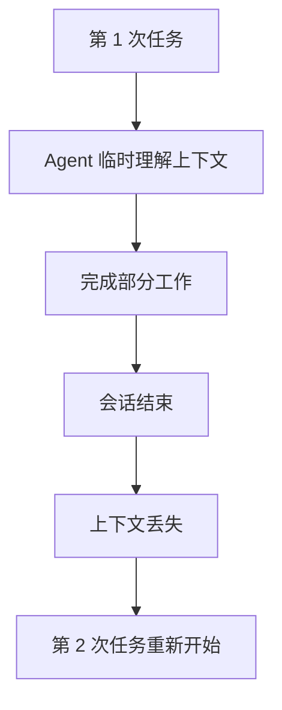
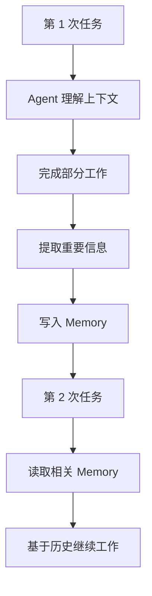
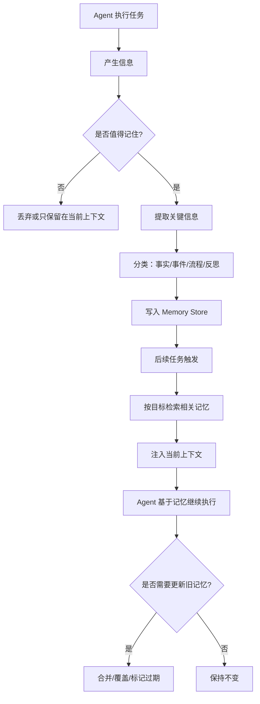
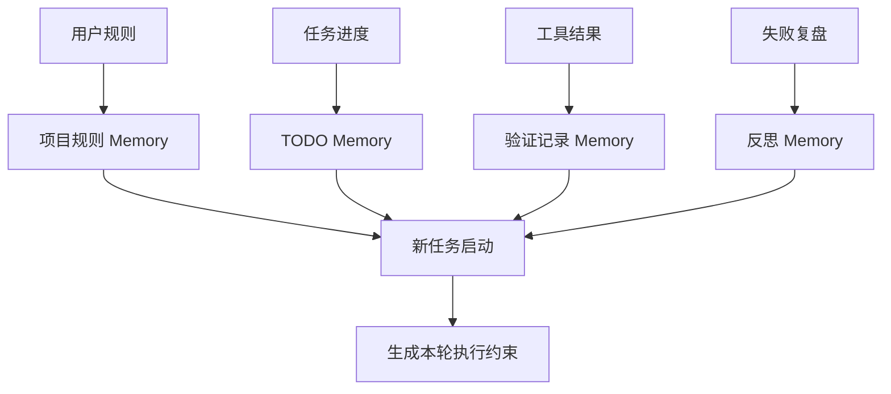
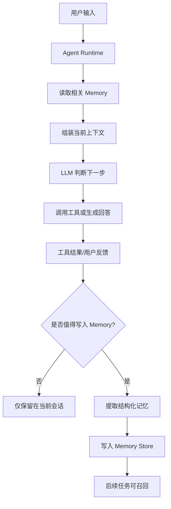
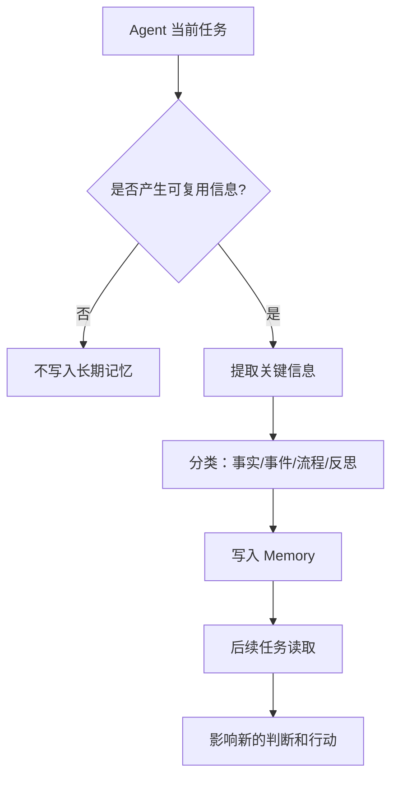


# Agent基础知识 05| Memory：短期上下文、长期记忆和反思机制

> 从短期上下文、长期记忆到自我反思，看 Agent 如何积累经验

上一篇我们讲了 RAG。

RAG 解决的是：

```text
Agent 不知道外部资料时，先去查，再回答。
```

但这里还有另一个问题：

> Agent 查到了资料、执行了任务、踩过了坑，下一次它还记得吗？

如果它每次都从零开始，那就会出现很尴尬的情况：

```text
你昨天刚告诉它：这个项目只能改当前目录。
今天它又跑去看外层工程。

你上次刚提醒它：改代码后一定要跑测试。
这次它又只改代码不验证。

你反复说：这个字段叫 pt_d，不叫 date。
它下一次还是写错。
```

这就是 **Memory** 要解决的问题。

---

## 一、先看一个真实问题：为什么 Agent 总像失忆一样？

假设你有一个本地 coding agent，你让它帮你排查一个数据 ETL 项目。

第一天，你告诉它：

```text
1. 只关注当前项目文件夹；
2. 不要扩展到外层微服务；
3. 每次先列 TODO；
4. 修改代码后必须提醒跑测试；
5. 真实表结构不确定时要问用户确认；
6. 本地用 mock Hive 测试。
```

它这次做得还不错。

第二天你继续同一个任务：

```text
继续做 TODO 5。
```

如果没有 Memory，它可能完全不知道：

```text
TODO 1 到 TODO 4 是什么；
前面有哪些设计约束；
哪些字段已经确认；
哪些是不能改的；
哪些测试已经跑过；
用户最在意什么。
```

这时它只能重新猜，或者让你把背景再说一遍。

这就是没有 Memory 的 Agent：



这张图里，`会话结束` 之后，前面建立的上下文没有被保存成可复用的信息。下一次任务进来时，Agent 只能从用户当前输入重新推断。

一个真正可用的 Agent 应该是这样：



这里的关键变化是：

> Agent 不只是完成当前任务，还会把值得保留的信息沉淀下来，下一次再取出来用。

这就是 Memory 的价值。

---

## 二、为什么会出现 Memory？

Memory 不是为了让 Agent “像人一样有感情”，而是为了解决工程系统里的长期状态问题。

---

### 1. 上下文窗口不是长期记忆

先解释一个概念：**上下文窗口**。

上下文窗口是什么？

> 上下文窗口是模型一次调用时能看到的输入范围，包括用户问题、历史对话、工具结果、文档片段等。

它为什么会出现？

模型不能无限处理文本，所以每次调用都有一个最大输入长度。这个长度就是上下文窗口。

它解决什么问题？

它让模型在当前对话里记住刚刚发生过什么。

但它不能解决长期记忆问题。

因为上下文窗口有几个限制：

|问题|表现|
|---|---|
|容量有限|对话太长后，早期内容会被压缩或丢弃|
|成本增加|历史越长，每次调用越贵|
|噪声增加|太多无关历史会干扰模型判断|
|不能天然跨会话|新会话不一定保留旧会话内容|

所以，上下文窗口更像“工作台上的纸”，而不是“档案库”。

它适合放当前正在处理的信息，但不适合长期保存经验、偏好和规则。

---

### 2. RAG 也不是 Memory

上一篇讲过 RAG 是“先查资料，再回答”。

那 RAG 和 Memory 有什么区别？

可以用这张表理解：

|对比项|RAG|Memory|
|---|---|---|
|主要对象|外部知识|交互历史、任务状态、用户偏好、经验|
|数据来源|文档、网页、数据库、知识库|用户对话、工具结果、Agent 执行过程|
|典型问题|“资料在哪里？”|“上次发生了什么？”|
|更新方式|文档同步、索引更新|任务过程中持续写入、更新、删除|
|目标|让模型知道外部事实|让 Agent 保持连续性和个性化|

举个例子：

```text
RAG 负责查：项目 README 里怎么描述部署流程。
Memory 负责记：上次用户说这个项目不能直接部署，只能先跑 mock 测试。
```

所以 RAG 和 Memory 不是替代关系，而是互补关系。

一个可靠 Agent 通常需要同时具备：

```text
RAG：查外部资料；
Memory：记住交互历史和任务经验。
```

---

### 3. Agent 需要跨任务积累经验

普通 Chatbot 的目标是回答当前问题。

Agent 的目标更复杂，它可能要连续完成任务：

```text
排查问题；
修改代码；
跑测试；
根据失败继续修；
整理报告；
下次接着做。
```

这类任务不是一问一答，而是长周期执行。

没有 Memory，Agent 会反复犯同样的错误：

```text
重复搜索已经确认过的文件；
重复问已经回答过的问题；
重复尝试失败过的方案；
忘记用户之前强调的限制；
忘记当前任务进度。
```

Memory 出现的核心原因是：

> Agent 从一次性问答，变成长期协作系统后，必须有状态管理。

这也是 2025—2026 年 Agent 研究中 Memory 变得重要的原因。近期综述指出，Agent Memory 已经成为 foundation-model-based agents 的核心能力之一，而且传统“短期/长期记忆”的简单分类已经不足以描述当前系统，需要从形式、功能和动态过程重新理解记忆。([arXiv](https://arxiv.org/abs/2512.13564 "Memory in the Age of AI Agents"))

---

## 三、Memory 到底是什么？

**Memory** 在 Agent 里可以理解为：

> Agent 在模型外部保存、管理、检索历史信息的机制。

这里有几个关键词：

```text
模型外部；
保存；
管理；
检索；
历史信息。
```

为什么强调“模型外部”？

因为模型参数本身不会因为一次对话就更新。你今天告诉模型一个项目规则，它不会自动写进模型权重里。要让它下次继续用，就必须把这条信息保存到某个外部位置，比如数据库、文件、向量库、图数据库，或者 Agent Runtime 的会话存储。

---

## 四、几个容易混淆的概念

先用表格把最容易混淆的词讲清楚。

|概念|它是什么|解决什么问题|不用它会怎样|
|---|---|---|---|
|Context|当前模型调用能看到的输入|让模型理解当前这一轮任务|模型只能孤立回答|
|Memory|跨轮次、跨任务可复用的历史信息|让 Agent 延续状态、记住偏好和经验|每次都从零开始|
|RAG|从外部知识库检索资料|让模型查文档、查网页、查代码|模型只能凭训练知识猜|
|Prompt|当前给模型的指令|约束模型这一次怎么做|模型行为不稳定|
|Parametric Memory|模型权重中学到的知识|提供通用语言和世界知识|模型没有基础能力|
|Session Store|保存一次任务会话状态的存储|支持中断恢复、继续执行|长任务无法恢复|

这张表里最重要的是两点：

第一，**Context 是短期的，Memory 是可持久化的**。  
第二，**RAG 主要查外部知识，Memory 主要保存 Agent 自己经历过的信息**。

---

## 五、Agent 需要记住什么？

不是所有信息都应该记住。

一个常见错误是：

```text
把所有对话、所有工具结果、所有日志都存进 Memory。
```

这会导致记忆膨胀、检索噪声增加、隐私风险上升。

Agent 真正应该记住的是那些“未来会影响行为”的信息。

|记忆类型|例子|为什么值得记|
|---|---|---|
|用户偏好|“回答先给短结论，不要大段展开”|影响后续交互风格|
|项目规则|“只关注当前项目文件夹，不扩展到外层微服务”|影响任务边界|
|任务进度|“TODO 4 已完成，TODO 5 暂停”|支持长任务续接|
|工具结果|“某个 SQL 已验证，字段 pt_d 存在”|避免重复验证|
|错误经验|“上次没跑 e2e 导致遗漏问题”|避免重复犯错|
|实体关系|“项目 A 依赖表 B，输出到表 C”|支持后续推理|
|历史决策|“用户确认第一版只做 APP + ALL + 单指标”|影响方案范围|

所以 Memory 不是“存聊天记录”，而是：

> 把未来有复用价值的信息提炼成结构化经验。

---

## 六、Memory 的核心类型

为了避免概念堆叠，我们不用机械重复“是什么、为什么、解决什么”。这里用一张表建立整体认知。

|类型|可以理解成|适合保存|不适合保存|
|---|---|---|---|
|Working Memory|当前任务工作台|当前目标、当前步骤、刚返回的工具结果|长期偏好、历史经验|
|Episodic Memory|事件记忆|某次任务发生了什么、做过哪些操作|稳定规则|
|Semantic Memory|事实记忆|项目结构、字段含义、实体关系|临时情绪和闲聊|
|Procedural Memory|流程记忆|如何做代码 review、如何排查配置问题|一次性事实|
|Reflective Memory|反思记忆|失败原因、下次避免策略|原始日志大文本|

下面逐个展开。

---

### 1. Working Memory：当前任务的临时工作区

Working Memory 是什么？

> 当前任务执行中，模型必须马上看到的信息。

比如你让 Agent 修一个 bug，Working Memory 里可能有：

```text
当前目标；
已经读过的文件；
刚刚失败的测试输出；
下一步计划；
用户刚刚补充的约束。
```

为什么需要它？

因为 Agent 每一步都要基于当前状态判断下一步。如果 Working Memory 不清楚，它就会乱跑。

不用它会怎样？

Agent 会忘记当前任务进度，比如已经读过文件又重复读，已经确认问题又重新搜索。

实现方式：

```text
直接放在当前上下文；
用 session state 保存；
每一步工具调用后更新状态摘要。
```

---

### 2. Episodic Memory：发生过的事件

Episodic Memory 可以理解为“事件记录”。

它保存的是：

```text
什么时候做了什么；
调用了什么工具；
得到什么结果；
用户做了什么确认；
任务最后如何结束。
```

比如：

```text
2026-06-03：用户确认 TODO 4 已完成，TODO 5 暂停。
2026-06-03：运行 mock Hive 测试通过，但未运行 e2e。
```

为什么需要它？

因为很多任务需要回看历史。

不用它会怎样？

Agent 无法解释“为什么现在不跑 e2e”，也无法知道上次为什么暂停某个任务。

实现方式：

```text
事件日志；
append-only session store；
任务报告；
工具 trace。
```

Claude Code 这类 coding agent 的研究分析中，append-oriented session storage、上下文压缩和权限系统都被视为 agent runtime 的重要部分，而不只是模型能力。([arXiv](https://arxiv.org/abs/2604.14228 "Dive into Claude Code: The Design Space of Today's and Future AI Agent Systems"))

---

### 3. Semantic Memory：稳定事实和知识

Semantic Memory 是“事实记忆”。

它保存相对稳定的信息：

```text
字段 pt_d 表示分区日期；
项目当前只关注 dev-data-anomaly 文件夹；
APP + ALL 是第一版范围；
某个表是输出表，某个表是输入表。
```

为什么需要它？

因为这些事实会反复影响后续判断。

不用它会怎样？

Agent 每次都要重新问你字段含义、任务范围和项目结构。

实现方式：

```text
结构化 JSON；
知识图谱；
向量数据库；
项目规则文档；
长期记忆库。
```

近期 Agent Memory 综述把 factual memory 作为功能维度之一，和 experiential memory、working memory 区分开来，说明“事实记忆”已经被视为 Agent Memory 的独立能力。([arXiv](https://arxiv.org/abs/2512.13564 "Memory in the Age of AI Agents"))

---

### 4. Procedural Memory：做事流程和技能

Procedural Memory 是“流程记忆”。

它保存的是：

```text
如何排查配置问题；
如何做代码 review；
如何验证 SQL 口径；
如何让 CC 分阶段汇报进展；
如何做插件鸿蒙化评估。
```

它不像 Semantic Memory 那样保存事实，而是保存“怎么做”。

为什么需要它？

因为 Agent 经常面对重复任务。如果每次都重新写一大段提示词，就很低效。

不用它会怎样？

用户每次都要重复说明流程，Agent 也容易漏步骤。

实现方式：

```text
Skill；
AGENTS.md；
CLAUDE.md；
提示词模板；
自动化 checklist；
可执行脚本。
```

2026 年关于 agentic coding tools 的研究指出，开发者已经开始通过仓库级 Markdown/JSON 配置来约束 Agent；研究覆盖 Claude Code、GitHub Copilot、Cursor、Gemini、Codex，并发现 Context Files、Skills 和 Subagents 是跨工具的重要配置机制。([arXiv](https://arxiv.org/abs/2602.14690 "Configuring Agentic AI Coding Tools: An Exploratory Study"))

---

### 5. Reflective Memory：失败后的反思总结

Reflective Memory 是“反思记忆”。

它保存的是：

```text
这次为什么失败；
下次如何避免；
哪条规则需要加入 checklist；
哪种工具调用容易出错。
```

比如：

```text
本次失败原因：字段名仍使用 date，未统一为 pt_d。
下次规则：涉及分区字段时，必须先确认项目统一口径。
```

为什么需要它？

因为 Agent 要变强，不只是记住事实，还要记住“错误模式”。

不用它会怎样？

它会一遍遍犯同样的错误。

实现方式：

```text
任务复盘；
错误模式库；
失败案例转 eval；
规则写入 Skill 或 AGENTS.md。
```

2026 年关于 autonomous LLM agents memory 的综述将 memory 描述为 write-manage-read loop，并把 reflective self-improvement、hierarchical virtual context、policy-learned management 等归为重要机制方向。([arXiv](https://arxiv.org/abs/2603.07670 "Memory for Autonomous LLM Agents:Mechanisms, Evaluation, and Emerging Frontiers"))

---

## 七、Memory 的工作流程

一个完整 Memory 系统不是“存起来再搜出来”这么简单。它至少包括五个动作：

```text
写入；
压缩；
组织；
检索；
更新或遗忘。
```

可以画成这样：



这张图的关键节点是：

`是否值得记住` 是写入过滤器。不是所有内容都该进长期记忆。  
`提取关键信息` 是把原始对话变成可复用信息。  
`分类` 是为了后续检索更准。  
`Memory Store` 可以是数据库、向量库、图数据库或文件。  
`按目标检索` 是读取阶段。  
`注入当前上下文` 是把记忆重新交给模型使用。  
`更新旧记忆` 是处理冲突、过期和纠错。

这个流程的设计原因是：

> Memory 如果只写不管，会变成垃圾堆；如果只读不写，又无法积累经验；如果不更新，就会被过期信息误导。

---

## 八、Memory 存在哪里？

Memory Store 有多种实现方式。

|存储方式|适合保存|优点|缺点|
|---|---|---|---|
|当前上下文|当前任务状态|简单、即时可见|不能长期保存|
|文本摘要文件|项目规则、任务进度|人类可读、易维护|检索能力弱|
|关系型数据库|结构化事实、任务状态|查询稳定、权限易控|不擅长语义检索|
|向量数据库|对话摘要、经验片段|语义检索方便|容易召回相似但不相关内容|
|图数据库|实体关系、时间关系|适合关系推理|建图和维护成本高|
|Git / 文档仓|ADR、规则、长期知识|可审计、可版本化|实时读写不够灵活|

所以没有一种 Memory Store 适合所有场景。

一个工程化 Agent 往往会组合使用：

```text
当前上下文：放正在处理的任务；
任务文件：放 TODO 和阶段报告；
向量库：放历史经验摘要；
数据库：放结构化状态；
图数据库：放实体关系；
Git：放长期规则和决策记录。
```

---

## 九、实际案例

### 1. Cursor：用项目上下文和会话历史降低重复劳动

Cursor 是 AI coding agent 和开发环境，可以根据自然语言修改代码、查询代码库，并支持代码库索引。([维基百科](https://en.wikipedia.org/wiki/Cursor_%28code_editor%29 "Cursor (code editor)"))

从 Memory 角度看，Cursor 需要处理两类信息：

|信息|属于什么记忆|
|---|---|
|当前打开文件、最近修改、终端输出|Working Memory|
|项目索引、文件结构、符号关系|Semantic Memory|
|用户对某次改动的接受或拒绝|Episodic Memory|
|“这个项目通常如何运行测试”|Procedural Memory|

比如你让 Cursor 修改某个接口，它会先理解当前文件、相关引用和已有 diff。下一轮你说“刚才那个实现不对，换成策略模式”，它需要知道“刚才那个实现”指的是什么。这依赖会话级记忆和当前任务上下文。

但是 Cursor 这类工具也容易遇到问题：

```text
上下文太长后，会忘记早期约束；
大型仓库中，索引命中不一定准确；
用户没明确边界时，Agent 会扩大修改范围。
```

所以 coding agent 的 Memory 不只是“记住聊天”，还要配合 diff、测试、文件索引和人工审查。

---

### 2. Claude Code：Memory 不只是记忆，而是 Runtime 的一部分

Claude Code 的公开架构分析指出，它的核心是一个 while-loop：模型调用工具，执行工具，再把结果交回模型继续循环；但大部分能力来自循环之外的系统，包括权限系统、五层上下文压缩、MCP/插件/skills/hooks、subagent 委托、session storage 等。([arXiv](https://arxiv.org/abs/2604.14228 "Dive into Claude Code: The Design Space of Today's and Future AI Agent Systems"))

这说明：

> Memory 在先进 Coding Agent 里不是独立小功能，而是 Agent Runtime 的一部分。

它要和这些系统协同：

|Runtime 组件|和 Memory 的关系|
|---|---|
|Context Compaction|把长历史压缩成可继续使用的摘要|
|Session Storage|保存任务历史，支持中断恢复|
|Skills|把重复流程变成可复用能力|
|Hooks|在工具调用前后记录状态或做校验|
|Subagents|给子任务独立上下文，避免主上下文污染|

举个例子：

```text
主 Agent 让 subagent 查日志；
subagent 读取大量日志；
subagent 只把“关键错误 + 文件位置 + 建议”返回给主 Agent；
主 Agent 把这个摘要写入当前任务记忆。
```

这样主 Agent 不需要吞下全部日志，也不会丢失关键结论。

---

### 3. 企业内部 Agent：记住规则比记住聊天更重要

企业内部 Agent 最重要的 Memory 往往不是用户闲聊，而是规则和流程。

比如数据 ETL 项目里，Agent 应该记住：

```text
当前项目目录边界；
TODO 清单；
字段命名口径；
测试要求；
真实表结构需要用户确认；
本地测试使用 mock Hive；
云端数据按 pt_d 查询。
```

这些信息一旦记住，Agent 下次就能少犯很多错。

可以设计成这样的结构：



这张图的流转是：

用户规则进入项目规则记忆；任务进度进入 TODO 记忆；工具结果进入验证记录；失败复盘进入反思记忆。下次任务开始时，这些记忆一起被读取，组合成本轮 Agent 的执行边界。

为什么这样设计？

因为企业内部任务更怕“忘规则”而不是“忘聊天”。

---

### 4. Manus / Skills：把流程经验变成可复用能力

Agent Skills 近年来成为重要抽象。Skills 可以理解成模块化能力包，里面包含说明、脚本、资源，Agent 在需要时按需加载，而不是把所有流程知识都塞进主上下文。2026 年关于 Agent Skills 的综述指出，Skills 将指令、代码、资源打包成可组合模块，并通过 progressive disclosure 按需加载，和 MCP 一起构成可扩展 Agent 能力层。([arXiv](https://arxiv.org/abs/2602.12430 "Agent Skills for Large Language Models: Architecture, Acquisition, Security, and the Path Forward"))

这和 Memory 有什么关系？

Procedural Memory 最适合沉淀成 Skill。

比如：

```text
配置问题排查 Skill；
SQL 口径验证 Skill；
代码 Review Skill；
插件鸿蒙化评估 Skill；
ETL 本地 mock 测试 Skill。
```

它们不是简单记住事实，而是记住“如何完成一类任务”。

不过 Skills 也带来安全风险。近期研究指出，SKILL.md 这类自然语言说明不是被动文档，而会影响 Agent 如何发现、选择和加载能力包；恶意或脆弱的技能说明可能引导 Agent 选择错误能力或绕过治理。([arXiv](https://arxiv.org/abs/2605.11418 "Under the Hood of SKILL.md: Semantic Supply-chain Attacks on AI Agent Skill Registry"))

所以流程记忆要变成 Skill 时，必须考虑来源、权限和审查。

---

## 十、主流 Memory 方案怎么选？

### 1. Conversation Summary：最简单的摘要记忆

做法：

```text
每隔一段时间，把历史对话总结成摘要。
```

优点：

```text
实现简单；
成本低；
适合轻量助手。
```

缺点：

```text
摘要会丢细节；
多次摘要可能语义漂移；
难以处理结构化事实和时间变化。
```

适合：

```text
普通聊天助手；
短期项目协作；
不要求高精度的个人助理。
```

不适合：

```text
合规场景；
代码排查；
需要精确历史事实的任务。
```

---

### 2. Vector Memory：向量记忆

做法：

```text
把历史信息切片、向量化，后续按语义相似度检索。
```

优点：

```text
检索方便；
适合自然语言经验；
实现成熟。
```

缺点：

```text
容易召回“相似但不正确”的记忆；
不擅长时间关系；
不擅长冲突处理。
```

适合：

```text
历史对话检索；
用户偏好检索；
知识片段复用。
```

不适合：

```text
精确时间推理；
复杂实体关系；
强审计场景。
```

---

### 3. Graph Memory：图记忆

做法：

```text
把用户、项目、字段、任务、事件等建成节点和关系。
```

优点：

```text
适合实体关系；
支持多跳推理；
可解释性强。
```

缺点：

```text
建图成本高；
实体抽取容易错；
维护复杂。
```

适合：

```text
组织关系；
项目依赖；
客户关系；
知识图谱问答。
```

Zep 就是一个代表性方向，它用 Graphiti 构建 temporal knowledge graph，用来整合会话数据和业务数据，并维护历史关系；论文中强调其面向企业应用中的动态知识整合和时间推理。([arXiv](https://arxiv.org/abs/2501.13956 "Zep: A Temporal Knowledge Graph Architecture for Agent Memory"))

---

### 4. Hierarchical Memory：分层记忆

做法：

```text
把记忆分为当前上下文、近期记忆、长期归档。
```

优点：

```text
符合长任务需求；
减少上下文爆炸；
便于按层级检索。
```

缺点：

```text
实现复杂；
需要设计何时迁移、压缩、遗忘。
```

适合：

```text
长周期项目；
研究助手；
coding agent；
个人长期助手。
```

Mem0 这类系统把长期记忆设计成可抽取、合并、检索的结构化机制；其论文指出，固定上下文窗口在长时间多会话对话中难以维持一致性，因此需要动态抽取、整合和检索重要信息。([arXiv](https://arxiv.org/abs/2504.19413 "Mem0: Building Production-Ready AI Agents with Scalable Long-Term Memory"))

---

### 5. Learned Memory Management：学习式记忆管理

做法：

```text
让模型或策略学习决定什么该记、什么该忘、什么时候读。
```

优点：

```text
更适合长程复杂任务；
可以控制记忆规模；
可能比规则更灵活。
```

缺点：

```text
训练成本高；
可解释性弱；
还在快速研究阶段。
```

适合：

```text
长程 web 任务；
多轮购物/检索；
科学研究代理；
复杂多目标任务。
```

例如 MEM1 研究提出让 Agent 在长程多轮任务中维护紧凑共享状态，并通过策略丢弃无关信息，以减少全历史上下文带来的成本和性能问题。([arXiv](https://arxiv.org/abs/2506.15841 "MEM1: Learning to Synergize Memory and Reasoning for Efficient Long-Horizon Agents"))

---

## 十一、Memory 为什么需要 Evaluation？

Memory 很容易看起来有用，但实际不可靠。

你不能只问：

```text
它有没有记住？
```

还要问：

```text
它有没有记对？
它什么时候该记？
它有没有记错？
它有没有把过期信息当成最新信息？
它有没有泄露隐私？
它有没有召回无关记忆？
```

所以 Memory Evaluation 至少要覆盖这些维度：

|评测维度|要回答的问题|
|---|---|
|Recall|需要记住的信息能不能找回来？|
|Precision|找回来的记忆是否真的相关？|
|Temporal Reasoning|能否区分过去和现在？|
|Conflict Handling|新旧信息冲突时如何处理？|
|Cost|记忆读写是否过贵？|
|Latency|检索是否太慢？|
|Privacy|是否召回了不该访问的信息？|
|Robustness|是否容易被错误或恶意信息污染？|

近期关于 Agent Memory 的综述已经把 evaluation 明确纳入核心讨论，并指出评测正从静态召回走向多会话、多任务、与决策耦合的 Agentic 测试。([arXiv](https://arxiv.org/abs/2603.07670 "Memory for Autonomous LLM Agents:Mechanisms, Evaluation, and Emerging Frontiers"))

---

## 十二、Memory 的风险和治理

Memory 不是越多越好。

### 1. 记错

如果 Agent 把错误结论写进长期记忆，下次就会继续基于错误行动。

比如：

```text
错误记忆：目标表字段叫 date。
真实情况：字段叫 pt_d。
```

后续所有 SQL 都可能写错。

治理方式：

```text
写入前校验；
关键记忆需要来源；
人类确认后再长期保存；
保存版本，支持回滚。
```

---

### 2. 记太多

如果什么都记，记忆库很快变成垃圾堆。

治理方式：

```text
只存未来可复用信息；
原始日志不长期保存，只存摘要；
设置过期时间；
定期压缩和清理。
```

---

### 3. 过期

项目规则会变，人员会变，表结构会变。

治理方式：

```text
每条记忆带时间戳；
区分当前事实和历史事实；
新事实覆盖旧事实时保留版本；
回答时优先使用最新有效记忆。
```

---

### 4. 隐私泄露

Memory 里可能有：

```text
用户偏好；
内部项目规则；
数据库信息；
客户记录；
密钥路径；
日志片段。
```

治理方式：

```text
敏感信息脱敏；
按用户和项目隔离；
最小权限访问；
审计 memory read/write；
禁止把敏感内容写入第三方不可信存储。
```

---

### 5. Skill / Memory 被投毒

如果 Agent 会从外部加载技能、规则或记忆，就可能被恶意内容影响。

例如一个恶意 Skill 的描述可能诱导模型优先选择它。2026 年关于 SKILL.md 攻击的研究显示，技能描述本身会影响 Agent 的发现、选择和治理环节，因此它不是“普通文档”，而是会改变 Agent 行为的操作性文本。([arXiv](https://arxiv.org/abs/2605.11418 "Under the Hood of SKILL.md: Semantic Supply-chain Attacks on AI Agent Skill Registry"))

治理方式：

```text
技能来源审核；
签名和版本控制；
只允许白名单技能；
高风险技能必须人工批准；
扫描自然语言指令中的注入风险。
```

---

## 十三、工程实践：怎么给自己的 Agent 加 Memory？

一个可落地的最小方案可以这样做。

### 第一步：先定义记忆类型

不要一上来搞向量库，先定义你到底要记什么：

```text
用户偏好；
项目规则；
任务进度；
工具结果；
失败复盘。
```

---

### 第二步：设计记忆格式

比如项目规则可以用 JSON：

```json
{
  "type": "project_rule",
  "project": "dev-data-anomaly",
  "content": "只关注当前项目文件夹，不扩展到外层微服务",
  "source": "user_confirmed",
  "created_at": "2026-06-03",
  "status": "active"
}
```

任务进度也可以结构化：

```json
{
  "type": "todo_state",
  "todo_id": "TODO_4",
  "status": "done",
  "summary": "字段名 pt_d 对齐补丁已完成",
  "evidence": ["transform/transformers/prophet_anomaly.py"]
}
```

---

### 第三步：设计写入规则

不是所有信息都写。

可以规定：

|信息|是否写入|
|---|---|
|用户明确强调的长期规则|写|
|当前任务 TODO 状态|写|
|工具临时输出|只写摘要|
|大段日志|不写原文|
|未验证猜测|不写长期记忆|
|敏感凭据|禁止写|

---

### 第四步：设计读取规则

新任务开始时，读取：

```text
项目规则；
当前 TODO；
最近失败复盘；
和当前问题相关的历史验证结果。
```

不要把所有记忆都塞回上下文。

读取时要做筛选：

```text
按项目过滤；
按时间过滤；
按任务类型过滤；
按用户权限过滤；
按相关性排序。
```

---

### 第五步：设计更新和遗忘

Memory 必须允许更新。

比如用户说：

```text
前面那个规则改一下，现在 TODO 开始时不需要列所有历史注意事项了。
```

系统应该把旧规则标记为 inactive，而不是直接硬删。

这样可以追踪为什么行为发生变化。

---

## 十四、一个最小 Memory 架构



图里的关键是：

`Agent Runtime` 是 Memory 的管理者。  
`LLM` 不直接随便写内存，而是通过 Runtime 的规则写入。  
`是否值得写入` 是最重要的过滤步骤。  
`Memory Store` 可以是数据库、向量库、文件或图数据库。  
`后续任务可召回` 才是 Memory 的目的。

为什么不能让模型随便写？

因为模型可能把错误推测、隐私信息或临时噪声写进去。

所以 Memory 必须由 Runtime 管控，而不是完全交给模型自由发挥。

---

## 十五、这一篇的核心结论

Memory 可以总结成一句话：

> **Memory 不是保存聊天记录，而是让 Agent 把未来会影响行为的信息保存、管理并按需取回。**

它为什么会出现？

```text
上下文窗口有限；
长任务需要状态；
跨会话需要连续性；
用户偏好需要沉淀；
Agent 需要避免重复犯错。
```

它解决什么问题？

```text
让 Agent 不再每次从零开始；
让 Agent 能延续任务进度；
让 Agent 能记住用户偏好；
让 Agent 能复用历史验证结果；
让 Agent 能从错误中形成规则。
```

最后用一张图总结：



Memory 的关键不是“记得越多越好”，而是：

> 该记的准确记住，不该记的及时丢掉，过期的能够更新，敏感的不能泄露。

一个可靠 Agent 的长期能力，往往不是来自模型参数本身，而是来自它外部的记忆系统、运行时管理和评测治理。
