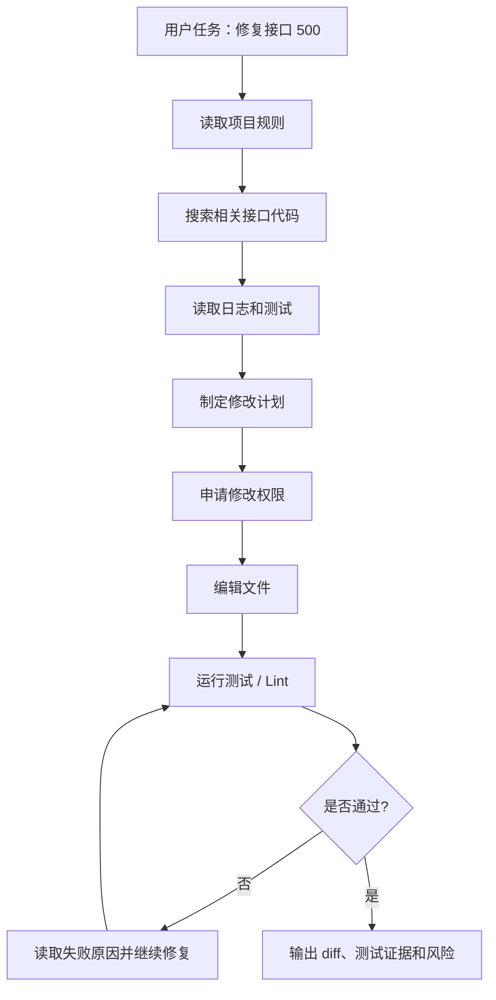
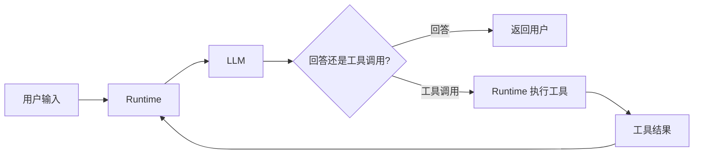
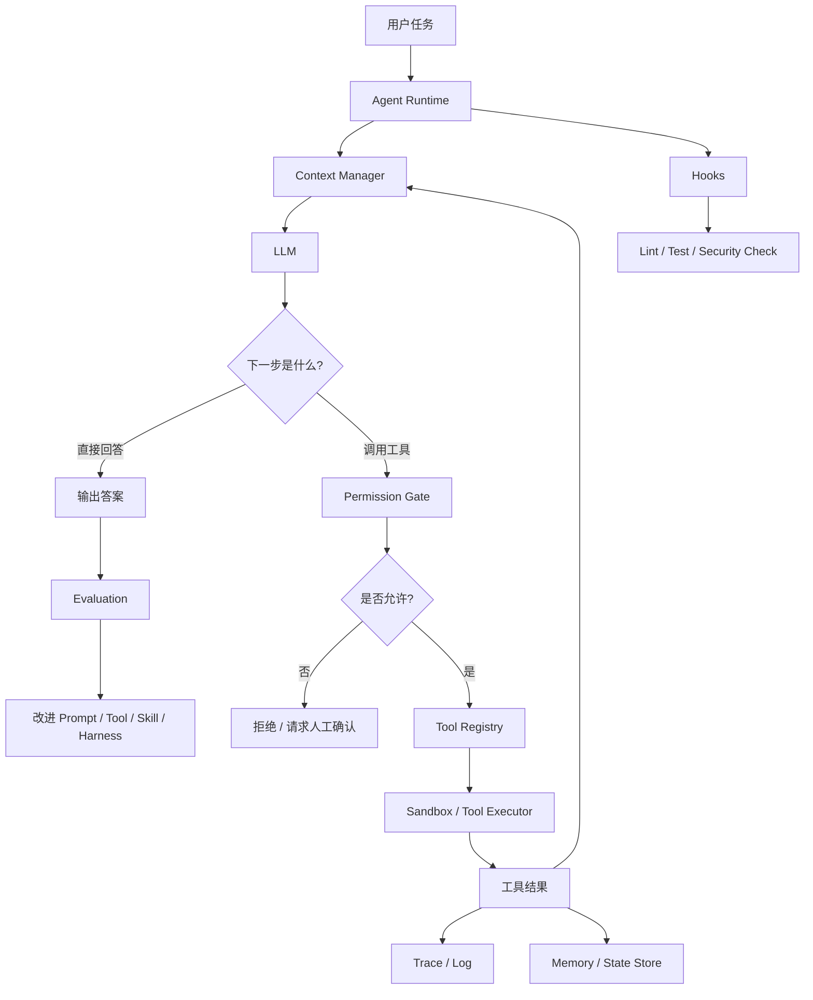
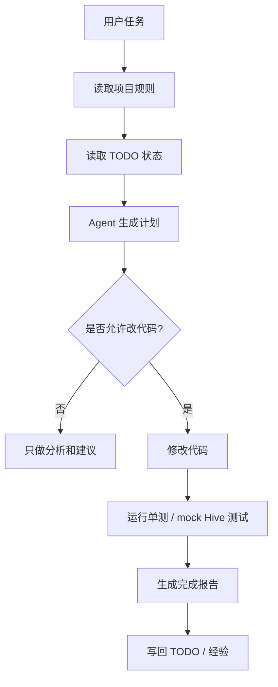
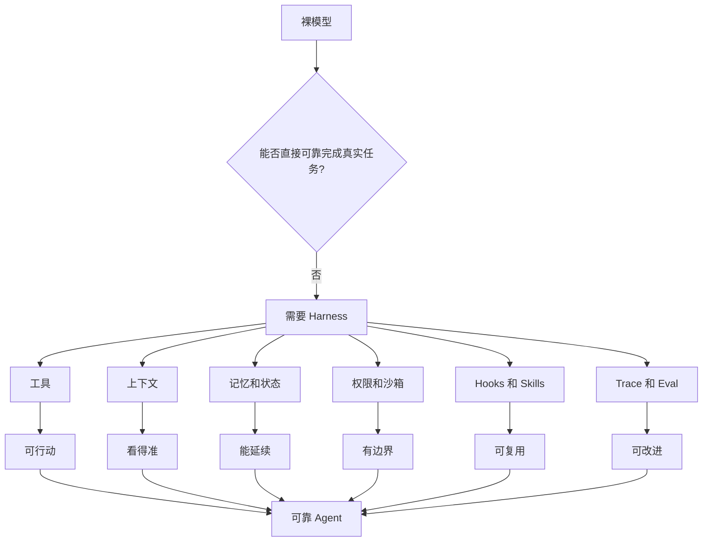

# Agent基础知识 07| Agent Harness：真正让 Agent 可靠的不是模型，是工作台

> 从 Claude Code、Codex 与 Agents SDK 看 Agent 的工具、权限、状态、记忆、评测和运行环境如何组成“工作台”

前面几篇我们讲过：

```text
RAG：让 Agent 先查资料，再回答。
Memory：让 Agent 记住历史、状态和经验。
MCP：让多个 Agent 复用同一批工具。
```

但这里还有一个更底层的问题：

> 为什么同一个模型，在不同产品里表现差别这么大？  
> 为什么 Claude Code、Codex、Cursor 这类产品比“裸模型 + 几个工具”更稳定？
> 为什么同样是M2.7，在现在的CodeAgent里面时常犯傻，但在ClaudeCode里却备受好评？
> 为什么有些 Agent 一上来就乱改代码，有些 Agent 却能规划、修改、测试、总结、等待你确认？

答案不是“模型更聪明”这么简单。

真正拉开差距的是：

> **Harness。**

---

## 一、先看一个真实问题：为什么同一个模型，有的 Agent 好用，有的 Agent 很蠢？

假设你让一个普通模型帮你修一个 bug：

```text
这个接口 500 了，帮我修一下。
```

如果只是裸模型，它可能直接开始猜：

```text
可能是参数为空；
可能是数据库连接失败；
可能是异常没捕获。
```

然后给你一段看起来合理但不一定能跑的代码。

但一个成熟的 Coding Agent 应该这样做：



这张图里，真正让 Agent 可靠的不是单独的模型，而是周围这一整套“工作台”：

|环节|作用|
|---|---|
|读取项目规则|避免 Agent 不知道边界|
|搜索代码|让 Agent 基于真实项目工作|
|读取日志和测试|给 Agent 真实反馈|
|制定计划|避免一上来乱改|
|申请权限|控制高风险动作|
|编辑文件|真正执行任务|
|运行测试|验证结果|
|输出 diff 和证据|方便人类 review|

这整套系统，就是 **Harness**。

---

## 二、为什么会出现 Harness？

前面说过，Agent 不是一次性回答，而是在循环中工作：

```text
观察 → 判断 → 行动 → 再观察
```

这个循环听起来很简单，但一旦进入真实工程环境，就会遇到很多问题。

### 1. 模型自己不会操作环境

大模型本质上只会生成文本。

它不会天然拥有：

```text
文件系统；
终端；
数据库；
浏览器；
Git；
测试框架；
日志平台；
权限系统。
```

如果没有这些外部能力，它最多只是一个 Chatbot。

所以 Agent 要真正干活，必须有工具和执行环境。

---

### 2. 模型自己不会判断权限边界

用户说：

```text
帮我清理一下无用文件。
```

模型可能认为删除文件是合理动作。

但在工程环境里，这个动作很危险：

```text
它可能删错目录；
可能删除未提交代码；
可能删除生成数据；
可能影响其他服务。
```

所以 Agent 必须有权限控制。

---

### 3. 模型自己不会稳定记住长期规则

你告诉 Agent：

```text
这个项目只看当前目录，不要扩展到外层微服务。
```

如果没有 Memory 或项目规则文件，它下一轮可能又忘了。

所以 Agent 必须有状态、记忆和规则注入。

---

### 4. 模型自己不会自动验证结果

模型可以说：

```text
我已经修复了。
```

但它说修复了，不代表真的修复了。

真实工程里，必须看：

```text
测试是否通过；
lint 是否通过；
diff 是否合理；
功能是否符合需求；
有没有引入新风险。
```

所以 Agent 必须有反馈机制和评测机制。

---

### 5. 复杂任务不能只靠 prompt

很多人一开始以为，只要写一个很强的系统提示词，就能让 Agent 稳定工作。

但真实情况是：

```text
提示词只能告诉模型应该怎么做；
Harness 才能限制它能做什么、看到什么、如何验证、何时停止。
```

Anthropic 在《Building effective agents》里也强调，成功的 agentic system 往往不是一上来堆复杂框架，而是从简单、可组合模式开始；他们同时区分了 workflow 和 agent，并指出 agent 在执行时需要从环境中获得 ground truth，例如工具结果或代码执行结果，再根据这些反馈推进任务。([Anthropic](https://www.anthropic.com/engineering/building-effective-agents "Building Effective AI Agents \ Anthropic"))

这就是 Harness 出现的根本原因：

> Agent 开始进入真实环境后，仅有模型和 prompt 不够，必须有一套工作台来管理工具、上下文、权限、状态、反馈和评测。

---

## 三、Harness 到底是什么？

**Harness** 直译是“ harness / 牵引装置 / 安全带 / 控制架”。在 Agent 语境里，可以理解为：

> **模型之外，所有让 Agent 能够安全、稳定、可验证地工作的工程系统。**

可以用一句话记：

```text
Agent = Model + Harness
```

也就是说：

```text
模型负责推理和决策；
Harness 负责提供工作环境、工具、规则、权限、状态、反馈和评测。
```

如果把模型比作一个开发者，那么 Harness 就是它的：

```text
电脑；
IDE；
终端；
Git；
项目文档；
测试环境；
权限系统；
代码规范；
CI；
日志平台；
review 流程。
```

没有 Harness 的模型，就像一个聪明但没有电脑、没有权限、没有项目资料、没有测试环境的开发者。

---

## 四、Harness 的核心组成

先用一张表建立整体认知。

|组件|可以理解成|主要解决什么问题|
|---|---|---|
|Runtime|Agent 的运行时|控制 Agent Loop 如何执行|
|Tool Registry|工具清单|告诉模型有哪些工具、怎么用|
|Context Manager|上下文管理器|控制模型看到什么、不看到什么|
|Memory / State Store|状态与记忆|支持跨轮次、跨会话继续工作|
|Permission Gate|权限门|防止危险工具被随意调用|
|Sandbox|沙箱|限制执行环境的破坏范围|
|Hooks / Middleware|钩子和中间件|在关键动作前后插入校验或自动化|
|Skills / Instructions|可复用流程知识|沉淀团队经验和任务流程|
|Subagents|专用子代理|隔离上下文、分工处理复杂任务|
|Trace / Observability|可观测性|记录 Agent 为什么这么做|
|Evaluation|评测体系|判断 Agent 是否真的变好|

下面逐个讲。

---

## 五、Runtime：Agent 的运行时

**Runtime** 是什么？

> Runtime 是真正执行 Agent Loop 的环境。

它负责：

```text
把用户输入交给模型；
把工具列表交给模型；
解析模型的工具调用；
执行工具；
把工具结果放回上下文；
控制最大轮数；
处理中断、错误、重试和结束条件。
```

如果没有 Runtime，模型只能“说我要调用工具”，但没人真正执行。

Runtime 类似后端服务里的主流程控制器：



这张图里：

`Runtime` 是中枢。  
`LLM` 只负责判断下一步。  
`工具调用` 必须回到 Runtime 执行。  
`工具结果` 再由 Runtime 注入下一轮模型输入。

Claude Code 这类工具的公开分析也指出，其核心是一个简单 while-loop：调用模型、运行工具、重复；但大部分系统复杂度都在这个 loop 周围，包括权限系统、上下文压缩、MCP、skills、hooks、subagent 和 session storage。([arXiv](https://arxiv.org/abs/2604.14228?utm_source=chatgpt.com "Dive into Claude Code: The Design Space of Today's and Future AI Agent Systems"))

---

## 六、Tool Registry：工具不是越多越好，而是要清楚可控

**Tool Registry** 是工具注册表。

它是什么？

> Tool Registry 记录 Agent 能用哪些工具、每个工具做什么、参数是什么、风险是什么。

比如：

|工具|作用|风险|
|---|---|---|
|`read_file`|读取文件|低|
|`grep`|搜索代码|低|
|`run_test`|运行测试|中|
|`edit_file`|修改文件|中|
|`delete_file`|删除文件|高|
|`deploy`|发布服务|高|

为什么需要 Tool Registry？

因为模型需要知道：

```text
有哪些工具；
什么时候用；
参数怎么填；
工具边界是什么；
哪些工具危险。
```

不用 Tool Registry 会怎样？

模型可能：

```text
调用不存在的工具；
用错参数；
把搜索工具当执行工具；
把危险工具当普通工具；
重复调用无效工具。
```

Anthropic 在 agent patterns 文章里特别强调，工具定义和说明应该像给初级开发者写 docstring 一样清楚，包括示例、边界、输入格式要求和易错点；他们甚至提到，在 SWE-bench agent 中花在优化工具上的时间超过了优化整体 prompt 的时间。([Anthropic](https://www.anthropic.com/engineering/building-effective-agents "Building Effective AI Agents \ Anthropic"))

所以 Harness 里的工具设计，不是简单暴露 API，而是：

> 为模型设计一套容易理解、难以误用、可审计的操作界面。

---

## 七、Context Manager：不是把所有东西都塞给模型

**Context Manager** 是上下文管理器。

它是什么？

> 它决定模型当前这一轮应该看到哪些信息。

包括：

```text
用户任务；
系统规则；
项目规则；
最近对话；
工具结果；
相关代码；
相关文档；
记忆摘要；
错误日志。
```

为什么需要 Context Manager？

因为上下文窗口有限，资料太多会产生三个问题：

|问题|表现|
|---|---|
|成本高|每次调用都更贵|
|噪声大|模型抓不到重点|
|容易混淆|旧信息和新信息冲突|

一个好的 Harness 不会把所有东西都塞进去，而是做选择：

```text
当前任务需要什么？
哪些历史规则必须保留？
哪些日志只需要摘要？
哪些文件应该由 subagent 单独阅读？
哪些内容已经过期？
```

Claude Code 文档里也明确提到，`CLAUDE.md` 可以作为项目根目录下的持久说明文件，用来保存编码标准、架构决策、偏好库和 review checklist；同时 Claude Code 会在工作过程中建立 auto memory，保存 build commands 和 debugging insights 等跨会话知识。([Claude API Docs](https://docs.claude.com/en/docs/claude-code/overview "Overview - Claude Code Docs"))

这说明先进 Agent 的上下文不是靠用户反复粘贴，而是由 Harness 主动组织。

---

## 八、Memory / State Store：让任务可以继续，而不是每次重来

前一篇已经讲过 Memory。

在 Harness 里，Memory 和 State Store 主要解决两个问题：

```text
跨会话记住规则；
长任务保存状态。
```

比如一个 Agent 跑 ETL 修复任务时，State Store 应该保存：

```text
当前 TODO；
已经修改的文件；
已经跑过的测试；
失败的测试原因；
用户确认过的约束；
下一步计划。
```

如果没有 State Store，Agent 一旦中断，就只能从头开始。

OpenAI Agents SDK 文档中也明确提到，SDK 路线适合“你的服务器拥有 orchestration、tool execution、state 和 approvals”的场景，并支持自定义存储或服务端管理的会话策略。([OpenAI平台](https://platform.openai.com/docs/guides/agents-sdk "Agents SDK | OpenAI API"))

这说明在生产系统里，状态不应该完全托管给模型上下文，而要由应用服务器管理。

---

## 九、Permission Gate：危险动作不能只靠模型自觉

**Permission Gate** 是权限门。

它是什么？

> 在 Agent 调用高风险工具前，先判断是否允许执行。

例如这些动作必须拦截：

```text
删除文件；
修改大量代码；
执行 shell 命令；
连接生产库；
写入数据库；
发送邮件；
创建工单；
触发部署。
```

为什么需要 Permission Gate？

因为模型会犯错，而且自然语言指令可能模糊。

用户说：

```text
清理一下这个目录。
```

到底是删除缓存文件，还是删除整个目录？

如果没有权限门，Agent 可能做出不可逆操作。

Permission Gate 的常见策略：

|风险等级|处理方式|
|---|---|
|只读操作|自动执行|
|小范围写操作|展示 diff 后确认|
|执行命令|根据命令白名单判断|
|删除 / 发布 / 发消息|必须人工确认|
|生产库写入|默认禁止|

OpenAI Agents SDK 文档也把 Guardrails 和 human review 作为 workflow 可能需要 block 或 pause 的机制；文档建议在 risky work 继续之前加入验证或人工 review。([OpenAI平台](https://platform.openai.com/docs/guides/agents-sdk "Agents SDK | OpenAI API"))

这就是 Harness 可靠性的关键：

> 不要相信模型永远自觉，要用系统边界限制它。

---

## 十、Sandbox：让错误有边界

**Sandbox** 是沙箱。

它是什么？

> 一个受限制的执行环境，用来运行 Agent 的命令、代码和工具。

为什么需要 Sandbox？

因为 Agent 可能执行错误命令。

比如：

```bash
rm -rf ./data
```

如果在真实工作目录执行，可能造成严重损失。  
如果在沙箱执行，损失范围被限制。

Sandbox 常见能力：

```text
限制文件访问范围；
限制网络访问；
限制系统命令；
限制环境变量；
隔离依赖安装；
保存执行快照；
支持回滚。
```

OpenAI Agents SDK 文档中也把 Sandbox agents 单独列为能力入口，说明当 Agent 需要文件、命令、包、快照、挂载或 provider links 时，应使用容器化环境。([OpenAI平台](https://platform.openai.com/docs/guides/agents-sdk "Agents SDK | OpenAI API"))

对企业来说，Sandbox 是 Agent 从 demo 走向生产的关键。

---

## 十一、Hooks：把确定性校验塞进 Agent 工作流

**Hook** 是钩子。

它是什么？

> Hook 是在 Agent 生命周期的特定时机自动触发的命令、HTTP 请求或提示。

比如：

```text
Agent 编辑文件后，自动运行 formatter；
Agent 提交前，自动跑 lint；
Agent 调用 Bash 前，检查是否包含危险命令；
Agent 结束任务时，自动生成报告。
```

为什么需要 Hook？

因为有些事情不应该交给模型“记得去做”，而应该由系统自动执行。

Claude Code 文档对 hooks 的定义是：用户定义的 shell commands、HTTP endpoints 或 LLM prompts，会在 Claude Code 生命周期的特定点自动执行；Hook 事件包括每个 session、每个 turn，以及 agent loop 内每个 tool call 的 PreToolUse、PostToolUse 等。([Claude API Docs](https://docs.claude.com/en/docs/claude-code/hooks "Hooks reference - Claude Code Docs"))

这对工程师非常重要。

例如你不应该只写提示：

```text
记得修改代码后跑 lint。
```

更好的 Harness 是：

```text
PostToolUse(edit_file) → 自动运行 lint
```

这样模型忘了也没关系。

Hook 的价值是：

> 把“希望模型遵守的规则”，变成“系统自动执行的规则”。

---

## 十二、Skills：把重复流程变成能力包

**Skill** 是可复用能力包。

它是什么？

> Skill 把一类任务的说明、脚本、参考文件和执行流程打包，Agent 在需要时加载使用。

比如：

```text
代码 review skill；
SQL 口径验证 skill；
配置排查 skill；
发布检查 skill；
PR 描述生成 skill。
```

Claude Code 文档中，Skills 可以包含 `SKILL.md`、支持文件、示例和脚本；`SKILL.md` 包含 frontmatter 和具体指令，并可以通过 description 帮助 Claude 判断何时使用。Claude Code 的 skills 还支持动态上下文注入，例如执行 `git diff HEAD` 后把当前 diff 放进 prompt。([Claude API Docs](https://docs.claude.com/en/docs/claude-code/skills "Extend Claude with skills - Claude Code Docs"))

为什么 Skill 属于 Harness？

因为它不是模型参数，而是外部流程知识。

它让团队可以把经验沉淀成标准能力：

```text
新成员不用重新学；
Agent 不用每次重新被提示；
不同项目可以共享一套工作流。
```

这和前面说的 Procedural Memory 很接近：

> Memory 记住“过去发生了什么”；Skill 沉淀“以后应该怎么做”。

---

## 十三、Subagents：不是多几个模型聊天，而是隔离上下文和职责

**Subagent** 是子代理。

它是什么？

> 一个专门处理某类任务的独立 Agent，拥有自己的上下文、提示词、工具权限和执行范围。

Claude Code 文档对 subagent 的说明很清楚：当一个 side task 会把主对话淹没在搜索结果、日志或文件内容中时，可以让 subagent 在自己的上下文里完成工作，只把摘要返回主对话；每个 subagent 有自己的上下文窗口、系统提示词、工具访问和独立权限。([Claude API Docs](https://docs.claude.com/en/docs/claude-code/sub-agents "Create custom subagents - Claude Code Docs"))

为什么需要 Subagent？

因为主 Agent 的上下文很宝贵。

比如让 Agent 查日志：

```text
日志可能有 5 万行；
主 Agent 不应该读完整日志；
应该让日志分析 subagent 读取、筛选、总结；
主 Agent 只接收关键结论。
```

Subagent 的价值：

|价值|说明|
|---|---|
|上下文隔离|大量搜索结果不污染主对话|
|职责专用|不同子代理使用不同 prompt|
|权限控制|子代理只能用部分工具|
|成本控制|简单子任务可用更便宜模型|
|并行执行|多个子任务同时做|

这也是为什么 Multi-Agent 不应该理解成“几个 AI 聊天群”，而应该理解成：

> 上下文隔离 + 任务分工 + 权限隔离 + 结果汇总。

---

## 十四、Trace / Observability：没有可观测性，就无法改进 Agent

**Trace** 是轨迹记录。

它是什么？

> Trace 记录 Agent 每一步做了什么：模型输入、工具调用、工具结果、权限判断、错误、耗时、成本。

为什么需要 Trace？

因为 Agent 的错误往往不是最终答案错这么简单，而是路径错。

比如：

```text
它为什么查了这个文件？
为什么没查另一个文件？
为什么调用了危险命令？
为什么重复搜索同一个关键词？
为什么没有跑测试？
```

没有 trace，只能猜。

有 trace，就能复盘：

```text
用户输入是什么；
模型看到了什么；
它选择了哪个工具；
工具返回什么；
它为什么继续或停止；
最后答案基于哪些证据。
```

OpenAI Agents SDK 文档也建议先用 traces 调试，再进入 evaluation loops；同时 SDK 路线适合需要直接控制工具、MCP servers、runtime behavior、自定义存储和应用逻辑集成的场景。([OpenAI平台](https://platform.openai.com/docs/guides/agents-sdk "Agents SDK | OpenAI API"))

这就是生产 Agent 和玩具 demo 的区别：

> Demo 看结果；生产系统看过程。

---

## 十五、Evaluation：不能靠感觉判断 Agent 好不好

**Evaluation** 是评测。

它是什么？

> 用固定任务集和指标判断 Agent 是否达标、是否退化、是否真的变好。

为什么需要 Evaluation？

因为 Agent 是非确定性的。同一个任务，它可能这次成功，下次失败。

没有评测，你只能凭感觉说：

```text
好像变强了。
```

但工程上需要回答：

```text
成功率提升了吗？
工具调用次数变多了吗？
延迟变高了吗？
成本变贵了吗？
失败类型有没有减少？
有没有引入新的安全风险？
```

Anthropic 也强调，成功不是构建最复杂的系统，而是为需求构建正确的系统；应该从简单 prompt 开始，通过 comprehensive evaluation 优化，只有当简单方案不够时才增加多步骤 agentic system。([Anthropic](https://www.anthropic.com/engineering/building-effective-agents "Building Effective AI Agents \ Anthropic"))

所以 Harness 需要评测集，就像后端需要单测、集成测试和压测。

---

## 十六、一个完整 Agent Harness 长什么样？

可以用这张图总结：



这张图里：

`Agent Runtime` 控制整个循环。  
`Context Manager` 决定模型看到什么。  
`LLM` 做判断。  
`Permission Gate` 管危险动作。  
`Tool Registry` 提供工具定义。  
`Sandbox / Tool Executor` 真正执行动作。  
`Trace / Log` 记录过程。  
`Memory / State Store` 保存状态。  
`Hooks` 在关键节点自动执行校验。  
`Evaluation` 判断整体是否可靠。  
最后，评测结果反过来改进 prompt、tool、skill 和 harness。

这才是一个完整 Agent 系统，而不是“一个模型 + 几个 API”。

---

## 十七、实际案例一：Claude Code 为什么强在 Harness？

Claude Code 官方文档将其描述为一个 agentic coding tool，可以读取代码库、编辑文件、运行命令，并和开发工具集成；它可以在 terminal、IDE、desktop app 和 browser 中使用。([Claude API Docs](https://docs.claude.com/en/docs/claude-code/overview "Overview - Claude Code Docs"))

它强的地方不只是模型，而是 Harness：

|Harness 能力|Claude Code 中的表现|
|---|---|
|工具执行|读文件、改文件、运行命令|
|项目规则|`CLAUDE.md` 保存编码标准、架构决策、review checklist|
|Memory|auto memory 保存 build commands、debugging insights|
|MCP|连接 Google Drive、Jira、Slack、自定义工具|
|Skills|打包 `/review-pr`、`/deploy-staging` 等复用流程|
|Hooks|文件编辑后自动 format、commit 前自动 lint|
|Subagents|让不同 agent 处理不同子任务|
|多端运行|terminal、IDE、desktop、web 共用底层能力|

官方文档明确提到，Claude Code 可以通过 MCP 读取 Google Drive 设计文档、更新 Jira tickets、从 Slack 拉数据或使用自定义工具；也可以用 `CLAUDE.md`、skills、hooks 和 auto memory 来定制行为。([Claude API Docs](https://docs.claude.com/en/docs/claude-code/overview "Overview - Claude Code Docs"))

所以 Claude Code 不是简单“Claude 会写代码”。

更准确地说：

> Claude Code = Claude 模型 + 代码库检索 + 文件编辑 + Shell + Git + MCP + Memory + Skills + Hooks + Subagents + 权限和审查界面。

这就是 Harness。

---

## 十八、实际案例二：OpenAI Agents SDK / Codex 的 Harness 思路

OpenAI Agents SDK 的文档把 Agent 开发拆成一系列能力：agent definitions、running agents、sandbox agents、orchestration、guardrails、results and state、integrations and observability、evaluate agent workflows 等；官方还说明 SDK 路线适合当你的服务器拥有 orchestration、tool execution、state 和 approvals，并需要直接控制 tools、MCP servers、runtime behavior、自定义存储或服务端会话策略时使用。([OpenAI平台](https://platform.openai.com/docs/guides/agents-sdk "Agents SDK | OpenAI API"))

这说明 OpenAI 的 Agent 架构也不是只关注模型，而是关注：

```text
运行循环；
沙箱环境；
工具系统；
状态管理；
审批；
可观测性；
评测；
MCP 集成。
```

对后端工程师来说，这更像在写一个可控的业务系统：

```text
工具调用 = 外部依赖；
state = 会话状态；
guardrails = 前置校验和阻断；
tracing = 链路追踪；
eval = 回归测试；
sandbox = 隔离执行环境。
```

Codex 这类 coding agent 的价值也在于它把代码任务放进可执行环境中，让 agent 可以读代码、改代码、运行测试，再把结果交给人审查，而不是只给一段建议文本。OpenAI 文档导航中也把 Codex 的 sandboxing、subagents、workflows、AGENTS.md、MCP、hooks、skills、permissions 等列成产品概念和配置项。([OpenAI平台](https://platform.openai.com/docs/guides/agents-sdk "Agents SDK | OpenAI API"))

这说明 Coding Agent 的竞争已经不只是模型能力竞争，而是 Harness 能力竞争。

---

## 十九、实际案例三：企业内部 Agent 的最小 Harness

比如你们内部的数据分析 ETL Agent。

不要一上来就做复杂平台。可以先做一个最小 Harness：



最小 Harness 包括：

|组件|最小实现|
|---|---|
|项目规则|`project_rules.md`|
|TODO 状态|`dev_data_anomaly_todolist.md`|
|工具边界|只允许读当前项目文件夹|
|权限控制|修改前必须输出计划|
|测试反馈|有代码变化必须跑测试|
|完成报告|固定格式：结论、产出、测试、风险|
|记忆写回|更新 TODO 和经验记录|

这已经比“让 Agent 自由发挥”强很多。

---

## 二十、Harness 技术方案怎么选？

### 1. 最小 Harness

适合个人或小项目。

包括：

```text
项目说明文档；
固定提示词模板；
只读工具；
手工 review；
简单日志。
```

优点：

```text
上手快；
成本低；
不需要平台化。
```

缺点：

```text
自动化弱；
状态容易丢；
复用性有限。
```

---

### 2. 工程化 Harness

适合团队级 coding agent。

包括：

```text
AGENTS.md / CLAUDE.md；
工具注册；
权限规则；
测试 hook；
session store；
diff review；
trace 日志；
eval 用例。
```

优点：

```text
稳定性明显提升；
能沉淀团队经验；
能减少重复犯错。
```

缺点：

```text
需要维护；
需要团队约定；
需要工具链支持。
```

---

### 3. 平台化 Harness

适合企业内部 Agent 平台。

包括：

```text
统一 MCP 工具平台；
统一权限；
统一审计；
统一 sandbox；
多 Agent 编排；
任务队列；
评测平台；
可观测性面板；
治理策略。
```

优点：

```text
可复用；
可治理；
适合多团队多系统。
```

缺点：

```text
建设成本高；
容易过度平台化；
需要安全、运维、数据团队参与。
```

---

## 二十一、2025～2026 的新进展：Harness 本身也开始被优化

2026 年的研究已经开始把 Harness Engineering 当成独立问题来研究。

例如 AHE（Agentic Harness Engineering）提出用 component observability、experience observability、decision observability 三类可观测性来自动改进 coding-agent harness；论文报告在 Terminal-Bench 2 上通过 10 轮 AHE 迭代将 pass@1 从 69.7% 提升到 77.0%，并指出增益主要来自 tools、middleware 和 long-term memory，而不只是 system prompt。([arXiv](https://arxiv.org/abs/2604.25850?utm_source=chatgpt.com "Agentic Harness Engineering: Observability-Driven Automatic Evolution of Coding-Agent Harnesses"))

这很关键。

它说明：

> Agent 变强，不一定靠换更大的模型；也可能靠改工具、改中间件、改记忆、改评测。

另一篇 2026 年综述则提出 “code as agent harness” 的视角，把代码从“模型输出目标”扩展为 Agent 推理、行动、环境建模和执行验证的基础设施；它强调 harness interface、planning、memory、tool use、feedback-driven control、multi-agent coordination 和 verification 是未来 agentic systems 的关键层次。([arXiv](https://arxiv.org/abs/2605.18747?utm_source=chatgpt.com "Code as Agent Harness"))

这意味着未来的 Agent Engineering，会越来越像传统软件工程：

```text
不是只调 prompt；
而是设计运行时、工具、状态、测试、反馈和治理。
```

---

## 二十二、Harness 的常见踩坑

### 1. 把模型问题和 Harness 问题混在一起

Agent 做不好，不一定是模型差。

可能是：

```text
工具描述不清；
上下文太乱；
权限太松；
没有测试反馈；
没有 trace；
没有项目规则；
没有状态管理。
```

先看 Harness，再骂模型。

---

### 2. 只写提示词，不做系统约束

比如：

```text
请不要删除文件。
```

这不如：

```text
delete_file 工具默认禁用；
rm 命令被 PreToolUse hook 拦截；
删除操作必须人工确认。
```

提示词是建议，Harness 是约束。

---

### 3. 工具太万能

给 Agent 一个：

```text
run_shell(command)
```

非常危险。

更好的做法是按风险拆工具：

```text
read_file
grep
run_tests
run_readonly_sql
create_draft_pr
request_deploy_approval
```

越高风险，越需要受控接口。

---

### 4. 没有测试反馈

让 Agent 改代码但不跑测试，本质上是在让它猜。

Coding Agent 之所以适合落地，一个重要原因是代码可以通过测试反馈验证。Anthropic 也指出，coding agents 有价值是因为代码方案可以用自动化测试验证，Agent 可以根据测试结果迭代，但人类 review 仍然重要。([Anthropic](https://www.anthropic.com/engineering/building-effective-agents "Building Effective AI Agents \ Anthropic"))

---

### 5. Trace 缺失

没有 trace，就不知道 Agent 为什么失败。

至少记录：

```text
用户输入；
系统规则；
模型输出；
工具调用；
工具结果；
权限判断；
测试结果；
最终报告。
```

---

### 6. 过度复杂

一开始就上：

```text
多 Agent；
图编排；
长期记忆；
MCP 平台；
评测平台；
自动回滚；
动态路由。
```

可能会把简单问题复杂化。

Anthropic 的建议仍然适用：先找最简单方案，只有简单方案不够时再增加复杂度。([Anthropic](https://www.anthropic.com/engineering/building-effective-agents "Building Effective AI Agents \ Anthropic"))

---

## 二十三、这一篇的核心结论

Agent Harness 可以总结成一句话：

> **Harness 是模型之外，让 Agent 能安全、稳定、可验证地工作的整套工程工作台。**

它为什么会出现？

```text
Agent 要调用真实工具；
Agent 要操作真实环境；
Agent 要执行长任务；
Agent 会犯错；
Agent 需要权限、状态、反馈、评测和审计。
```

它解决什么问题？

```text
让 Agent 不只是会说；
让 Agent 能在真实环境中做事；
让危险动作可控；
让长任务可恢复；
让结果可验证；
让失败可复盘；
让能力可以持续改进。
```

最后用一张图总结：



这张图的重点是：

`裸模型` 不能直接等于生产 Agent。  
`工具` 让它能行动。  
`上下文` 让它看对资料。  
`记忆和状态` 让它能延续任务。  
`权限和沙箱` 让它有边界。  
`Hooks 和 Skills` 让流程可复用、可自动校验。  
`Trace 和 Eval` 让系统可复盘、可改进。

所以：

> Claude Code、Codex 这类产品强，不只是因为模型强，而是因为它们把模型放进了一套成熟的 Agent Harness 里。