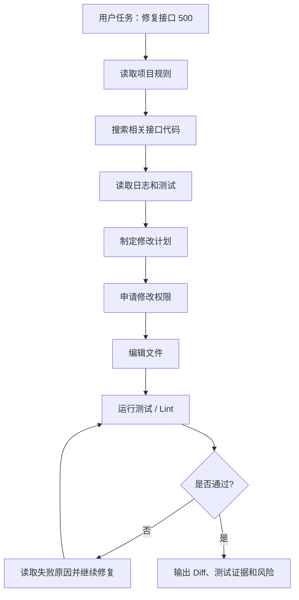
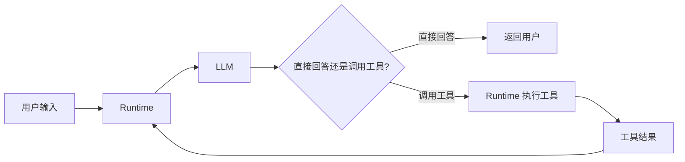
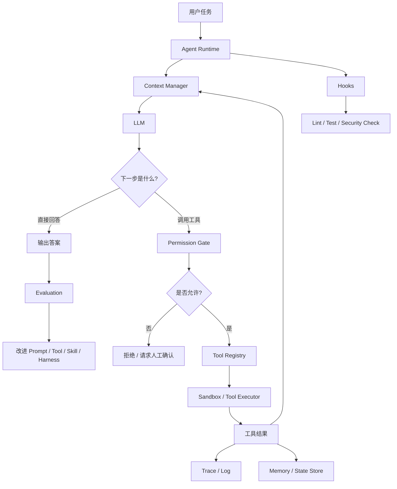
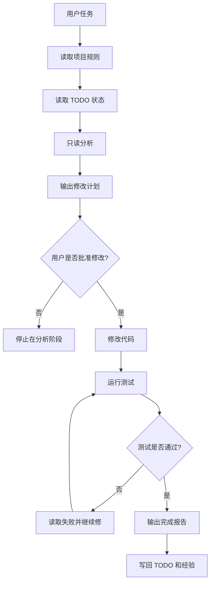
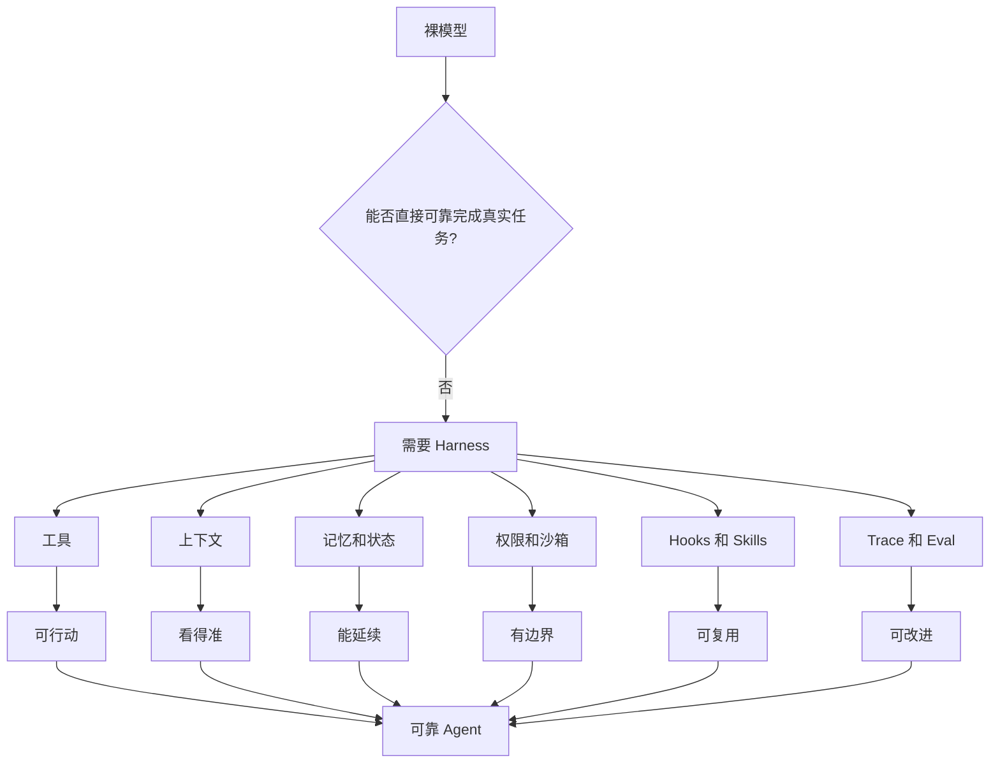

# Agent基础知识 07| Agent Harness：真正让 Agent 可靠的不是模型，是工程底座

> 从 Claude Code、Codex、OpenAI Agents SDK 和 Anthropic Agent Patterns 看 Agent 的运行时、工具、权限、状态、记忆、评测和执行环境如何组成“工程底座”

前面几篇我们已经讲过：

```text
RAG：让 Agent 先查资料，再回答。
Memory：让 Agent 记住历史、状态和经验。
MCP：让多个 Agent 复用同一批工具。
```

这一篇讲一个更底层的问题：

> 为什么同一个模型，放在不同 Agent 产品里，表现差别会很大？
> 为什么 Claude Code、Codex、Cursor 这类产品，比“裸模型 + 几个工具”稳定？
> 为什么有些 Agent 一上来就乱改代码，有些却能规划、执行、验证、总结、等待你确认？

答案不是“模型更聪明”这么简单。

真正拉开差距的是：

> **Agent Harness，也就是模型外部的工程底座。**

这里我建议统一用 **“工程底座”**，而不是“工作台”或者“工程化平台”。

| 说法    |      是否推荐 | 原因                  |
| ----- | --------: | ------------------- |
| 工作台   |       不推荐 | 太口语，容易让人理解成一个 UI 页面 |
| 工程化平台 |  可在特定场景使用 | 更像公司统一建设后的平台，范围偏大   |
| 工程底座  |        推荐 | 准确表达“模型外部支撑系统”      |
| 工程支撑层 | 推荐但标题不够有力 | 技术含义准确，但表达略平        |

所以后面统一这样理解：

```text
Harness = Agent 的工程底座 / 工程支撑层
企业统一建设后的 Harness = Agent 工程化平台
```

---

## 一、先看一个真实问题：为什么同一个模型，在不同 Agent 产品里表现差别很大？

### 1. 裸模型只能给建议，不能稳定完成任务

假设你对一个普通聊天模型说：

```text
这个接口 500 了，帮我修一下。
```

如果它只是裸模型，它可能会根据经验猜：

```text
可能是参数为空；
可能是数据库连接失败；
可能是异常没有捕获；
可以加一个 try-catch。
```

这些建议不是完全没用，但问题是：它没有真正进入你的工程环境。

它不知道：

```text
接口在哪个文件；
日志里具体报了什么；
上游服务有没有超时；
配置文件有没有写错；
测试命令是什么；
哪些目录不能改；
项目代码规范是什么；
修改后怎么验证。
```

所以裸模型更像一个“远程建议者”，而不是一个能独立推进任务的工程助手。

---

### 2. 成熟 Agent 能规划、执行、验证和总结

成熟 Coding Agent 的流程应该更像这样：



这张图里的每一步都不是“模型本身”单独能完成的：

| 环节              | 作用                   |
| --------------- | -------------------- |
| 读取项目规则          | 让 Agent 知道当前项目的边界和规范 |
| 搜索相关接口代码        | 让 Agent 基于真实代码上下文工作  |
| 读取日志和测试         | 让 Agent 获取真实环境反馈     |
| 制定修改计划          | 防止 Agent 一上来乱改       |
| 申请修改权限          | 控制编辑、删除、执行命令等高风险动作   |
| 编辑文件            | 让 Agent 从“建议”进入“执行”  |
| 运行测试 / Lint     | 给 Agent 提供客观反馈       |
| 失败后继续修复         | 形成真正的 Agent Loop     |
| 输出 Diff、测试证据和风险 | 让人类能审查实际改动           |

所以，成熟 Agent 的能力来自两部分：

```text
模型：负责理解、推理、计划、判断。
工程底座：负责工具、上下文、权限、执行、状态、验证和审计。
```

---

### 3. 差距来自模型外部的工程底座

Claude Code 官方把 Claude Code 描述为一个 agentic coding tool，它能读取代码库、编辑文件、运行命令，并和开发工具集成；它还可以在终端、IDE、桌面应用和浏览器中使用。([Claude API Docs][1])

注意这里的关键词不是“聊天”，而是：

```text
读取代码库；
编辑文件；
运行命令；
集成开发工具。
```

这些都属于模型外部的工程底座。

也就是说，Claude Code 不是简单的：

```text
Claude 模型 + 聊天窗口
```

而是更接近：

```text
Claude 模型
+ 代码库检索
+ 文件编辑
+ Shell 命令
+ Git / Diff
+ 项目规则
+ 记忆
+ Hooks
+ Skills
+ Subagents
+ MCP
+ 权限控制
+ 测试反馈
```

这就是 Harness。

---

## 二、为什么会出现 Agent Harness？

### 1. 模型不会自己操作真实环境

大模型本质上会生成文本。

它不会天然拥有：

```text
文件系统；
终端；
Git；
数据库；
浏览器；
日志平台；
测试环境；
工单系统；
企业权限系统。
```

如果没有这些外部能力，模型最多是 Chatbot。

它可以说：

```text
你可以检查这个文件。
```

但它不能真的去读这个文件。

它可以说：

```text
建议你运行测试。
```

但它不能真的运行测试。

因此，Agent 要进入真实工程环境，就必须有一层系统来承载工具调用、执行动作、返回结果。这一层就是 Harness 的一部分。

---

### 2. 模型不会自己判断权限边界

用户说：

```text
帮我清理一下这个目录。
```

这句话可能有多种含义：

```text
删除临时缓存；
删除过期日志；
删除生成文件；
删除某天数据；
误删整个项目目录。
```

模型可能误解意图。

如果没有权限边界，Agent 可能执行不可逆操作。

所以 Harness 需要 Permission Gate，也就是权限门：

| 动作类型    | 默认策略          |
| ------- | ------------- |
| 只读文件    | 可以自动执行        |
| 搜索代码    | 可以自动执行        |
| 运行测试    | 通常允许，但限制目录    |
| 修改文件    | 需要展示 Diff 或计划 |
| 删除文件    | 默认阻断或必须确认     |
| 生产库写入   | 默认禁止          |
| 发布 / 部署 | 必须人工审批        |

这里的核心不是“提醒模型小心”，而是：

> 把危险动作变成系统级控制，而不是靠模型自觉。

---

### 3. 模型不会稳定记住长期规则

你告诉 Agent：

```text
这个项目只能看当前目录，不要扩展到外层微服务。
```

如果这句话只存在当前对话中，一旦上下文被压缩、新会话开始，模型可能就忘了。

所以项目规则需要被写入更稳定的位置，例如：

```text
AGENTS.md；
CLAUDE.md；
项目规则文件；
Skill 文件；
长期 Memory；
平台配置。
```

Claude Code 文档提到，`CLAUDE.md` 是项目根目录中的 Markdown 文件，Claude Code 会在每次 session 开始时读取；它可用于保存 coding standards、architecture decisions、preferred libraries 和 review checklists。([Claude API Docs][1])

这说明：长期规则不能只靠 prompt 临时传递，应该进入工程底座。

---

### 4. 模型不会自动验证结果

模型可以说：

```text
我已经修复了。
```

但这句话本身没有工程意义。

工程上真正有意义的是：

```text
测试通过了吗？
构建通过了吗？
Lint 通过了吗？
类型检查通过了吗？
Diff 合理吗？
有没有改到无关文件？
有没有引入新风险？
```

所以 Harness 必须把验证流程接进来。

Claude Code 文档明确举例，它可以写测试、修 lint、解决 merge conflict、更新依赖和写 release notes；在 bug 场景下，它会追踪代码库、识别根因并实现修复。([Claude API Docs][1])

这类能力背后，不只是模型生成代码，还包括：

```text
读代码；
改文件；
跑命令；
看测试；
根据反馈继续改。
```

---

### 5. Prompt 只能提醒，Harness 才能约束

很多人会先尝试写更强的提示词：

```text
你是高级工程师。
你要谨慎。
你不要乱改。
你要先计划。
你要跑测试。
你要遵守规范。
```

这些提示有用，但它们只是软约束。

更可靠的做法是把规则变成系统行为：

| 只靠 Prompt  | Harness 做法              |
| ---------- | ----------------------- |
| “不要删除文件”   | 删除工具默认禁用                |
| “记得跑测试”    | 文件修改后自动触发测试 Hook        |
| “不要越界访问目录” | 文件工具限制根目录               |
| “回答要有证据”   | Trace 记录工具结果和引用         |
| “先计划再执行”   | Plan 阶段和 Execute 阶段分离   |
| “危险操作要确认”  | Permission Gate 阻断并请求确认 |

Anthropic 在《Building effective agents》中也强调，最成功的实现通常不是复杂框架堆叠，而是简单、可组合的模式；同时建议在构建 LLM 应用时先找最简单方案，只有需要时再提高复杂度。([Anthropic][2])

这也适用于 Harness：不要一上来造大平台，而是先把真实失败点变成工程约束。

---

## 三、Agent Harness 到底是什么？

### 1. Harness 的中文理解：工程底座

**Agent Harness** 可以理解为：

> 模型之外，所有让 Agent 能安全、稳定、可验证地工作的工程支撑系统。

它不是一个单独工具，也不一定是一个完整平台。

它包括：

```text
运行时；
工具系统；
上下文管理；
记忆；
状态存储；
权限控制；
沙箱；
Hooks；
Skills；
Subagents；
Trace；
Evaluation；
人工确认。
```

当这些能力被公司统一建设成一套平台时，我们可以叫它 **Agent 工程化平台**。

但在概念上，Harness 更准确的叫法是：

> **Agent 的工程底座。**

---

### 2. Agent = Model + Harness

可以用一个公式理解：

```text
Agent = Model + Harness
```

其中 Model 负责：

```text
理解任务；
生成计划；
判断下一步；
选择工具；
总结结果。
```

Harness 负责：

```text
提供工具；
执行工具；
管理上下文；
保存状态；
限制权限；
隔离环境；
记录过程；
验证结果；
支持恢复；
反馈评测。
```

只有 Model，没有 Harness，它更像 Chatbot。
只有 Harness，没有 Model，它更像自动化脚本或 Workflow。
两者结合，才是能处理不确定任务的 Agent。

---

### 3. Harness 和 Prompt / Context / Runtime 的区别

| 概念                  | 中文理解  | 关注点             | 典型问题                   |
| ------------------- | ----- | --------------- | ---------------------- |
| Prompt Engineering  | 提示词工程 | 怎么写指令           | 模型这一轮怎么回答              |
| Context Engineering | 上下文工程 | 给模型看什么          | 当前任务需要哪些信息             |
| Runtime             | 运行时   | Agent Loop 怎么执行 | 模型、工具、状态如何流转           |
| Harness             | 工程底座  | 整个 Agent 如何可靠落地 | 工具、权限、上下文、状态、验证、评测如何协作 |

举个例子：

```text
Prompt Engineering：告诉模型“先分析再修改”。
Context Engineering：把相关代码、日志、规则放进上下文。
Runtime：驱动模型调用工具并回填结果。
Harness：限制只能改当前目录，修改后自动跑测试，记录 trace，失败后可回滚。
```

所以 Harness 更接近软件工程系统，而不是提示词技巧。

---

### 4. 不做 Harness 会出现什么问题？

没有 Harness 的 Agent 常见问题是：

```text
工具乱用；
权限越界；
上下文污染；
重复搜索；
忘记项目规则；
长任务中断后无法恢复；
改了代码不跑测试；
结果无法复盘；
失败无法评测；
每次都靠用户手工纠正。
```

这也是为什么很多 Agent Demo 看起来惊艳，真正用到工程里就变得不稳定。

---

## 四、Harness 的核心组件

先用表格建立整体认知：

| 组件                    | 中文理解      | 主要解决什么问题           |
| --------------------- | --------- | ------------------ |
| Runtime               | 运行时       | 控制 Agent Loop 如何执行 |
| Tool Registry         | 工具注册表     | 管理 Agent 能用哪些工具    |
| Context Manager       | 上下文管理器    | 决定模型当前应该看到什么       |
| Memory / State Store  | 记忆与状态存储   | 保存长期经验和当前任务状态      |
| Permission Gate       | 权限门       | 控制危险动作             |
| Sandbox               | 沙箱环境      | 限制执行环境的破坏范围        |
| Hooks / Middleware    | 钩子 / 中间件  | 在关键节点自动执行校验        |
| Skills / Instructions | 技能 / 指令包  | 沉淀可复用任务流程          |
| Subagents             | 子代理       | 隔离上下文和职责           |
| Trace / Observability | 轨迹 / 可观测性 | 记录 Agent 每一步为什么这么做 |
| Evaluation            | 评测体系      | 判断 Agent 是否真的可靠    |

---

### 1. Runtime：运行 Agent Loop 的环境

**Runtime**，中文可以理解为“运行时”。

它不是模型本身，而是负责驱动 Agent Loop 的外部执行环境。

Runtime 负责：

```text
接收用户输入；
调用模型；
解析模型输出；
执行工具调用；
把工具结果回填给模型；
控制最大轮数；
处理错误、超时、重试；
判断任务是否结束。
```

可以画成：



图里每个节点的作用：

| 节点           | 作用                |
| ------------ | ----------------- |
| 用户输入         | 提供任务目标            |
| Runtime      | 控制整个 Agent Loop   |
| LLM          | 判断下一步             |
| 工具调用         | 模型提出要执行某个动作       |
| Runtime 执行工具 | 真正调用文件、Shell、数据库等 |
| 工具结果         | 环境反馈              |
| 回到 Runtime   | 将反馈放入下一轮上下文       |

没有 Runtime，模型只能“说想做什么”，但不能真正做。

---

### 2. Tool Registry：工具注册表

**Tool Registry**，中文叫“工具注册表”。

它记录：

```text
有哪些工具；
每个工具做什么；
参数怎么填；
返回什么格式；
风险等级；
是否需要权限确认。
```

示例：

| 工具               | 作用   | 风险等级 |
| ---------------- | ---- | ---- |
| `read_file`      | 读取文件 | 低    |
| `grep_code`      | 搜索代码 | 低    |
| `run_tests`      | 运行测试 | 中    |
| `edit_file`      | 修改文件 | 中    |
| `delete_file`    | 删除文件 | 高    |
| `deploy_service` | 发布服务 | 高    |

Anthropic 在 Agent Patterns 中强调，工具定义需要像给初级开发者写优秀 docstring 一样清楚，包括示例、边界和输入格式要求；他们还提到，在 SWE-bench Agent 中，优化工具花的时间甚至多于优化整体 prompt。([Anthropic][2])

所以 Tool Registry 的重点不是“工具越多越好”，而是：

> 工具语义清楚、参数明确、边界可控、风险可审计。

---

### 3. Context Manager：上下文管理器

**Context Manager**，中文叫“上下文管理器”。

它决定模型当前这一轮应该看到什么。

包括：

```text
用户目标；
系统规则；
项目规则；
最近对话；
相关代码；
工具结果；
错误日志；
记忆摘要；
检索资料。
```

如果没有 Context Manager，系统可能把所有内容都塞给模型，导致：

```text
成本高；
噪声大；
模型抓不到重点；
旧信息和新信息冲突；
上下文被无关日志淹没。
```

Context Manager 的目标是：

> 让模型看到“当前任务真正需要的信息”，而不是看到“所有能看到的信息”。

---

### 4. Memory / State Store：记忆和状态存储

**Memory** 是长期记忆，保存用户偏好、项目规则、失败经验等。
**State Store** 是状态存储，保存当前任务的进度、计划、工具结果和测试状态。

二者区别如下：

| 类型          | 保存内容    | 典型例子              |
| ----------- | ------- | ----------------- |
| Memory      | 长期经验和规则 | “这个项目只看当前目录”      |
| State Store | 当前任务状态  | “TODO 3 已完成，测试未跑” |

OpenAI API 文档的 Agents SDK 导航中包含 Agent definitions、running agents、sandbox agents、orchestration、guardrails、results and state、integrations and observability、evaluate agent workflows 等能力入口，说明状态、沙箱、编排、护栏、可观测性和评测都是 Agent 开发工具链中的核心模块。([OpenAI Platform][3])

第一次提到 OpenAI Agents SDK 时也要说明一下：**SDK 是 Software Development Kit，也就是开发工具包。OpenAI Agents SDK 不是一个具体 Agent 产品，而是 OpenAI 提供给开发者构建 Agent 的一组组件，包含 Agent 定义、运行、编排、Guardrails、状态结果、可观测性和评测等能力。**

---

### 5. Permission Gate：权限门

**Permission Gate**，中文叫“权限门”。

它负责判断某个动作能不能执行、是否需要人工确认。

比如：

| 动作   | 处理策略           |
| ---- | -------------- |
| 读取文件 | 通常允许           |
| 搜索代码 | 通常允许           |
| 运行测试 | 限制目录后允许        |
| 编辑文件 | 展示计划或 Diff 后允许 |
| 删除文件 | 默认阻断或人工确认      |
| 写生产库 | 默认禁止           |
| 发布服务 | 必须审批           |

Permission Gate 解决的是：

> 模型可能误解任务或被注入指令诱导，所以危险操作不能只靠模型自觉。

---

### 6. Sandbox：沙箱环境

**Sandbox**，中文叫“沙箱环境”。

它不是普通测试环境，而是一个受限制、可隔离、可回滚的执行空间。

Sandbox 限制：

```text
文件访问范围；
网络访问范围；
系统命令；
环境变量；
密钥访问；
执行时间；
资源消耗。
```

为什么需要它？

因为 Agent 可能运行命令、安装依赖、生成文件、修改目录。没有沙箱，错误可能直接污染真实环境。

OpenAI Agents SDK 文档也把 Sandbox agents 单独列为 Agents SDK 的能力入口，说明当 Agent 需要安全地执行文件、命令或工具时，沙箱是重要运行形态。([OpenAI Platform][3])

---

### 7. Hooks / Middleware：流程钩子

**Hook**，中文叫“钩子”。

它是在 Agent 生命周期的某个时间点自动触发的脚本、HTTP 请求或提示。

Claude Code Hooks 文档列出了大量事件点，包括 UserPromptSubmit、PreToolUse、PermissionRequest、PostToolUse、PostToolUseFailure、SubagentStart、TaskCreated、Stop、PreCompact、PostCompact 等。([Claude API Docs][4])

可以这样理解：

| Hook 触发点           | 可以做什么          |
| ------------------ | -------------- |
| PreToolUse         | 调用工具前检查权限或危险命令 |
| PostToolUse        | 工具执行后记录结果或自动测试 |
| PostToolUseFailure | 工具失败后自动收集错误信息  |
| Stop               | 任务结束时生成报告      |
| PreCompact         | 压缩上下文前保存关键状态   |
| PermissionRequest  | 请求人工确认         |

Hooks 的价值是：

> 把“希望模型记得做的事”，变成“系统自动执行的事”。

---

### 8. Skills / Instructions：可复用能力包

**Skill**，中文可以叫“技能”或“能力包”。

它是把一类重复任务的说明、脚本、参考资料和流程打包，供 Agent 按需加载。

Claude Code Skills 文档说明，Skill 通过创建 `SKILL.md` 文件为 Claude 扩展能力；当你反复把相同说明、检查清单、多步骤流程贴进聊天，或者某段 `CLAUDE.md` 逐渐变成流程而不是事实时，就适合创建 Skill。([Claude API Docs][5])

例如：

```text
代码 Review Skill；
SQL 口径验证 Skill；
配置排查 Skill；
发布检查 Skill；
PR 描述生成 Skill。
```

Skill 解决的问题是：

> 不要让用户每次重复讲流程，把流程沉淀成可复用能力。

---

### 9. Subagents：子代理

**Subagent**，中文叫“子代理”。

它是一个专门处理某类任务的独立 Agent，有自己的上下文、提示词、工具权限和执行范围。

Claude Code Subagents 文档说明，Subagents 用于 task-specific workflows 和更好的上下文管理；文档还列出工具控制、MCP Server 作用域、权限模式、预加载 Skills、持久记忆、自动压缩、并行研究等配置项。([Claude API Docs][6])

Subagent 不等于“多个模型聊天”。

它的核心价值是：

| 价值    | 说明              |
| ----- | --------------- |
| 上下文隔离 | 大量日志、搜索结果不污染主对话 |
| 职责隔离  | 不同子代理负责不同任务     |
| 工具隔离  | 子代理只拿必要工具       |
| 权限隔离  | 子代理能力范围更小       |
| 并行执行  | 多个子任务可同时推进      |

例如：

```text
日志分析 Subagent：读取大量日志，只返回关键错误。
代码 Review Subagent：只看 diff，输出风险。
SQL Validator Subagent：只验证 SQL，不改代码。
```

---

### 10. Trace / Observability：轨迹和可观测性

**Trace**，中文叫“轨迹记录”。

**Observability**，中文叫“可观测性”。

它们记录 Agent 每一步做了什么：

```text
用户输入；
系统指令；
模型输出；
工具调用；
工具结果；
权限判断；
错误信息；
测试结果；
耗时；
token 成本；
最终答案。
```

没有 Trace，Agent 出错后只能猜原因。

有 Trace 才能知道：

```text
它为什么查这个文件；
为什么没查另一个文件；
为什么调用危险命令；
为什么没有跑测试；
为什么最终给出这个结论。
```

OpenAI 文档的 Agents SDK 导航把 integrations and observability、evaluate agent workflows、tracing 相关能力列入 Agent 开发路径，说明可观测性与评测已经是 Agent 工程中的核心环节。([OpenAI Platform][3])

---

### 11. Evaluation：评测体系

**Evaluation**，中文叫“评测”。

它不是简单看最终答案对不对，而是系统性评估：

```text
任务是否完成；
工具是否选对；
路径是否合理；
是否遵守权限；
测试是否通过；
引用是否正确；
成本是否可接受；
失败是否可复现。
```

Anthropic 建议开发者从简单方案开始，并通过 comprehensive evaluation 优化；只有当简单方案不够时，再增加复杂 agentic system。([Anthropic][2])

所以 Harness 的评测原则是：

> 不要因为系统复杂就假设它更强，必须用评测证明复杂度带来了收益。

---

## 五、Agent Harness 的底层工作流程

### 1. 总流程图



### 2. 节点对齐解释

| 节点                           | 作用                  |
| ---------------------------- | ------------------- |
| 用户任务                         | 提供目标和约束             |
| Agent Runtime                | 驱动整个 Agent Loop     |
| Context Manager              | 组装当前模型需要看的上下文       |
| LLM                          | 判断下一步是回答还是调用工具      |
| Permission Gate              | 判断工具调用是否允许          |
| Tool Registry                | 提供工具定义和风险信息         |
| Sandbox / Tool Executor      | 在受控环境中执行工具          |
| 工具结果                         | 给模型提供真实环境反馈         |
| Trace / Log                  | 记录完整执行过程            |
| Memory / State Store         | 保存长期经验和当前任务状态       |
| Hooks                        | 在关键节点自动触发检查         |
| Lint / Test / Security Check | 提供确定性验证             |
| Evaluation                   | 判断本次任务和整体能力是否可靠     |
| 改进 Harness                   | 根据失败反向优化工具、规则、技能和评测 |

### 3. 为什么这样设计

因为 Agent 的每一步都有可能出错：

| 风险点    | Harness 对应控制    |
| ------ | --------------- |
| 看错上下文  | Context Manager |
| 调错工具   | Tool Registry   |
| 执行危险动作 | Permission Gate |
| 污染环境   | Sandbox         |
| 忘记规则   | Memory / 项目规则文件 |
| 改完不测   | Hooks           |
| 过程不可复盘 | Trace           |
| 能力退化   | Evaluation      |

这就是 Harness 的价值：它把 Agent 的不确定性控制在可观察、可验证、可治理的范围里。

---

## 六、实际案例：Claude Code 为什么强在 Harness？

### 1. 案例输入

假设用户输入：

```text
接口 /api/user/profile 偶发 500，日志里有 NullPointerException，帮我定位并修复。
```

### 2. Claude Code 的工程底座会怎么支撑这个任务

| 步骤 | Harness 组件         | 具体动作                                         |
| -- | ------------------ | -------------------------------------------- |
| 1  | `CLAUDE.md` / 项目规则 | 读取项目编码规范、测试命令、禁止事项                           |
| 2  | Tool Registry      | 确认可以使用 grep、read_file、run_tests 等工具          |
| 3  | Context Manager    | 把用户问题、项目规则、相关文件片段组织进上下文                      |
| 4  | RAG / 代码检索         | 搜索 `/api/user/profile`、Controller、Service、测试 |
| 5  | Runtime            | 驱动模型判断下一步                                    |
| 6  | Permission Gate    | 修改文件前请求确认或展示计划                               |
| 7  | File Edit Tool     | 修改空值处理逻辑                                     |
| 8  | Hook               | 修改后触发格式化或测试                                  |
| 9  | Shell / Test Tool  | 运行相关单测                                       |
| 10 | Trace              | 记录搜索、修改、测试全过程                                |
| 11 | Completion Report  | 输出 Diff、测试结果、风险和未验证点                         |

### 3. 这个案例说明什么

Claude Code 强，不是因为它只“会写 Java/Python”。

强在它能把模型放进完整工程流程：

```text
读规则；
查代码；
改文件；
跑命令；
看结果；
触发检查；
输出证据；
保留人工 Review。
```

Claude Code 官方文档也明确展示了这些能力：自动化写测试、修 lint、解决 merge conflict、更新依赖；基于自然语言构建功能、修 bug；直接使用 Git 创建 commit 和 PR；通过 MCP 连接 Google Drive、Jira、Slack 和自定义工具；通过 `CLAUDE.md`、skills、hooks 和 auto memory 定制行为。([Claude API Docs][1])

---

## 七、实际案例：OpenAI Agents SDK / Codex 的 Harness 思路

### 1. 先解释 OpenAI Agents SDK 是什么

**OpenAI Agents SDK** 是 OpenAI 提供的一套 Agent 开发工具包。

SDK 是 **Software Development Kit**，中文叫“软件开发工具包”。

它不是一个具体的聊天产品，而是一组帮助开发者构建 Agent 的代码组件。

从 OpenAI 文档导航可以看到，Agents SDK 覆盖 Agent definitions、running agents、sandbox agents、orchestration、guardrails、results and state、integrations and observability、evaluate agent workflows 等模块。([OpenAI Platform][3])

换成工程语言，就是：

```text
定义 Agent；
运行 Agent；
使用沙箱；
编排多步骤流程；
设置护栏；
管理结果和状态；
接入可观测性；
评测 Agent 工作流。
```

这正是 Harness 的核心组成。

---

### 2. Codex 为什么也体现 Harness 思路

Codex 相关文档体系中列出了 permissions、rules、hooks、AGENTS.md、MCP、skills、subagents、agent approvals & security、governance、GitHub Action 等配置和管理入口。([OpenAI Platform][3])

这说明 Codex 不是简单“模型写代码”，而是围绕代码任务提供：

| 模块                         | 对应 Harness 能力 |
| -------------------------- | ------------- |
| Permissions                | 权限控制          |
| Rules                      | 行为规则          |
| Hooks                      | 生命周期自动化       |
| AGENTS.md                  | 项目级指令         |
| MCP                        | 工具与外部系统连接     |
| Skills                     | 可复用能力包        |
| Subagents                  | 子任务隔离         |
| Agent approvals & security | 审批和安全         |
| Governance                 | 企业治理          |
| GitHub Action              | CI/CD 集成      |

### 3. 这个案例说明什么

OpenAI 体系里的 Agent 能力，同样不是“模型自己做完任务”。

它依赖：

```text
运行环境；
工具接入；
沙箱；
权限；
状态；
审计；
评测；
CI/CD；
GitHub 集成。
```

这就是工程底座。

---

## 八、企业内部 Agent 的最小 Harness 应该怎么做？

不要一上来做大平台。

如果团队只是想让 Agent 帮忙做数据 ETL、代码排查、测试修复，可以先做最小可用工程底座。

### 1. 最小 Harness 目录结构

可以从这些文件开始：

```text
AGENTS.md                  # Agent 行为规则
project_rules.md           # 项目规则
todo.md                    # 当前任务状态
test_commands.md           # 测试命令
review_checklist.md        # 完成报告和 Review 清单
skills/
  sql_validation.md
  config_debugging.md
  code_review.md
```

### 2. 最小 Harness 工作流



### 3. 节点对齐解释

| 节点          | 作用            |
| ----------- | ------------- |
| 读取项目规则      | 让 Agent 知道边界  |
| 读取 TODO 状态  | 让 Agent 能续接任务 |
| 只读分析        | 避免一开始乱改       |
| 输出修改计划      | 让人类先判断方向      |
| 用户批准修改      | 保留关键控制权       |
| 修改代码        | 进入执行阶段        |
| 运行测试        | 给出客观反馈        |
| 失败继续修       | 形成 Agent Loop |
| 输出完成报告      | 让结果可审查        |
| 写回 TODO 和经验 | 让下次不从零开始      |

### 4. 最小 Harness 的好处

| 问题           | 最小 Harness 怎么解决  |
| ------------ | ---------------- |
| Agent 忘记项目边界 | 写入项目规则文件         |
| Agent 直接乱改   | 要求先只读分析和计划       |
| Agent 改完不测   | 固定测试命令或 Hook     |
| Agent 任务断档   | 用 TODO 状态文件续接    |
| Agent 报告混乱   | 固定完成报告模板         |
| Agent 重复犯错   | 把失败经验写回规则或 Skill |

---

## 九、Agent Harness 的技术方案怎么选？

### 1. 最小 Harness：适合个人和小项目

| 项目  | 内容                       |
| --- | ------------------------ |
| 组成  | 项目规则、提示模板、只读工具、手工 Review |
| 优点  | 上手快、成本低、无需平台化            |
| 缺点  | 自动化弱、状态容易丢               |
| 适合  | 个人项目、小团队 PoC、一次性任务       |
| 不适合 | 多团队、多工具、强合规场景            |

---

### 2. 工程化 Harness：适合团队级 Coding Agent

| 项目  | 内容                                                   |
| --- | ---------------------------------------------------- |
| 组成  | AGENTS.md、工具注册、权限规则、测试 Hook、Session Store、Trace、Eval |
| 优点  | 稳定性明显提升，可沉淀团队经验                                      |
| 缺点  | 需要维护工具链和团队规范                                         |
| 适合  | 后端团队、数据工程团队、日常开发                                     |
| 不适合 | 完全不固定的探索型任务                                          |

---

### 3. 平台化 Harness：适合企业内部多 Agent 平台

| 项目  | 内容                                      |
| --- | --------------------------------------- |
| 组成  | 统一 MCP 工具平台、统一权限、统一审计、Sandbox、任务队列、评测平台 |
| 优点  | 可复用、可治理、适合多团队                           |
| 缺点  | 建设成本高，容易过度设计                            |
| 适合  | 大型企业、多个业务系统、多个 Agent                    |
| 不适合 | 小团队早期验证                                 |

---

### 4. 什么时候不应该过早做复杂 Harness？

这些场景不需要一上来平台化：

```text
单次问答；
临时脚本生成；
小范围代码解释；
一次性文档总结；
内部 PoC。
```

更好的路线是：

```text
先做最小 Harness；
观察真实失败模式；
把失败沉淀成规则、Hook、Skill、Eval；
再逐步平台化。
```

---

## 十、2025～2026 年 Harness Engineering 的新进展

### 1. Harness Engineering 从经验技巧变成独立工程方向

2026 年的 Harness-Bench 论文指出，LLM agents 正越来越像可执行系统：它们使用工具、修改 workspace、产出具体 artifact；性能不只取决于基础模型，也取决于管理上下文、工具、状态、约束、权限、追踪和恢复的 harness。论文还主张应在 model-harness configuration 层面报告 Agent 能力，而不是只归因于基础模型。([arXiv][7])

这说明：

> 以后讨论 Agent 能力，不能只问“用的什么模型”，还要问“用的什么 Harness”。

---

### 2. Code as Agent Harness：代码不只是输出，也是基础设施

2026 年的 Code as Agent Harness 综述提出，在新一代 agentic systems 中，代码不再只是模型要生成的目标，也成为 Agent 推理、行动、环境建模和执行验证的操作性基础设施。论文围绕 harness interface、planning、memory、tool use、feedback-driven control、multi-agent coordination 和 verification 组织 Agent Harness 研究。([arXiv][8])

这对工程师很重要。

过去我们把代码看成：

```text
模型生成的产物。
```

现在还要把代码看成：

```text
Agent 的工具接口；
Agent 的执行环境；
Agent 的验证手段；
Agent 的状态载体；
Agent 的协作媒介。
```

---

### 3. 未来 Agent 能力提升不只靠换模型，也靠改 Harness

Anthropic 在 Agent Patterns 中强调，coding agents 特别有效，因为代码方案可以通过自动化测试验证，Agents 可以用测试结果作为反馈迭代；但自动化测试之外，人类 Review 仍然关键。([Anthropic][2])

结合 2026 年 Harness-Bench 的观察，可以得出一个重要结论：

> Agent 变强，不一定靠换更大的模型，也可能靠改工具、改上下文、改权限、改记忆、改测试反馈和改评测集。

---

## 十一、Agent Harness 的常见踩坑

### 1. 把模型问题和 Harness 问题混在一起

Agent 做不好，不一定是模型差。

可能是：

```text
工具描述不清；
上下文太乱；
权限太松；
没有测试反馈；
没有 Trace；
没有项目规则；
没有状态管理。
```

先检查工程底座，再急着换模型。

---

### 2. 只写提示词，不做系统约束

不推荐：

```text
请不要删除文件。
```

更推荐：

```text
delete_file 工具默认禁用；
rm 命令被 PreToolUse Hook 拦截；
删除操作必须人工确认。
```

提示词是建议，Harness 是约束。

---

### 3. 工具太万能，权限太粗

危险工具：

```text
run_shell(command)
```

更好的拆法：

```text
read_file；
grep_code；
run_unit_tests；
run_readonly_sql；
create_ticket_draft；
request_deploy_approval。
```

工具越接近业务语义，越容易控制风险。

---

### 4. 没有测试反馈

让 Agent 改代码但不跑测试，本质上是在让它猜。

正确做法是：

```text
改文件后运行测试；
测试失败后读取失败信息；
再回到计划或修改阶段；
最终报告必须附测试证据。
```

---

### 5. 没有 Trace，无法复盘

没有 Trace，就无法回答：

```text
Agent 为什么查这个文件？
为什么没有查另一个文件？
为什么跳过测试？
为什么调用这个工具？
为什么最终得出这个结论？
```

Agent 没有 Trace，就像线上服务没有日志。

---

### 6. 一开始就过度平台化

不推荐一开始就做：

```text
多 Agent 平台；
长期记忆平台；
统一 MCP 平台；
复杂权限系统；
自动回滚；
动态路由；
大规模评测平台。
```

推荐路线是：

```text
先解决真实任务；
记录失败模式；
把失败变成规则；
把规则变成 Hook / Skill / Eval；
最后再平台化。
```

---

## 十二、这一篇的核心结论

### 1. Harness 是 Agent 的工程底座

Agent Harness 不是 UI，也不是一个具体产品。

它是：

```text
模型之外，所有让 Agent 能安全、稳定、可验证地工作的工程支撑系统。
```

---

### 2. 模型负责推理，Harness 负责让推理落地

| 模型负责   | Harness 负责       |
| ------ | ---------------- |
| 理解目标   | 提供工具             |
| 生成计划   | 执行工具             |
| 选择下一步  | 管理权限             |
| 总结结果   | 保存状态             |
| 判断是否继续 | 跑测试、记录 Trace、做评测 |

---

### 3. 可靠 Agent = 工具 + 上下文 + 状态 + 权限 + 验证 + 评测



### 4. 图中节点对齐说明

| 节点             | 作用               |
| -------------- | ---------------- |
| 工具             | 让 Agent 能行动      |
| 上下文            | 让 Agent 看对资料     |
| 记忆和状态          | 让 Agent 能续接任务    |
| 权限和沙箱          | 让 Agent 有安全边界    |
| Hooks 和 Skills | 让规则可执行、流程可复用     |
| Trace 和 Eval   | 让 Agent 可复盘、可改进  |
| 可靠 Agent       | 模型能力和工程底座共同作用的结果 |

---

### 5. 最后一句话

> **Claude Code、Codex 这类产品强，不只是因为模型强，而是因为它们把模型放进了一套成熟的工程底座里。**

[1]: https://docs.claude.com/en/docs/claude-code/overview "Overview - Claude Code Docs"
[2]: https://www.anthropic.com/engineering/building-effective-agents "Building Effective AI Agents \ Anthropic"
[3]: https://platform.openai.com/docs/guides/agents-sdk "Agents SDK | OpenAI API"
[4]: https://docs.claude.com/en/docs/claude-code/hooks "Hooks reference - Claude Code Docs"
[5]: https://docs.claude.com/en/docs/claude-code/skills "Extend Claude with skills - Claude Code Docs"
[6]: https://docs.claude.com/en/docs/claude-code/sub-agents "Create custom subagents - Claude Code Docs"
[7]: https://arxiv.org/abs/2605.27922 "Harness-Bench: Measuring Harness Effects across Models in Realistic Agent Workflows"
[8]: https://arxiv.org/abs/2605.18747 "Code as Agent Harness"
