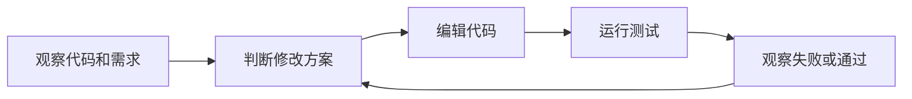
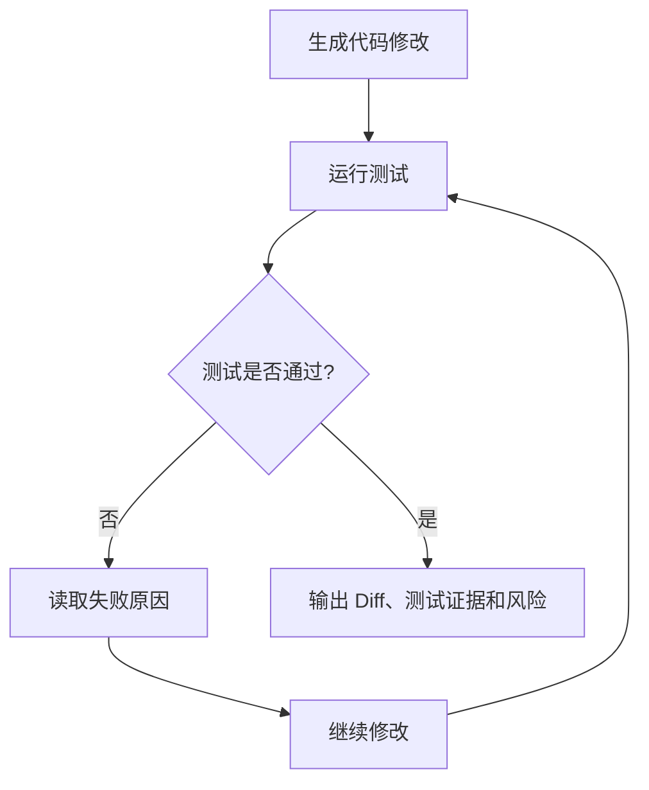
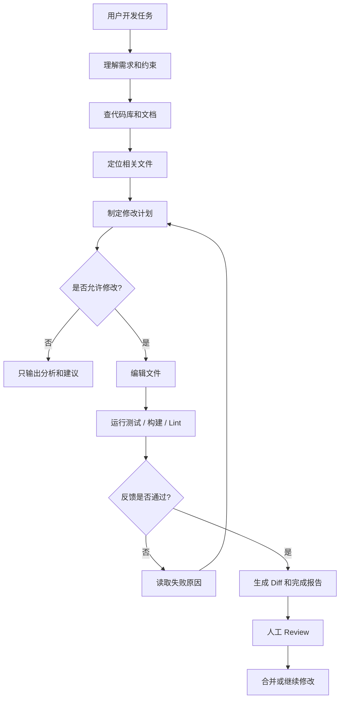
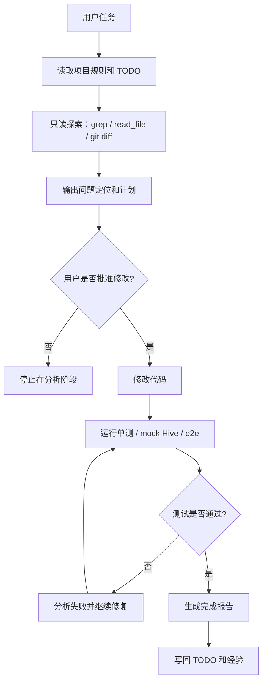
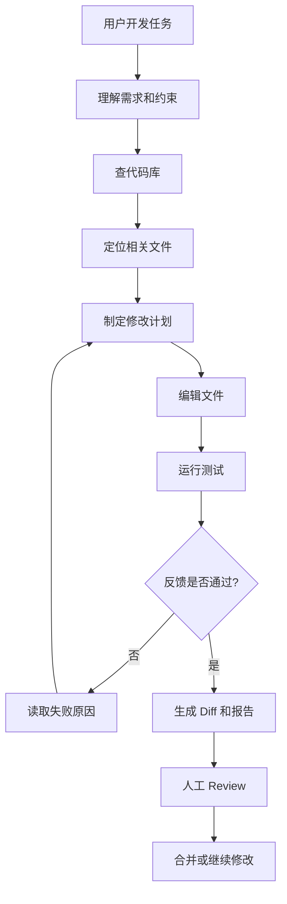

# Agent基础知识 08| Coding Agent：为什么代码库是 Agent 最好的训练场

> 从 Claude Code、Codex、SWE-bench 看 Coding Agent 为什么最容易落地，以及如何理解 Shell、文件编辑、测试反馈和代码仓库环境

前面几篇我们讲了 Agent 的很多基础部件：

```text
Tool Use：让 Agent 能调用工具。
RAG：让 Agent 能查资料，而不是凭感觉回答。
Memory：让 Agent 能记住历史、状态和经验。
MCP：让多个 Agent 复用同一批工具。
Harness：让 Agent 拥有稳定运行的工程底座。
```

这一篇讲一个非常重要、也非常容易落地的 Agent 场景：

> **Coding Agent，代码智能体。**

它不是简单的“AI 写代码”，而是：

> Agent 在真实代码库里读代码、查文件、改文件、运行命令、看测试反馈，并根据结果继续调整。

代码库为什么特别适合 Agent？

因为它天然具备 Agent 最需要的条件：

| 条件     | 代码库里对应什么                      |
| ------ | ----------------------------- |
| 有明确任务  | issue、bug、需求、测试失败             |
| 有真实上下文 | 源码、配置、README、测试、日志            |
| 有可执行工具 | Shell、Git、测试框架、构建工具           |
| 有行动空间  | 文件编辑、分支、提交、PR                 |
| 有客观反馈  | 编译结果、单测结果、lint、类型检查           |
| 有回滚机制  | Git diff、commit、branch、revert |
| 有人类审查  | Code Review、PR Review、CI/CD   |

很多 Agent 场景很难判断“做得好不好”。但代码不一样。

代码能不能编译，测试能不能通过，Diff 是否合理，错误日志是否消失，这些都可以被检查。

所以，代码库是 Agent 最好的训练场。

---

## 一、先看一个真实问题：为什么写代码比很多 Agent 场景更容易落地？

### 1.1 两类任务的差别

假设你让 Agent 完成两个任务。

第一个任务：

```text
帮我分析一下这个市场未来三年的机会。
```

第二个任务：

```text
帮我修复这个接口的空指针异常，并确保测试通过。
```

这两个任务都可以交给 Agent，但它们的落地难度完全不同。

| 对比项  | 市场分析任务           | 代码修复任务                         |
| ---- | ---------------- | ------------------------------ |
| 目标边界 | 模糊，什么叫“分析好”很难定义  | 相对清晰，异常是否修复、测试是否通过             |
| 输入材料 | 新闻、报告、观点、数据，真假混杂 | 代码、日志、issue、测试、配置              |
| 执行动作 | 搜索、阅读、判断、写报告     | 读代码、改文件、运行命令、跑测试               |
| 反馈方式 | 主要靠人判断           | 测试、编译、lint、类型检查能自动反馈           |
| 失败信号 | 模糊，比如“感觉不全面”     | 明确，比如测试失败、编译失败                 |
| 回滚方式 | 不明显              | Git diff / revert / branch 可回滚 |

市场分析任务里，“好不好”经常需要人类经验判断。
代码修复任务里，“有没有修好”至少有一部分可以通过工程工具验证。

这就是 Coding Agent 更容易落地的第一个原因：

> **代码任务有更明确的目标、更清楚的环境、更客观的反馈。**

---

### 1.2 代码任务天然有反馈闭环

代码开发本来就是循环式工作。

```text
看需求
  ↓
读代码
  ↓
改代码
  ↓
跑测试
  ↓
看失败
  ↓
继续改
  ↓
通过后提交
```

而 Agent Loop 也是循环式工作。

```text
观察
  ↓
判断
  ↓
行动
  ↓
再观察
```

两者天然吻合。



图里每个节点对应真实开发动作：

| 节点      | 在代码开发中的含义               |
| ------- | ----------------------- |
| 观察代码和需求 | 读取 issue、日志、README、相关代码 |
| 判断修改方案  | 决定改哪个文件、哪段逻辑、是否需要补测试    |
| 编辑代码    | 通过文件编辑工具修改真实项目文件        |
| 运行测试    | 执行单测、构建、lint、类型检查       |
| 观察失败或通过 | 根据测试结果决定继续修还是结束         |

这说明 Coding Agent 不是强行把 Agent 套到软件开发上，而是软件开发本身就很像 Agent Loop。

---

### 1.3 本篇先给结论

Coding Agent 最容易落地，不是因为“模型特别会写代码”，而是因为代码库提供了完整的工程闭环。

| 能力    | 代码库如何提供                |
| ----- | ---------------------- |
| 真实上下文 | 代码、配置、测试、文档、日志         |
| 执行能力  | Shell、构建工具、测试框架        |
| 行动能力  | 文件编辑、Git 分支、PR         |
| 客观反馈  | 测试、编译、lint、类型检查        |
| 风险控制  | Diff、Review、Sandbox、权限 |
| 持续改进  | 失败日志、回归测试、评测集          |

所以 Coding Agent 的核心不是：

```text
AI 生成了一段代码。
```

而是：

```text
AI 在一个可执行、可验证、可回滚的工程环境里持续行动。
```

---

## 二、为什么会出现 Coding Agent？

### 2.1 从“代码补全”到“工程任务执行”

早期 AI 编程助手主要做代码补全。

比如你写：

```java
public String getUserName(
```

它预测下一行该怎么写。

这种工具解决的是：

> 当前文件、当前光标位置的局部编码效率问题。

但真实软件开发不只是补全代码。

真实任务通常包括：

```text
理解需求；
定位问题；
追调用链；
跨文件修改；
补测试；
运行构建；
修复失败；
生成 PR；
接受 Review。
```

于是 Coding Agent 出现了。

它解决的不是“下一行怎么写”，而是：

> 一个开发任务如何从问题描述走到可验证的代码改动。

Claude Code 官方文档把 Claude Code 定义为一个 agentic coding tool，也就是“具备 Agent 行为的编码工具”。它能读取代码库、编辑文件、运行命令，并和开发工具集成；官方还说明它可以在终端、IDE、桌面应用和浏览器中使用。这里的 IDE 是 Integrated Development Environment，也就是集成开发环境，例如 VS Code、JetBrains 系列等。([Claude API Docs][1])

这说明现代 Coding Agent 已经从“补全工具”演化为“工程任务执行器”。

---

### 2.2 软件工程任务天然适合 Agent Loop

普通 Chatbot 的模式是：

```text
用户问
  ↓
模型答
```

Coding Agent 的模式是：

```text
用户给任务
  ↓
Agent 查代码
  ↓
Agent 制定计划
  ↓
Agent 修改文件
  ↓
Agent 运行测试
  ↓
Agent 根据反馈继续修
```

Claude Code 的常见工作流文档列出了一系列日常开发任务：探索代码库、修 bug、重构、写测试、创建 PR、处理文档、恢复之前的会话、用 worktree 并行运行会话、编辑前先计划、把研究任务委托给 subagent、把 Claude 接入脚本等。这说明成熟 Coding Agent 的工作方式是围绕真实开发流程设计，而不是只生成一段代码。([Claude API Docs][2])

---

### 2.3 自动化反馈让 Coding Agent 能自我修正

代码最特别的地方在于：

> **代码可以运行。**

Agent 写完代码后，可以马上验证：

```text
编译能不能过；
单测能不能过；
接口能不能返回预期结果；
类型检查是否通过；
lint 是否通过；
安全扫描是否报警。
```

这让 Agent 能形成“反馈驱动”的迭代。



节点解释：

| 节点              | 作用                 |
| --------------- | ------------------ |
| 生成代码修改          | Agent 根据计划修改项目文件   |
| 运行测试            | 用测试框架验证修改是否有效      |
| 测试是否通过          | 给出客观反馈             |
| 读取失败原因          | 从报错、堆栈、断言信息中找下一步方向 |
| 继续修改            | 根据反馈再次行动           |
| 输出 Diff、测试证据和风险 | 交给人类 Review        |

这里最关键的是 `测试是否通过` 这个节点。它让 Agent 不再是“写完就结束”，而是变成：

> 写完 → 验证 → 失败 → 修复 → 再验证。

Anthropic 在 Agent Patterns 中也专门指出，coding agents 很有效，是因为代码方案可以用自动化测试验证，Agent 可以用测试结果继续迭代；同时，自动化测试之外仍然需要人类 Review 来判断更广泛的系统要求。([Anthropic][3])

---

## 三、Coding Agent 到底是什么？

### 3.1 定义

**Coding Agent**，中文可以叫“代码智能体”或“编程智能体”。

它指的是：

> 能在代码库环境中自主阅读、搜索、修改、运行和验证代码的 Agent。

它不是单纯的代码生成器。

它至少要具备这些能力：

```text
读代码；
搜代码；
理解调用链；
编辑文件；
运行 Shell；
运行测试；
读取失败日志；
根据反馈继续修改；
生成 Diff；
输出完成报告。
```

---

### 3.2 Coding Agent 和常见编程工具的区别

| 类型               | 主要能力               | 典型边界          |
| ---------------- | ------------------ | ------------- |
| 代码补全             | 补当前行或当前函数          | 依赖当前编辑位置      |
| Chatbot 写代码      | 根据用户描述生成代码片段       | 用户手动复制、集成、验证  |
| Coding Assistant | 解释代码、给建议           | 偏辅助，不一定实际改项目  |
| Coding Agent     | 读代码、改文件、跑命令、看反馈、迭代 | 能进入真实工程环境执行任务 |

一句话区分：

```text
代码补全：帮你写下一行。
Chatbot：帮你写一段代码。
Coding Assistant：帮你理解和建议。
Coding Agent：帮你完成一个代码任务。
```

---

### 3.3 Coding Agent 不是替代开发者，而是接管部分工程循环

Coding Agent 最适合接管：

```text
重复性搜索；
跨文件定位；
样板代码生成；
测试补充；
lint 修复；
依赖升级；
文档同步；
低风险 bug 修复。
```

它不适合完全替代：

```text
架构取舍；
需求澄清；
安全责任；
生产变更审批；
复杂业务边界判断；
关键代码 Review。
```

更准确的定位是：

> Coding Agent 接管执行闭环中的重复性劳动，人类保留目标设定、边界判断和最终 Review 权。

---

## 四、Coding Agent 的核心能力

### 4.1 Shell：让 Agent 拥有执行能力

#### 4.1.1 Shell 是什么

**Shell**，中文可以理解为“命令行环境”。

它是开发者通过命令与操作系统、构建工具、测试框架交互的入口。

例如：

```bash
pytest
mvn test
npm run build
grep -R "login" .
git diff
```

#### 4.1.2 为什么 Coding Agent 需要 Shell

真实开发不是只写代码，还包括：

```text
安装依赖；
运行测试；
启动服务；
查看日志；
构建项目；
查找文件；
执行脚本。
```

没有 Shell，Agent 只能给建议，不能验证建议。

| 有无 Shell | Agent 能力差异             |
| -------- | ---------------------- |
| 没有 Shell | 只能生成代码和建议              |
| 有 Shell  | 能运行测试、读日志、构建项目、根据反馈继续修 |

Shell 让 Coding Agent 从“文本建议者”变成“能执行工程动作的开发助手”。

#### 4.1.3 Shell 的风险

Shell 也是高风险工具。

危险命令包括：

```bash
rm -rf ./data
curl xxx | bash
chmod -R 777 .
drop database
```

所以成熟 Coding Agent 不会无条件开放 Shell，而是要配合：

```text
权限控制；
命令白名单；
工作目录限制；
Sandbox；
人工确认；
日志审计。
```

---

### 4.2 文件编辑：让 Agent 从“建议”变成“执行”

#### 4.2.1 文件编辑是什么

文件编辑指 Agent 直接修改项目中的真实文件，而不是只在聊天窗口里输出代码片段。

#### 4.2.2 为什么需要文件编辑

真实任务往往涉及多个文件：

```text
Controller；
Service；
DTO；
Mapper；
配置文件；
测试文件；
README。
```

如果 Agent 只输出代码片段，用户还要自己复制、粘贴、改路径、处理依赖。

文件编辑让 Agent 可以直接完成项目修改。

#### 4.2.3 文件编辑的风险

文件编辑必须受控，因为 Agent 可能：

```text
改错文件；
覆盖用户未提交修改；
格式破坏；
删除重要逻辑；
跨模块误改；
引入隐藏 bug。
```

因此文件编辑必须配合：

| 控制手段      | 作用          |
| --------- | ----------- |
| Diff 展示   | 让人类看到实际改了什么 |
| 修改范围限制    | 防止跨目录、跨模块乱改 |
| Git 版本控制  | 支持回滚        |
| 人工 Review | 保留最终判断权     |
| 测试反馈      | 验证修改是否有效    |
| Sandbox   | 控制执行风险      |

---

### 4.3 测试反馈：让 Agent 知道自己改对没有

#### 4.3.1 测试反馈是什么

测试反馈是通过单元测试、集成测试、构建、lint、类型检查等方式，验证代码修改是否有效。

#### 4.3.2 为什么测试反馈是 Coding Agent 的核心

模型说“我修好了”没有工程意义。

工程上真正有意义的是：

```text
测试通过；
构建通过；
lint 通过；
错误日志消失；
关键功能仍然正常。
```

SWE-bench 是 Software Engineering Benchmark 的缩写，可以理解为“软件工程基准测试”。它包含 2,294 个来自真实 GitHub issue 和 Pull Request 的软件工程问题；给定代码库和 issue 描述，模型需要编辑代码来解决问题。这类任务常常需要理解多个函数、类和文件之间的协同变化，远超传统代码生成任务。([arXiv][4])

这说明 Coding Agent 的评测不能只看“代码像不像”，而要看：

> 修改是否真正解决了真实工程问题。

#### 4.3.3 测试反馈的局限

测试通过不等于绝对正确。

常见问题包括：

```text
测试覆盖不完整；
测试本身可能有缺陷；
Agent 可能为了通过测试写特殊逻辑；
行为符合测试但不符合业务意图；
旧测试没有覆盖新需求。
```

因此测试反馈必须结合：

```text
人工 Review；
安全扫描；
代码风格检查；
业务边界检查；
回归测试。
```

---

### 4.4 Diff / Git：让修改可审查、可回滚

#### 4.4.1 Diff 是什么

**Diff**，中文可以叫“差异”。

它展示代码修改前后的变化：

```text
改了哪些文件；
新增了哪些行；
删除了哪些行；
修改了哪些逻辑。
```

#### 4.4.2 为什么 Coding Agent 必须输出 Diff

Agent 的总结不能完全相信。

它可能说：

```text
我只是增加了空指针判断。
```

但 Diff 里可能还包括：

```text
修改了配置；
删除了测试；
改了无关模块；
引入了新依赖。
```

Diff 让人类可以审查真实改动。

#### 4.4.3 Git 在 Coding Agent 中的价值

**Git** 是版本控制系统。

在 Coding Agent 中，它至少提供四个关键能力：

| 能力                | 对 Coding Agent 的意义 |
| ----------------- | ------------------ |
| `git diff`        | 审查改动               |
| branch / worktree | 隔离任务               |
| revert / checkout | 回滚错误               |
| commit / PR       | 进入协作流程             |

所以 Coding Agent 最好不要“改完就算”，而是始终围绕 Diff 和 Review 交付。

---

### 4.5 Sandbox：让错误有边界

#### 4.5.1 Sandbox 是什么

**Sandbox**，中文叫“沙箱”。

它是一个受限制、可隔离、可回滚的执行环境。

#### 4.5.2 为什么 Coding Agent 需要 Sandbox

Agent 可能运行命令、安装依赖、修改文件、访问网络。

如果这些操作直接发生在真实生产环境里，风险很高。

Sandbox 可以限制：

```text
文件访问范围；
网络访问范围；
系统命令；
凭证暴露；
依赖污染；
资源消耗。
```

OpenAI Codex 官方文档把 Codex 称为 OpenAI 的 coding agent，说明它可以 read、edit、run code，也就是读取、编辑和运行代码；Codex cloud 则可以在自己的 cloud environment 里后台执行任务，并支持并行任务。这里 cloud environment 可以理解为“云端执行环境”。([OpenAI平台][5])

这说明云端隔离环境和沙箱能力已经成为现代 Coding Agent 的重要组成部分。

---

### 4.6 项目规则：让 Agent 知道“这个项目怎么做事”

Coding Agent 不是通用脚本，它必须遵守项目规则。

项目规则可能包括：

```text
测试命令是什么；
目录边界在哪里；
哪些文件不能改；
提交信息格式是什么；
是否允许引入依赖；
是否必须补测试；
是否需要兼容旧接口。
```

这些规则可以放在：

```text
AGENTS.md；
CLAUDE.md；
项目 README；
team rules；
Skill 文件；
内部记忆系统。
```

Claude Code 文档提到，`CLAUDE.md` 可以保存 coding standards、architecture decisions、preferred libraries 和 review checklists；Claude Code 也会构建 auto memory，保存 build commands 和 debugging insights 等跨会话经验。([Claude API Docs][1])

所以项目规则是 Coding Agent 稳定工作的关键。

---

## 五、Coding Agent 的完整工作流程

### 5.1 总流程图

一个完整 Coding Agent 通常分成七步。



### 5.2 节点对齐解释

| 节点               | 作用                             |
| ---------------- | ------------------------------ |
| 用户开发任务           | 提供 bug、功能需求、日志或 issue          |
| 理解需求和约束          | 明确目标、禁止事项、修改范围                 |
| 查代码库和文档          | 使用 RAG / grep / read_file 找上下文 |
| 定位相关文件           | 找到真正需要修改的代码位置                  |
| 制定修改计划           | 说明改什么、为什么改、怎么验证                |
| 是否允许修改           | 权限门，防止直接乱改                     |
| 编辑文件             | 实际修改项目文件                       |
| 运行测试 / 构建 / Lint | 获取客观反馈                         |
| 反馈是否通过           | 判断是否继续迭代                       |
| 读取失败原因           | 从报错信息中找下一步方向                   |
| 生成 Diff 和完成报告    | 交付可审查结果                        |
| 人工 Review        | 人类最终判断是否接受                     |
| 合并或继续修改          | 进入交付或继续迭代                      |

### 5.3 三条主线

这个流程有三条主线。

| 主线  | 流程                        | 作用             |
| --- | ------------------------- | -------------- |
| 证据线 | 查代码库 → 定位文件 → 给出依据        | 防止 Agent 凭感觉改  |
| 执行线 | 计划 → 修改 → 测试 → 迭代         | 让 Agent 真正完成任务 |
| 安全线 | 权限确认 → Diff Review → 人工合并 | 控制风险，保留最终决策权   |

Coding Agent 真正可靠，必须三条线同时存在。

---

## 六、为什么代码库是 Agent 最好的训练场？

### 6.1 代码库提供明确环境

代码库不是散乱文本，它有清楚结构：

```text
目录；
模块；
类；
函数；
配置；
依赖；
测试；
构建脚本；
Git 历史。
```

Claude Code common workflows 文档建议，理解新代码库时可以先获取高层概览，再继续追问架构模式、关键数据模型、鉴权方式；查找相关代码时，可以先找相关文件，再理解这些文件如何交互，并追踪执行流程。([Claude API Docs][2])

这说明代码库天然适合“由粗到细”的 Agent 探索路径。

---

### 6.2 代码库提供行动空间

Agent 可以直接对代码库执行动作：

```text
读文件；
写文件；
运行命令；
创建分支；
生成测试；
提交 PR；
回滚修改。
```

这使得 Coding Agent 不只是回答问题，而是可以改变环境。

---

### 6.3 代码库提供可验证反馈

测试、编译、lint、类型检查都是反馈。

它们告诉 Agent：

```text
这一步是否正确；
哪里失败了；
接下来应该修哪里。
```

这非常适合 Agent 的循环式执行。

---

### 6.4 代码库提供版本控制

Git 让 Agent 的每一步都可审查、可撤销。

| Git 能力 | 对 Agent 的意义    |
| ------ | -------------- |
| Diff   | 审查改动           |
| Branch | 隔离任务           |
| Commit | 固化结果           |
| Revert | 撤销错误           |
| PR     | 进入团队 Review 流程 |

这让 Agent 的风险更可控。

---

### 6.5 代码库提供标准 Benchmark

SWE-bench 重要，因为它不是简单函数题，而是真实 GitHub issue 和 Pull Request 组成的软件工程问题，要求模型在代码库中编辑代码解决问题。([arXiv][4])

不过 benchmark 不是全部。SWE-Bench++ 的 2025 年论文指出，现有 SWE-bench 类基准存在手工整理、静态数据和偏 Python bug fix 等限制，因此提出从开源 GitHub PR 自动生成跨 11 种语言的仓库级 coding tasks。([arXiv][6])

所以评估 Coding Agent 不能只看榜单分数，还要看它在你自己项目、真实语言栈、真实约束和真实 Review 下的表现。

---

## 七、实际案例

### 7.1 Claude Code：本地开发工作流里的 Coding Agent

#### 7.1.1 Claude Code 能做什么

Claude Code 官方文档说明，它可以读取代码库、编辑文件、运行命令、集成开发工具，并帮助构建功能、修复 bug、自动化重复任务。它还可以写测试、修 lint、解决 merge conflict、更新依赖、写 release notes、创建 commit 和 PR。([Claude API Docs][1])

#### 7.1.2 具体输入案例

用户输入：

```text
接口 /api/user/profile 偶发 500，日志里有 NullPointerException，帮我定位原因。
```

#### 7.1.3 推荐执行步骤

| 步骤 | Claude Code 应该做什么         | 为什么这样做      |
| -- | ------------------------- | ----------- |
| 1  | 读取日志片段                    | 确认 NPE 发生位置 |
| 2  | 搜索 `/api/user/profile` 路由 | 找到入口代码      |
| 3  | 读取 Controller 和 Service   | 追调用链        |
| 4  | 查找可能为空的字段                 | 定位根因        |
| 5  | 查看已有测试                    | 判断测试覆盖      |
| 6  | 制定修改计划                    | 防止直接乱改      |
| 7  | 修改空值处理逻辑                  | 解决问题        |
| 8  | 补充或更新单测                   | 固化回归验证      |
| 9  | 运行测试                      | 获取客观反馈      |
| 10 | 输出 Diff、测试结果和风险           | 交付可审查结果     |

#### 7.1.4 这个案例说明什么

Claude Code 的关键不是“直接写一个 if 判断”。

关键是完整闭环：

```text
读代码；
读日志；
定位根因；
制定计划；
改文件；
跑测试；
看反馈；
交付 Diff。
```

这就是 Coding Agent 和普通 Chatbot 的区别。

---

### 7.2 Codex：云端并行任务里的 Coding Agent

#### 7.2.1 Codex 是什么

Codex 是 OpenAI 的 coding agent。官方文档说明，它可以读取、编辑和运行代码，帮助开发者更快构建、修 bug、理解陌生代码；Codex cloud 可以在自己的云环境中后台处理任务，包括并行执行任务。([OpenAI平台][5])

#### 7.2.2 具体输入案例

用户在 GitHub issue 里写：

```text
修复导出 CSV 时中文乱码的问题，并补充测试。
```

#### 7.2.3 推荐执行步骤

| 步骤 | Codex 应该做什么   | 为什么这样做 |
| -- | ------------- | ------ |
| 1  | 在云环境拉取仓库      | 隔离执行环境 |
| 2  | 阅读 issue 描述   | 理解目标   |
| 3  | 搜索 CSV 导出相关代码 | 定位相关模块 |
| 4  | 检查当前编码设置      | 判断乱码原因 |
| 5  | 修改导出编码逻辑      | 解决问题   |
| 6  | 新增或修改测试       | 防止回归   |
| 7  | 运行测试          | 验证修改   |
| 8  | 生成 Diff       | 供用户审查  |
| 9  | 创建 PR 或返回建议   | 进入协作流程 |

#### 7.2.4 Claude Code 和 Codex 的差异

| 维度   | Claude Code   | Codex                |
| ---- | ------------- | -------------------- |
| 典型入口 | 终端、IDE、桌面、Web | Web、CLI、IDE、GitHub   |
| 执行环境 | 本地与云端结合       | 更强调云端任务和后台执行         |
| 适合任务 | 本地开发、交互式排查    | 后台 issue、并行任务、PR 自动化 |
| 关键风险 | 本地权限控制        | 云环境权限与代码数据安全         |

两者不是谁绝对更好，而是执行环境和工作流不同。

---

### 7.3 企业内部 Coding Agent：数据 ETL 场景

#### 7.3.1 任务背景

假设企业内部有一个数据 ETL 项目，Agent 要完成：

```text
实现一个异常检测算子；
接入 mock Hive 测试；
支持多指标配置；
输出完成报告；
不得猜真实生产表结构。
```

#### 7.3.2 推荐流程



#### 7.3.3 节点对齐解释

| 节点                     | 作用                |
| ---------------------- | ----------------- |
| 读取项目规则和 TODO           | 让 Agent 知道当前边界和进度 |
| 只读探索                   | 先收集证据，避免上来乱改      |
| 输出定位和计划                | 让用户确认方向           |
| 用户批准修改                 | 保留关键控制权           |
| 修改代码                   | 进入执行阶段            |
| 运行单测 / mock Hive / e2e | 给出验证证据            |
| 分析失败并继续修复              | 形成 Agent Loop     |
| 生成完成报告                 | 让结果可审查            |
| 写回 TODO 和经验            | 让后续任务能续接          |

#### 7.3.4 这个流程为什么可靠

| 风险     | 控制方式                     |
| ------ | ------------------------ |
| 乱改代码   | 修改前必须出计划                 |
| 越界读工程  | 限制当前项目目录                 |
| 猜真实表结构 | 要求用户确认                   |
| 改完不测   | 强制运行单测 / mock Hive / e2e |
| 任务断档   | 写回 TODO                  |
| 结果难审查  | 固定完成报告格式                 |

这比简单说“帮我开发一下”可靠得多。

---

## 八、Coding Agent 的技术方案怎么选？

### 8.1 Chat + 手工复制模式

| 项目  | 内容                 |
| --- | ------------------ |
| 做法  | 用户把代码贴给模型，模型给修改建议  |
| 优点  | 安全、简单、无工具权限风险      |
| 缺点  | 效率低、容易漏上下文、用户要手工集成 |
| 适合  | 学习、代码片段解释、小函数修改    |
| 不适合 | 跨文件修改、真实项目修复、长期任务  |

---

### 8.2 IDE Agent 模式

| 项目  | 内容                         |
| --- | -------------------------- |
| 做法  | Agent 集成在 IDE 中，能读取和编辑当前项目 |
| 优点  | 贴近日常开发、能看 Diff、交互自然        |
| 缺点  | 容易受 IDE 状态影响，大任务上下文可能混乱    |
| 适合  | 小型功能开发、代码问答、局部重构           |
| 不适合 | 大规模后台批量任务、复杂云端自动化          |

---

### 8.3 CLI Agent 模式

**CLI** 是 Command Line Interface，也就是命令行界面。

| 项目  | 内容                             |
| --- | ------------------------------ |
| 做法  | Agent 在终端运行，能使用 Shell、Git、测试命令 |
| 优点  | 贴近真实工程命令，适合后端、数据、DevOps        |
| 缺点  | 命令风险高，需要权限、沙箱和日志               |
| 适合  | 后端开发、数据工程、构建排障、自动化脚本           |
| 不适合 | 非技术用户、高风险无审批场景                 |

---

### 8.4 Cloud Agent 模式

| 项目  | 内容                        |
| --- | ------------------------- |
| 做法  | Agent 在云端隔离环境中拉取仓库并执行任务   |
| 优点  | 环境隔离、可后台运行、便于并行           |
| 缺点  | 代码和数据需要上云，合规要求高           |
| 适合  | 自动修 issue、依赖升级、批量 PR、安全扫描 |
| 不适合 | 严格内网项目、敏感代码不能出域的项目        |

---

### 8.5 企业内部 Harness 模式

| 项目  | 内容                          |
| --- | --------------------------- |
| 做法  | 自建 Agent 工程底座，集成工具、权限、测试、审计 |
| 优点  | 权限可控、数据不出域、符合内部流程           |
| 缺点  | 建设成本高，需要平台团队维护              |
| 适合  | 大型企业、多团队、多工具、多项目            |
| 不适合 | 小团队 PoC、一次性脚本任务             |

---

## 九、Coding Agent 的评测

### 9.1 SWE-bench 为什么重要

SWE-bench 重要，是因为它把评测从“写一个函数”推进到“修真实仓库里的 issue”。

它给模型一个代码库和一个 issue 描述，要求模型编辑代码来解决问题；这往往需要理解多个函数、类和文件之间的关系。([arXiv][4])

这比传统代码生成更接近真实 Coding Agent。

---

### 9.2 不要迷信公开排行榜

公开 benchmark 有价值，但不能直接等价于你项目里的效果。

原因包括：

```text
项目语言不同；
测试覆盖不同；
issue 描述风格不同；
内部框架不同；
权限和数据不同；
评测环境和真实环境不同。
```

SWE-PRBench 这类研究进一步说明，AI 代码 Review 仍明显弱于人类专家；该研究用 350 个 pull requests 和人工标注 ground truth 评估 AI code review，发现前沿模型只能检测出人类标记问题中的一部分。这提醒我们：会写代码和会可靠 Review 代码不是一回事。([arXiv][7])

---

### 9.3 企业内部应该怎么做评测集

企业内部评测不一定一开始很复杂，可以从真实失败开始沉淀。

| 任务类型      | 评测方式                     |
| --------- | ------------------------ |
| 修 bug     | 给日志和代码，检查测试是否通过          |
| 补测试       | 检查覆盖率和测试有效性              |
| 改配置       | 跑配置加载测试                  |
| 改 SQL     | 跑 mock 数据和口径校验           |
| 重构        | 跑全量测试并人工 Review Diff     |
| 生成文档      | 人工检查准确性和完整性              |
| 代码 Review | 对照历史 PR 问题，看 Agent 是否能发现 |

核心原则：

> 每次 Agent 犯错，都应该抽象成新的 eval case。

这和传统软件工程里的回归测试是同一个思想。

---

## 十、Coding Agent 的常见踩坑

### 10.1 上来就让 Agent 改代码

不推荐：

```text
帮我修好这个问题。
```

更推荐：

```text
先只读分析，不要修改代码。
找出相关文件、调用链和证据。
最后给修改计划，等我确认后再改。
```

核心原则：

> 先探索，再计划，再执行。

---

### 10.2 没有边界，导致改动扩散

Agent 可能顺手做很多“它觉得合理”的事：

```text
改了无关文件；
重构了一堆代码；
修改配置；
删除测试；
引入新依赖。
```

需要明确边界：

```text
只允许改哪些目录；
不允许改哪些文件；
不允许引入新依赖；
不允许删除测试；
不允许跨模块重构。
```

---

### 10.3 只跑局部测试，不看主流程

Agent 可能让一个测试通过，但破坏主流程。

建议分层验证：

```text
单测；
相关集成测试；
配置加载测试；
主流程 e2e；
必要时人工验证。
```

---

### 10.4 任务过大，导致 Agent 迷路

不推荐：

```text
重构整个认证系统。
```

推荐拆成：

```text
第一步：梳理认证链路；
第二步：提取 token 校验函数；
第三步：补测试；
第四步：替换两个调用点；
第五步：跑回归测试。
```

任务越大，越要阶段化。

---

### 10.5 忽略安全风险

Coding Agent 可能引入：

```text
SQL 注入；
路径遍历；
权限绕过；
敏感日志；
硬编码密钥；
依赖漏洞。
```

高风险代码必须结合：

```text
安全 Review；
静态扫描；
依赖扫描；
人工审批；
生产变更流程。
```

---

### 10.6 把测试通过当成唯一标准

测试通过不等于代码好。

还要看：

```text
设计是否合理；
边界是否覆盖；
异常是否处理；
是否过度修改；
是否符合项目风格；
是否引入维护成本；
是否影响未来扩展。
```

---

## 十一、这一篇的核心结论

### 11.1 Coding Agent 为什么会出现

因为代码补全已经不够了。

真实软件开发需要：

```text
理解项目；
定位问题；
跨文件修改；
运行测试；
修复失败；
生成 Diff；
进入 Review 流程。
```

Coding Agent 出现，是为了把 AI 从“代码片段生成器”推进到“工程任务执行者”。

---

### 11.2 为什么代码库是最好的 Agent 训练场

代码库同时具备：

```text
上下文；
工具；
执行环境；
自动反馈；
版本控制；
测试验证；
人类 Review。
```

这让 Agent 的每一步都可以被观察、验证和回滚。

---

### 11.3 Coding Agent 的核心不是写代码，而是闭环



### 11.4 节点对齐说明

| 节点        | 作用                  |
| --------- | ------------------- |
| 查代码库      | 让 Agent 基于真实上下文工作   |
| 制定修改计划    | 防止 Agent 一上来乱改      |
| 编辑文件      | 让 Agent 从“建议”进入“执行” |
| 运行测试      | 给 Agent 提供客观反馈      |
| 失败后回到计划   | 形成真正的 Agent Loop    |
| Diff 和报告  | 让人类能审查实际改动          |
| 人工 Review | 保留最终决策权             |

---

### 11.5 最后一句话

> **Coding Agent 的核心不是“AI 会写代码”，而是 AI 能在代码库这个可执行、可验证、可回滚的环境里持续行动。**

---

[1]: https://docs.claude.com/en/docs/claude-code/overview "Overview - Claude Code Docs"
[2]: https://docs.claude.com/en/docs/claude-code/common-workflows "Common workflows - Claude Code Docs"
[3]: https://www.anthropic.com/engineering/building-effective-agents "Building Effective AI Agents \ Anthropic"
[4]: https://arxiv.org/abs/2310.06770 "SWE-bench: Can Language Models Resolve Real-World GitHub Issues?"
[5]: https://platform.openai.com/docs/codex "Web – Codex | OpenAI Developers"
[6]: https://arxiv.org/abs/2512.17419 "SWE-Bench++: A Framework for the Scalable Generation of Software Engineering Benchmarks from Open-Source Repositories"
[7]: https://arxiv.org/abs/2603.26130 "SWE-PRBench: Benchmarking AI Code Review Quality Against Pull Request Feedback"
