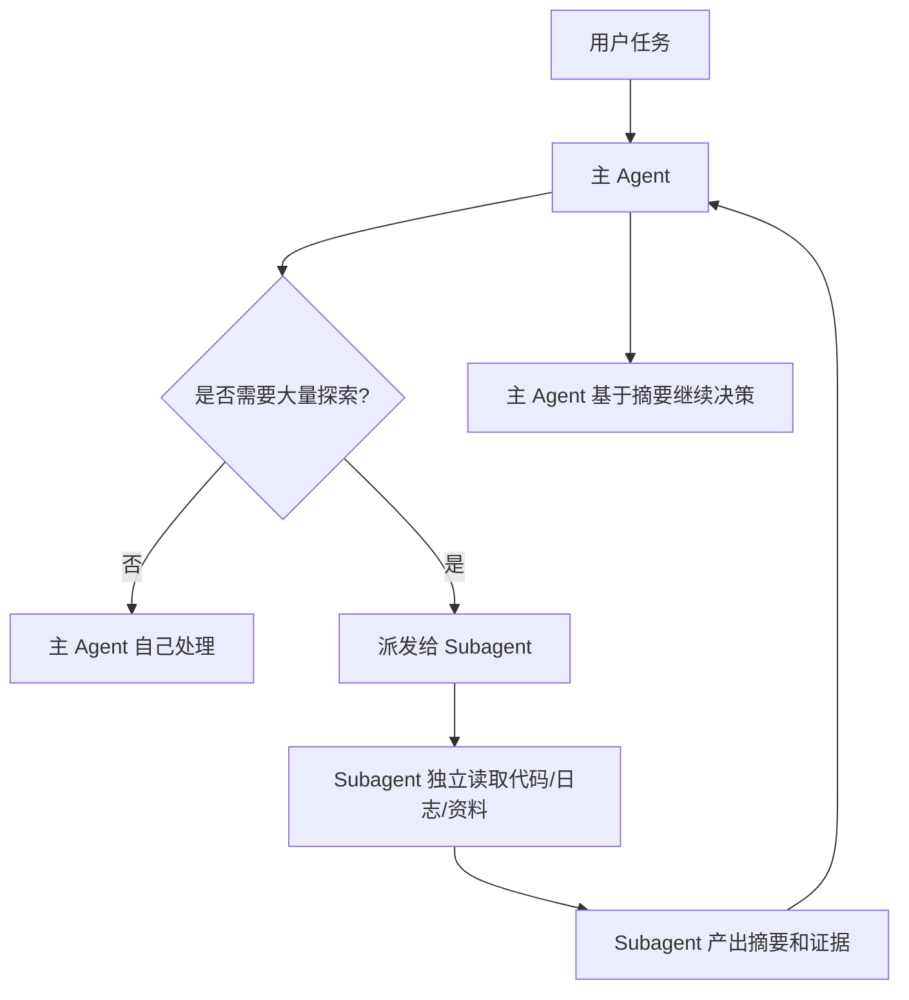
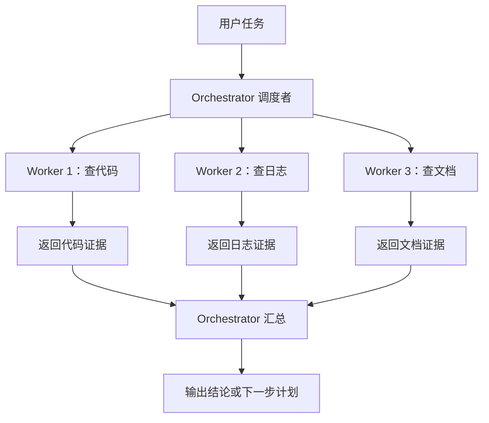
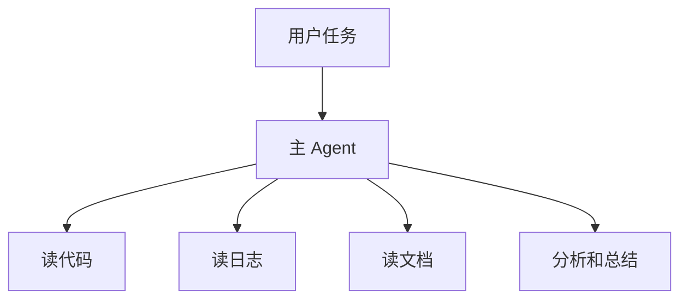
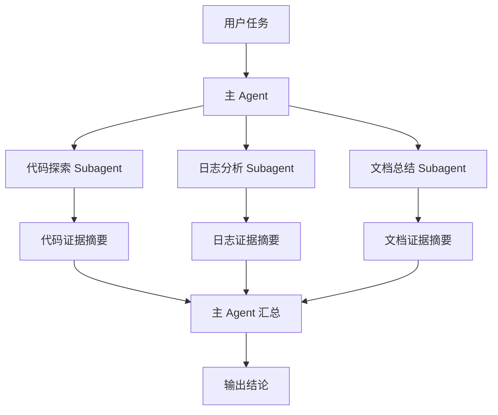
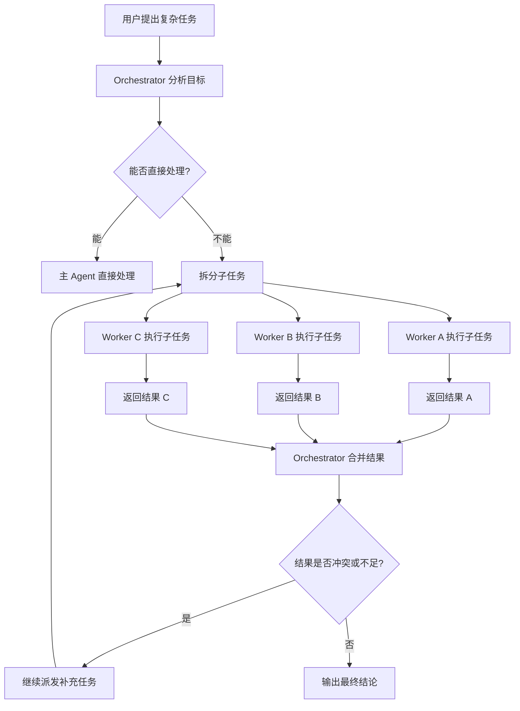
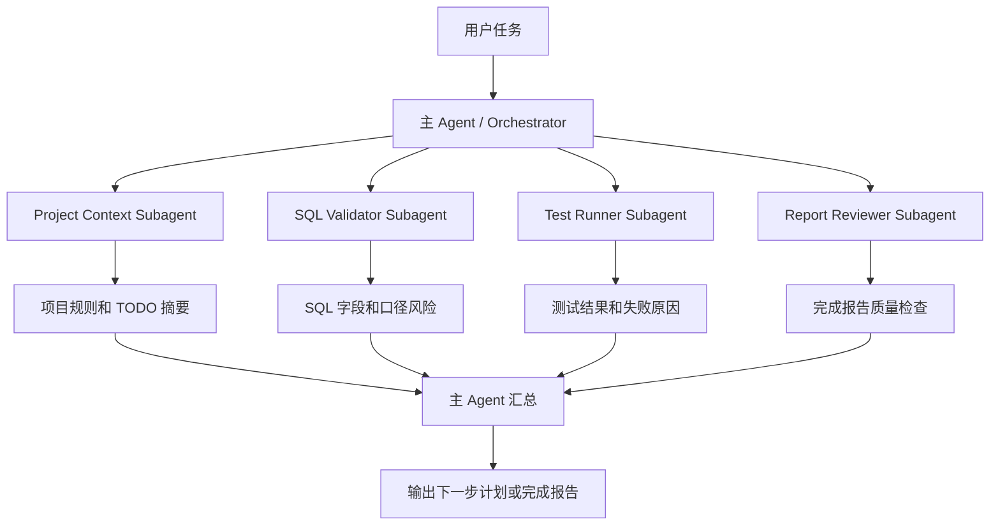
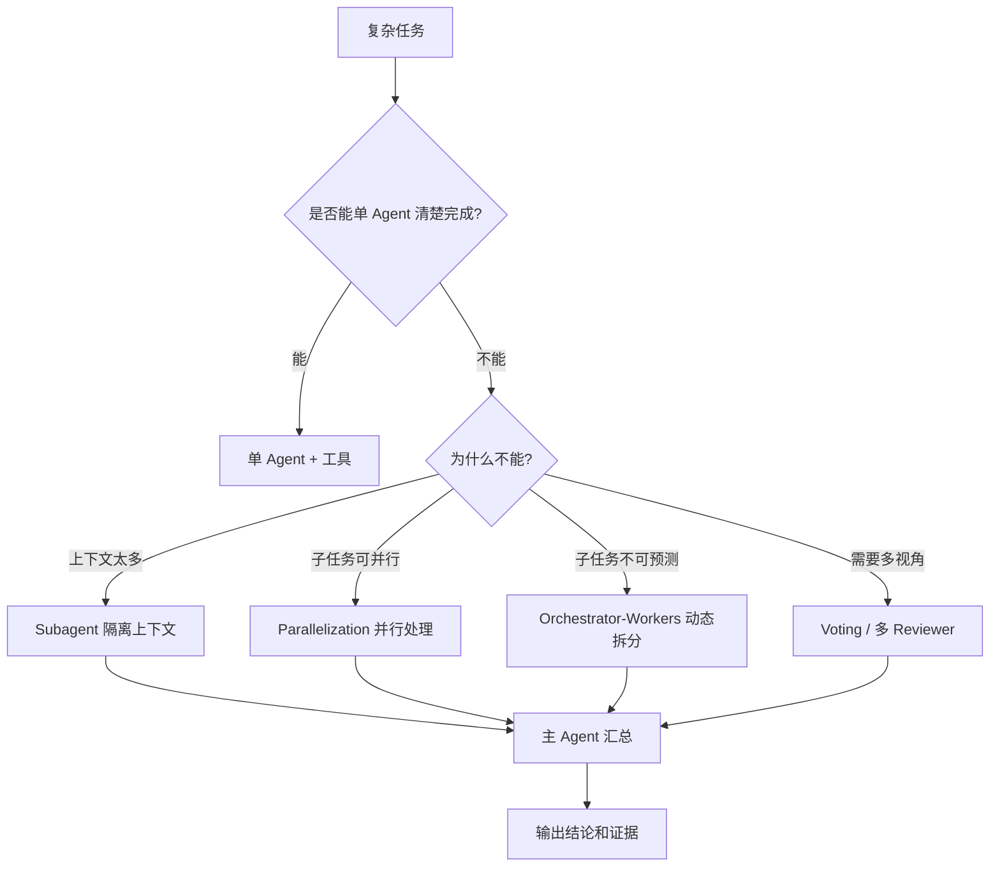

# Agent基础知识 09| Subagent / Multi-Agent：多 Agent 不是聊天群，而是上下文隔离和任务分工

> 从 Claude Code Subagents 和 Anthropic Orchestrator-Workers 看多 Agent 什么时候有用，什么时候反而添乱

前面几篇我们已经讲过：

```text
RAG：让 Agent 先查资料，再回答。
Memory：让 Agent 记住历史、状态和经验。
MCP：让多个 Agent 复用同一批工具。
Harness：让 Agent 拥有稳定运行的工程底座。
Coding Agent：让 Agent 在代码库里读、改、测、评审。
```

这一篇讲一个很容易被误解的东西：

> **Subagent / Multi-Agent。**

很多人一听“多 Agent”，第一反应是：

```text
搞几个 Agent 互相聊天；
一个当产品经理；
一个当架构师；
一个当开发；
一个当测试；
大家开会讨论。
```

这不是完全没用，但很容易变成“AI 聊天群”。

真正有价值的多 Agent，不是为了让多个模型热闹地聊天，而是为了解决三个工程问题：

```text
上下文隔离；
任务分工；
权限隔离。
```

一句话先给结论：

> **多 Agent 的价值，不在于“人多力量大”，而在于让不同 Agent 在不同上下文、不同工具权限、不同任务边界里工作。**

---

## 一、先看一个真实问题：为什么一个 Agent 会被上下文淹没？

### 1.1 单 Agent 做复杂任务时会发生什么？

假设你让一个 Coding Agent 排查一个复杂 bug：

```text
接口 /api/order/submit 偶发 500。
请帮我定位问题，不要直接改代码。
```

一个单 Agent 可能会做这些事：

```text
读取接口代码；
搜索 order submit；
读取 Controller；
读取 Service；
读取 Mapper；
读取配置文件；
读取日志；
读取测试；
查看数据库字段；
查看上游调用；
总结可能原因。
```

这听起来很合理，但很快会遇到问题。

| 问题     | 表现                             |
| ------ | ------------------------------ |
| 上下文过载  | Agent 读了太多日志和文件，主对话被大量内容淹没     |
| 注意力分散  | 它一边读日志、一边看代码、一边想测试，容易漏重点       |
| 工具权限过大 | 为了查问题，它拿到了读、写、执行命令等所有权限        |
| 任务边界混乱 | 本来只让分析，它可能顺手改代码                |
| 成本增加   | 一个主 Agent 扛下所有搜索和阅读，token 消耗很高 |
| 难以复盘   | 不知道哪些探索是必要的，哪些是噪声              |

这就是单 Agent 的典型问题：

> **复杂任务会把一个上下文窗口塞满，最后主 Agent 既看不清重点，也很难保持边界。**

---

### 1.2 Subagent 要解决的第一个问题：上下文隔离

**Subagent**，中文可以叫“子代理”。

它是什么？

> Subagent 是一个专门处理某类子任务的独立 Agent，通常有自己的上下文窗口、系统提示词、工具权限和任务边界。

为什么会出现？

因为主 Agent 不应该把所有搜索结果、日志、文件内容都塞进同一个上下文里。

Subagent 解决什么问题？

它把高噪声、局部性强、可独立完成的任务拆出去，让子代理在自己的上下文里处理，最后只把结果摘要返回主 Agent。

Claude Code 官方文档对 Subagents 的定义很清楚：它们是处理特定任务的专用 AI 助手；当一个旁路任务会用大量搜索结果、日志或文件内容淹没主对话时，就可以让子代理在自己的上下文中工作，然后只返回总结。每个子代理可以有自己的系统提示、工具访问和独立权限。([Claude API Docs][1])

不用 Subagent 会怎样？

主对话会被大量中间信息污染，Agent 会越来越难判断下一步。

---

### 1.3 用一张图理解 Subagent



节点解释：

| 节点               | 作用                     |
| ---------------- | ---------------------- |
| 用户任务             | 用户提出完整目标               |
| 主 Agent          | 负责理解目标、拆分任务、汇总结果       |
| 是否需要大量探索         | 判断某个子任务是否会污染主上下文       |
| Subagent         | 在独立上下文中执行局部任务          |
| 独立读取代码 / 日志 / 资料 | 子代理消化大量材料              |
| 摘要和证据            | 子代理只返回关键结论             |
| 主 Agent 继续决策     | 主 Agent 保持上下文清爽，继续推进任务 |

这张图的关键点是：

> **Subagent 不是为了增加一个“角色”，而是为了把大量上下文隔离出去。**

---

## 二、为什么会出现 Subagent / Multi-Agent？

### 2.1 因为上下文窗口很贵，不能什么都往主对话里塞

LLM 的上下文窗口虽然越来越长，但长上下文不等于可以无限塞资料。

问题在于：

```text
上下文越长，成本越高；
上下文越杂，模型越容易抓不到重点；
旧信息和新信息容易冲突；
大量工具结果会淹没真正重要的结论。
```

所以，多 Agent 的第一价值是：

> **让不同 Agent 各自处理一部分上下文，只把压缩后的结论交给主 Agent。**

---

### 2.2 因为不同任务需要不同工具权限

一个日志分析任务只需要读日志。

一个代码修改任务需要编辑文件。

一个数据库验证任务只需要只读 SQL。

如果所有任务都由主 Agent 执行，主 Agent 往往会被赋予过大的工具权限。

Subagent 可以把权限拆开。

| 子任务    | 推荐工具权限                      |
| ------ | --------------------------- |
| 日志分析   | 只读日志、搜索日志                   |
| 代码搜索   | read_file、grep、glob         |
| 代码修改   | edit_file、run_test          |
| SQL 校验 | readonly_sql、describe_table |
| 安全审查   | read_diff、static_scan       |
| 文档总结   | read_doc、search_doc         |

Claude Code 文档中也提到，Subagents 可以通过工具访问、权限模式、MCP Server 范围、hooks、skills、memory 等字段进行配置；`tools`、`disallowedTools`、`permissionMode`、`mcpServers`、`memory`、`isolation` 等都是子代理 frontmatter 可配置项。([Claude API Docs][1])

这说明 Subagent 不是“换个名字的聊天窗口”，而是一个可配置的受控执行单元。

---

### 2.3 因为不同任务需要不同提示词和专业能力

主 Agent 的系统提示通常比较通用：

```text
你是一个负责完成用户任务的 Agent。
```

但子任务往往需要更专门的行为：

```text
你是代码审查员，只看安全和可维护性。
你是 SQL 校验员，只判断字段、分区和聚合口径。
你是日志分析员，只提取关键错误、时间线和 trace_id。
你是测试修复员，只根据测试失败原因提出最小修复。
```

Subagent 可以拥有自己的系统提示词。

这解决的是：

> **不要让一个 Agent 同时背负所有角色，而是让每个 Agent 在更清晰的任务边界中工作。**

---

### 2.4 因为某些任务可以并行

有些任务天然可以拆开并行做：

```text
一个 Agent 查代码；
一个 Agent 查日志；
一个 Agent 查文档；
一个 Agent 查历史 issue；
主 Agent 汇总。
```

Anthropic 在《Building Effective Agents》中把并行化分成两类：一种是 Sectioning，也就是把任务分成独立子任务并行处理；另一种是 Voting，也就是用多个模型实例对同一任务给出多个判断再聚合。Anthropic 也指出，并行化适合可独立拆分、或者需要多个视角提高置信度的任务。([Anthropic][2])

所以多 Agent 的第二个价值是：

> **在可并行任务中提高速度和覆盖面。**

---

### 2.5 但多 Agent 也会增加复杂度

多 Agent 并不总是更好。

它会带来：

```text
更多模型调用；
更多上下文管理；
更多结果冲突；
更多权限配置；
更高成本；
更难调试；
更难评测。
```

Anthropic 也强调，不要为了复杂而复杂，应从简单方案开始，只有当复杂度能带来可衡量收益时再增加多步骤 agentic system。([Anthropic][2])

所以多 Agent 的原则是：

> **能单 Agent 清楚完成，就不要拆；只有当上下文、权限、并行、专业性真的需要拆时，才拆。**

---

## 三、Subagent、Multi-Agent、Orchestrator-Workers 到底是什么？

这一节先把几个容易混淆的词讲清楚。

### 3.1 Subagent：一个主任务下的专用子代理

**Subagent** 是一个更小粒度的概念。

它通常服务于一个主 Agent 或一个主任务。

它的特征是：

```text
有自己的上下文；
有自己的系统提示；
有自己的工具权限；
做一个局部子任务；
最后把摘要返回主 Agent。
```

适合：

```text
日志分析；
代码搜索；
安全 Review；
SQL 校验；
文档总结；
测试失败分析。
```

不适合：

```text
需要长期独立运营的业务代理；
需要跨多个会话互相协作的团队型代理；
可以由主 Agent 三两步完成的小事。
```

---

### 3.2 Multi-Agent：多个 Agent 协同完成任务

**Multi-Agent**，中文可以叫“多智能体系统”。

它是什么？

> 多个 Agent 按某种协作关系共同完成一个任务。

为什么会出现？

因为有些任务太复杂，一个 Agent 很难同时承担所有职责。

它解决的问题包括：

```text
任务拆分；
并行处理；
专业分工；
多视角审查；
上下文隔离；
权限隔离。
```

但 Multi-Agent 不等于多个 Agent 随便聊天。

真正工程化的 Multi-Agent 需要定义：

```text
谁负责拆任务；
谁负责执行；
谁负责评估；
谁能调用哪些工具；
谁能修改状态；
结果如何汇总；
冲突如何处理；
什么时候停止。
```

---

### 3.3 Orchestrator-Workers：调度者-执行者模式

**Orchestrator-Workers** 可以翻译为“调度者-执行者模式”。

它是什么？

> 一个中心 Agent 作为 Orchestrator，负责动态拆解任务、分配给多个 Worker，再汇总结果。

Anthropic 对这个模式的定义是：中心 LLM 动态拆解任务，把子任务委托给 worker LLMs，并综合它们的结果；它适合那些无法提前预测子任务数量和性质的复杂任务，比如复杂多文件代码修改和多源搜索分析。([Anthropic][2])

可以画成这样：



节点解释：

| 节点               | 作用                |
| ---------------- | ----------------- |
| 用户任务             | 完整目标              |
| Orchestrator 调度者 | 分析任务、决定拆成哪些子任务    |
| Worker           | 执行局部任务            |
| 返回证据             | 每个 Worker 输出结论和来源 |
| Orchestrator 汇总  | 合并证据、处理冲突、生成最终计划  |
| 输出结论             | 给用户或进入下一轮执行       |

这个模式的关键不是“并行”，而是：

> **子任务不是预先固定的，而是由 Orchestrator 根据当前任务动态拆出来。**

---

### 3.4 Parallelization：并行化模式

**Parallelization**，中文叫“并行化”。

它和 Orchestrator-Workers 很像，但不是一回事。

| 对比项       | Parallelization   | Orchestrator-Workers              |
| --------- | ----------------- | --------------------------------- |
| 子任务是否预先确定 | 通常可以预先确定          | 动态拆分                              |
| 主要目标      | 提速或多视角投票          | 处理复杂、不可预判任务                       |
| 例子        | 三个 Reviewer 同时审代码 | Orchestrator 读任务后决定需要查代码、查日志、查数据库 |
| 聚合方式      | 简单合并或投票           | 中心 Agent 综合分析                     |

Anthropic 对并行化的解释是：多个 LLM 同时处理任务，再由程序聚合输出；它适合可并行拆分，或者需要多个视角提高置信度的任务。([Anthropic][2])

---

### 3.5 Routing：路由模式

**Routing**，中文叫“路由”。

它是什么？

> 先判断任务类型，再把任务交给对应的处理流程或 Agent。

比如：

```text
SQL 问题 → SQL Validator
日志问题 → Log Analyzer
代码 Review → Code Reviewer
文档总结 → Doc Summarizer
```

Routing 适合任务类型清晰、分流规则明确的场景。Anthropic 指出，Routing 适合复杂任务中存在明显类别且分类可以准确完成的情况；它能让不同类别问题进入不同 prompt、流程和工具。([Anthropic][2])

---

## 四、Subagent / Multi-Agent 的底层工作流程

### 4.1 单 Agent 和 Subagent 的区别

单 Agent：



Subagent 模式：



对齐解释：

| 对比点  | 单 Agent        | Subagent 模式  |
| ---- | -------------- | ------------ |
| 上下文  | 所有材料塞到主上下文     | 子任务上下文隔离     |
| 权限   | 主 Agent 往往权限更大 | 不同子代理可限制权限   |
| 成本   | 主模型处理全部内容      | 可用小模型处理局部任务  |
| 可复盘  | 中间探索混在主对话中     | 每个子任务可单独记录   |
| 适合任务 | 简单、短任务         | 复杂、多资料、多步骤任务 |

---

### 4.2 Orchestrator-Workers 完整流程



节点解释：

| 节点                | 作用             |
| ----------------- | -------------- |
| Orchestrator 分析目标 | 判断任务需要哪些能力     |
| 能否直接处理            | 决定是否需要拆分       |
| 拆分子任务             | 动态生成 Worker 任务 |
| Worker 执行子任务      | 局部探索或处理        |
| 返回结果              | 给出证据和摘要        |
| 合并结果              | 综合多个 Worker 结论 |
| 结果冲突或不足           | 判断是否继续调查       |
| 输出最终结论            | 给用户可审查的结果      |

这个流程适合复杂任务，但不适合简单任务。

因为每个 Worker 都要占用模型调用、上下文和工具资源。

---

## 五、实际案例

### 5.1 Claude Code：用 Subagents 隔离代码搜索、计划和复杂操作

#### 5.1.1 输入案例

用户输入：

```text
这个接口 /api/order/submit 偶发 500。
先不要改代码，帮我定位原因，给证据和修改计划。
```

#### 5.1.2 推荐执行流程

| 步骤 | 使用哪个 Agent | 做什么 | 为什么这样做 |
| -- | --- | --- | --- |
| 1 | 主 Agent | 理解任务，确认“只定位，不修改” | 保持任务边界 |
| 2 | Explore Subagent | 只读搜索 `/api/order/submit` 相关代码 | 搜索结果多，避免污染主上下文 |
| 3 | Log Analyzer Subagent | 读取日志，提取错误时间、trace_id、异常栈 | 日志内容多，适合单独处理 |
| 4 | Plan Subagent | 基于代码和日志证据生成修改计划 | 计划阶段不直接写代码 |
| 5 | 主 Agent | 汇总证据，输出原因、风险和修改建议 | 保留主线控制权 |
| 6 | 用户确认后使用 General-purpose / 主 Agent | 执行修改和测试 | 修改动作需要明确授权 |

Claude Code 内置的 Explore 是快速只读代理，使用 Haiku 模型、只读工具，适合文件发现、代码搜索和代码库探索；Plan subagent 用于 plan mode 中收集代码库上下文；General-purpose 则适合复杂、多步骤、可能涉及修改的任务。([Claude API Docs][1])

#### 5.1.3 这个案例说明什么

这个案例里，多 Agent 不是为了“开会”，而是为了：

| 目标      | 通过什么实现                          |
| ------- | ------------------------------- |
| 不污染主上下文 | Explore 和 Log Analyzer 分别消化大量资料 |
| 不越权修改   | Explore / Plan 只读，修改阶段需要确认      |
| 让结果可审查  | 子代理返回证据摘要                       |
| 保留主线控制  | 主 Agent 汇总和决定下一步                |

---

### 5.2 代码 Review：并行 Reviewer 不等于聊天群

#### 5.2.1 输入案例

用户输入：

```text
请 Review 这个 PR，重点看安全、性能、可维护性和测试覆盖。
```

#### 5.2.2 推荐拆分

| Worker                   | 关注点               | 工具权限           |
| ------------------------ | ----------------- | -------------- |
| Security Reviewer        | SQL 注入、权限绕过、敏感日志  | 只读 Diff + 安全规则 |
| Performance Reviewer     | N+1 查询、缓存失效、循环复杂度 | 只读 Diff + 代码搜索 |
| Maintainability Reviewer | 命名、重复代码、架构边界      | 只读 Diff        |
| Test Reviewer            | 测试是否覆盖关键路径        | 只读测试文件 + Diff  |

这种设计对应 Anthropic 所说的 Parallelization 中的 Sectioning：把复杂任务拆成多个独立维度，让每个 LLM call 聚焦一个方面；代码漏洞审查也可以使用多个 prompts 从不同角度 review。([Anthropic][2])

#### 5.2.3 为什么这样更可靠

| 单 Agent Review | 多 Reviewer        |
| -------------- | ----------------- |
| 容易只关注一两个问题     | 每个维度独立检查          |
| 容易被大量 Diff 淹没  | 每个 Reviewer 有明确范围 |
| 结论混在一起         | 主 Agent 汇总成结构化报告  |
| 难以确认遗漏         | 每个维度都有检查项         |

---

### 5.3 企业内部 ETL Agent：多 Agent 如何拆分数据任务

#### 5.3.1 输入案例

用户输入：

```text
继续开发异常检测任务。
要求：只关注当前项目目录；不要猜真实表结构；先基于 mock Hive 跑通多指标链路。
```

#### 5.3.2 推荐多 Agent 结构



#### 5.3.3 节点对齐说明

| 节点                       | 作用                      |
| ------------------------ | ----------------------- |
| 主 Agent / Orchestrator   | 负责拆任务、汇总结果、控制最终输出       |
| Project Context Subagent | 读取项目规则、TODO、交接文件        |
| SQL Validator Subagent   | 检查 SQL 字段、pt_d、聚合口径     |
| Test Runner Subagent     | 跑单测、mock Hive、e2e，并总结失败 |
| Report Reviewer Subagent | 检查完成报告是否有结论、产出、测试、风险    |
| 主 Agent 汇总               | 决定继续修复、请求确认或交付          |

#### 5.3.4 为什么这样拆

| 问题           | 拆分后的好处           |
| ------------ | ---------------- |
| 项目规则很长       | 单独读取并总结，不污染主上下文  |
| SQL 校验细节多    | 交给专门子代理检查        |
| 测试日志很长       | 测试子代理只返回关键失败原因   |
| 完成报告要求高      | 用报告子代理做二次检查      |
| 主 Agent 容易分心 | 主 Agent 只负责调度和决策 |

---

## 六、什么时候多 Agent 有用？

### 6.1 有用场景总表

| 场景               | 为什么适合多 Agent              |
| ---------------- | ------------------------- |
| 大量搜索 / 日志 / 文件读取 | 子代理可隔离高噪声上下文              |
| 多维度 Review       | 不同 Reviewer 可关注不同维度       |
| 多源研究             | 各 Worker 查不同来源，主 Agent 汇总 |
| 大型代码修改           | Orchestrator 动态拆分文件和模块    |
| 权限差异明显           | 不同子代理可配置不同工具权限            |
| 成本需要优化           | 简单子任务可用更便宜模型              |
| 需要并行加速           | 独立子任务可同时执行                |

---

### 6.2 一个判断公式

可以用这个公式判断是否值得拆 Subagent：

```text
子任务是否高噪声？
子任务是否可独立完成？
子任务是否需要不同工具权限？
子任务结果是否能摘要返回？
拆分后是否减少主上下文压力？
```

如果大部分答案是“是”，可以拆。

如果只是为了“看起来更像团队”，不要拆。

---

## 七、什么时候多 Agent 反而添乱？

### 7.1 任务太小

例如：

```text
解释一个函数；
改一个变量名；
补一个简单单测；
总结一页文档。
```

这些任务用单 Agent 就够了。

拆多个 Agent 只会增加成本和延迟。

---

### 7.2 子任务边界不清

如果你无法说清：

```text
哪个 Agent 负责什么；
输入是什么；
输出是什么；
是否能独立完成；
谁负责汇总。
```

那拆分通常会失败。

多 Agent 不是把任务交给多个人“自由发挥”，而是需要清楚的接口设计。

---

### 7.3 子代理之间互相依赖太强

如果 A 的结果依赖 B，B 的结果依赖 C，C 又要等 A，那么并行没有意义。

这时更适合用 Prompt Chaining 或单 Agent 顺序执行。

---

### 7.4 没有汇总和冲突处理机制

多个 Agent 可能给出冲突结论。

比如：

```text
Security Reviewer：这里有权限绕过风险。
Feature Reviewer：这里实现符合需求。
Test Reviewer：测试通过。
```

如果没有主 Agent 或人类处理冲突，最后报告会变得混乱。

---

### 7.5 没有 Trace 和 Eval

多 Agent 系统失败后更难排查：

```text
到底哪个子代理错了？
是拆分错了，还是执行错了？
是证据不足，还是汇总错了？
```

没有 Trace 和 Eval，多 Agent 会让系统更难维护。

---

## 八、多 Agent 技术方案怎么选？

### 8.1 单 Agent + 工具

| 项目 | 内容                     |
| -- | ---------------------- |
| 适合 | 简单任务、上下文不大、权限一致        |
| 优点 | 成本低、流程简单、易调试           |
| 缺点 | 容易被复杂上下文淹没             |
| 示例 | 修改一个函数、解释一个 SQL、写一个小脚本 |

---

### 8.2 单 Agent + Subagent

| 项目 | 内容                        |
| -- | ------------------------- |
| 适合 | 主任务清晰，但某些子任务高噪声           |
| 优点 | 隔离搜索、日志、文件内容              |
| 缺点 | 需要设计子代理输入输出               |
| 示例 | 主 Agent 调用日志分析子代理、代码搜索子代理 |

---

### 8.3 Orchestrator-Workers

| 项目 | 内容                        |
| -- | ------------------------- |
| 适合 | 子任务数量和性质无法提前预测            |
| 优点 | 灵活，适合复杂 coding / research |
| 缺点 | 成本高，汇总复杂                  |
| 示例 | 多文件代码修改、多源研究、多模块排障        |

Anthropic 明确指出，Orchestrator-Workers 适合无法提前预测所需子任务的复杂任务，例如 coding 中需要改多少文件、每个文件改什么，都依赖具体任务；这与简单并行化的区别在于子任务由调度者根据输入动态决定。([Anthropic][2])

---

### 8.4 Parallelization / Voting

| 项目 | 内容                      |
| -- | ----------------------- |
| 适合 | 子任务可预定义，或需要多个视角         |
| 优点 | 并行快，多视角提高置信度            |
| 缺点 | 可能成本高，结果冲突需要处理          |
| 示例 | 多个 Reviewer 审安全、性能、测试覆盖 |

---

### 8.5 Agent Teams / 独立会话

Claude Code 文档中特别区分了 Subagents、background agents 和 agent teams：Subagents 工作在单个 session 内；如果要运行许多独立会话并统一监控，应该看 background agents；如果会话之间需要互相通信，则应看 agent teams。([Claude API Docs][1])

| 类型               | 适合场景        |
| ---------------- | ----------- |
| Subagent         | 单个任务里的子任务隔离 |
| Background Agent | 多个独立任务后台运行  |
| Agent Team       | 多个会话需要协作通信  |

这个区分很重要。

不要把所有多 Agent 都叫 Subagent。

---

## 九、2025～2026 年的新进展

### 9.1 Subagents 已经从概念进入工具配置层

2026 年对 agentic coding tools 的实证研究分析了 Claude Code、GitHub Copilot、Cursor、Gemini 和 Codex 等工具的配置机制，发现 Context Files、Skills 和 Subagents 已经成为跨工具的重要配置机制；其中 Claude Code 用户使用的配置机制最丰富。([arXiv][3])

这说明 Subagent 不再只是论文里的多智能体概念，而是进入了实际开发工具的工程配置层。

---

### 9.2 多 Agent 的核心仍然是上下文工程

2025 年的 Context Engineering 研究指出，复杂多文件项目中，AI coding assistants 经常受上下文限制和知识缺口影响；结合意图澄清、检索增强、文档合成和 Claude Code 多 Agent 系统，可以提高真实仓库中的代码生成和验证效果。([arXiv][4])

这再次说明：

> 多 Agent 的核心不是多个模型聊天，而是把上下文、工具和任务拆分得更合理。

---

### 9.3 Claude Code 的 Subagent 设计已经非常工程化

Claude Code 的 subagent 配置支持：

```text
name；
description；
tools；
disallowedTools；
model；
permissionMode；
maxTurns；
skills；
mcpServers；
hooks；
memory；
background；
isolation。
```

官方文档还说明，`isolation: worktree` 可以让 subagent 在临时 git worktree 里运行，获得独立仓库副本；`memory` 可以设置 user、project、local 等持久记忆范围。([Claude API Docs][1])

这说明 Subagent 已经不是简单 prompt，而是可配置的工程执行单元。

---

## 十、Subagent / Multi-Agent 的常见踩坑

### 10.1 把多 Agent 做成聊天群

不推荐：

```text
产品经理 Agent、架构师 Agent、开发 Agent、测试 Agent 互相聊天。
```

如果没有明确输入输出，最后会变成模型之间互相复述和争论。

推荐：

```text
代码搜索 Agent：只返回相关文件和证据。
SQL 校验 Agent：只返回字段和口径风险。
测试 Agent：只返回测试结果和失败原因。
主 Agent：只负责汇总和决策。
```

---

### 10.2 子代理职责不清

错误写法：

```text
让子代理帮忙看看这个问题。
```

更好的写法：

```text
你是日志分析子代理。
输入：错误日志和时间范围。
任务：提取异常栈、trace_id、可能根因。
输出：最多 5 条证据，不要修改代码。
```

---

### 10.3 子代理权限过大

如果一个只负责日志分析的子代理也能编辑文件、执行 shell、写数据库，就违背了权限隔离原则。

建议：

| 子代理           | 工具权限         |
| ------------- | ------------ |
| Explore       | 只读           |
| SQL Validator | 只读 SQL + 表结构 |
| Reviewer      | 只读 Diff      |
| Implementer   | 编辑文件 + 运行测试  |
| Deploy Agent  | 仅审批后触发部署     |

---

### 10.4 主 Agent 不做汇总判断

多个子代理返回结果后，必须有一个汇总层。

汇总层要做：

```text
去重；
判断证据强弱；
处理冲突；
标记未确认点；
生成最终结论；
决定下一步。
```

否则多 Agent 的输出会变成一堆散乱报告。

---

### 10.5 没有成本控制

多 Agent 很容易增加模型调用次数。

控制方式：

```text
简单任务不拆；
子任务使用更便宜模型；
限制 maxTurns；
限制工具调用次数；
只让子代理返回摘要；
并行任务设置超时。
```

Claude Code 文档中也提到 Subagents 可通过选择模型来控制成本，例如 Explore 使用 Haiku，适合快速、低延迟的只读代码搜索。([Claude API Docs][1])

---

### 10.6 没有评测

多 Agent 的效果必须评测。

否则你不知道：

```text
拆分是否真的提升成功率；
子代理是否经常跑偏；
汇总是否丢信息；
成本是否过高；
是否比单 Agent 更好。
```

Anthropic 在总结中也强调，成功不是构建最复杂系统，而是为需求构建正确系统；应从简单 prompt 开始，用评测优化，只有当简单方案不够时才增加多步骤系统。([Anthropic][2])

---

## 十一、这一篇的核心结论

### 11.1 多 Agent 为什么会出现

多 Agent 出现，不是因为一个 Agent 不够“热闹”，而是因为真实任务中会出现：

```text
上下文过载；
任务分工；
工具权限差异；
多源检索；
多维度审查；
并行执行；
成本优化。
```

---

### 11.2 Subagent 的核心价值

Subagent 的核心价值是：

```text
上下文隔离；
职责隔离；
权限隔离；
成本隔离；
结果压缩。
```

可以用一句话总结：

> **Subagent 不是“另一个人”，而是主 Agent 的一个受控子任务执行环境。**

---

### 11.3 Multi-Agent 的核心不是聊天，而是工程分工



### 11.4 节点对齐说明

| 节点                        | 作用               |
| ------------------------- | ---------------- |
| 单 Agent + 工具              | 简单任务优先使用         |
| Subagent 隔离上下文            | 处理大量日志、文件、搜索结果   |
| Parallelization 并行处理      | 适合预定义独立子任务       |
| Orchestrator-Workers 动态拆分 | 适合无法提前预测子任务的复杂任务 |
| Voting / 多 Reviewer       | 适合多视角评审          |
| 主 Agent 汇总                | 处理冲突、整合证据、形成最终结论 |

---

### 11.5 最后一句话

> **多 Agent 不是把几个 AI 放在一起聊天，而是用清晰的任务边界、上下文隔离、工具权限和结果汇总，把复杂任务拆成可控的工程流程。**

---

[1]: https://docs.claude.com/en/docs/claude-code/sub-agents "Create custom subagents - Claude Code Docs"
[2]: https://www.anthropic.com/engineering/building-effective-agents "Building Effective AI Agents \ Anthropic"
[3]: https://arxiv.org/abs/2602.14690 "Configuring Agentic AI Coding Tools: An Exploratory Study"
[4]: https://arxiv.org/abs/2508.08322 "Context Engineering for Multi-Agent LLM Code Assistants Using Elicit, NotebookLM, ChatGPT, and Claude Code"
