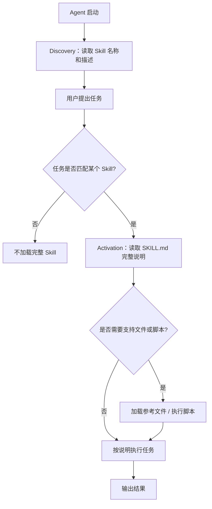
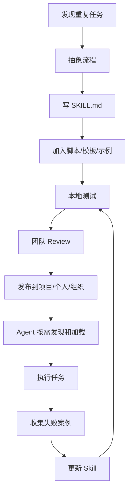
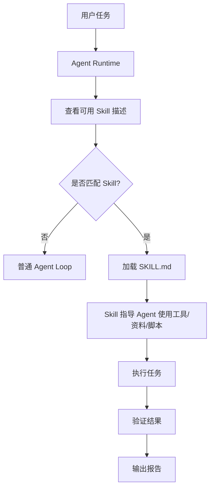
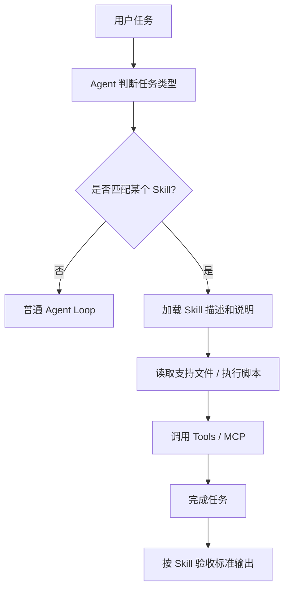

# Agent基础知识 10| Skills：把提示词升级成可复用能力包

> 从 Claude Code Skills、Agent Skills Open Standard 和 Agent-Learning-Hub 看 Skill 如何把提示词、流程、脚本、模板和验收标准打包成 Agent 的可复用能力

前面几篇我们讲过：

```text
RAG：让 Agent 先查资料，再回答。
Memory：让 Agent 记住历史、状态和经验。
MCP：让多个 Agent 复用同一批工具。
Harness：让 Agent 拥有稳定运行的工程底座。
Subagent：让复杂任务通过上下文隔离和任务分工变得可控。
```

这一篇讲 **Skills**。

它是现代 Agent 体系里非常重要的一层能力包装方式。

如果用一句话概括：

> **Skill 是把一类重复任务的流程知识、脚本、模板、参考资料和验收标准打包成一个可发现、可复用、可版本化的能力包。**

它解决的问题不是“模型会不会说”，也不是“工具能不能调用”，而是：

> **同一类任务，能不能稳定地按同一套方法做。**

---

## 一、先看一个真实问题：为什么反复写提示词会变成负担？

### 1.1 一个常见场景

假设你经常让 Agent 帮你做代码 Review。

每次你都要写：

```text
请帮我 review 这次改动。

要求：
1. 先看 git diff；
2. 总结本次改动；
3. 检查空指针风险；
4. 检查硬编码；
5. 检查是否缺测试；
6. 检查是否影响兼容性；
7. 最后按“问题 / 风险 / 建议 / 是否阻塞”输出。
```

第一次写还好。

第二次、第三次、第十次，你就会发现：

```text
同样的要求要反复粘贴；
不同人写出来的提示词不一致；
Agent 有时漏掉检查项；
复杂流程越来越长；
团队经验很难复用；
脚本、模板、参考资料不好一起交给 Agent。
```

这就是 Skill 要解决的问题。

---

### 1.2 不用 Skill 会怎样？

如果没有 Skill，团队通常会用这些方式凑合：

| 方式                         | 问题                  |
| -------------------------- | ------------------- |
| 反复粘贴长 Prompt               | 容易漏、容易变形、不可版本化      |
| 写在 README 里                | Agent 不一定知道什么时候用    |
| 写在 CLAUDE.md / AGENTS.md 里 | 太多流程会污染长期上下文        |
| 写成脚本                       | 只能执行固定逻辑，不会结合自然语言判断 |
| 写成 Tool                    | 适合单个动作，不适合多步骤流程     |

所以 Skill 出现的核心原因是：

> **Prompt 太临时，Tool 太原子，Memory 太分散，MCP 偏连接；我们需要一种能包装“做事流程”的能力单元。**

---

### 1.3 Skill 要解决的根本问题

Skill 主要解决四个问题。

| 问题      | Skill 怎么解决            |
| ------- | --------------------- |
| 重复提示词   | 把常用流程写进 `SKILL.md`    |
| 流程不一致   | 用一个版本化文件统一步骤和验收标准     |
| 上下文太长   | 只在需要时加载完整说明           |
| 知识和脚本分散 | 把说明、脚本、模板、参考资料放进同一个目录 |

Claude Code Skills 文档也明确说：当你反复把相同指令、checklist 或多步骤流程粘贴进聊天，或者 `CLAUDE.md` 中某段内容逐渐变成流程而不是事实时，就适合创建 Skill；Skill 的正文只在使用时加载，因此长参考资料在不需要时几乎不消耗上下文。([Claude API Docs][1])

---

## 二、为什么会出现 Skills？

### 2.1 Prompt 的问题：一次性强，复用性弱

**Prompt**，中文可以叫“提示词”或“指令”。

它是什么？

> Prompt 是用户或系统在某一次模型调用中给模型的指令和上下文。

它解决什么问题？

Prompt 告诉模型这一次应该怎么回答、用什么格式、遵守什么限制。

但 Prompt 的问题是：

```text
临时；
难复用；
难版本化；
难分发；
难和脚本、模板一起管理；
很容易变成长篇说明。
```

所以，Prompt 适合一次性任务，不适合沉淀长期能力。

---

### 2.2 Tool 的问题：能做动作，但不懂流程

**Tool**，中文叫“工具”。

它是什么？

> Tool 是 Agent 可以调用的一个具体动作，比如读文件、跑 SQL、调用 API、执行脚本。

它解决什么问题？

Tool 让 Agent 能影响外部世界。

例如：

```text
read_file(path)
grep_code(keyword)
run_test(command)
query_database(sql)
create_ticket(title, description)
```

但 Tool 通常是原子的。

它擅长做一个动作，不擅长表达完整流程。

比如“代码 Review”不是一个简单工具调用，而是一套流程：

```text
读取 diff；
理解改动；
检查风险；
检查测试；
分类问题；
输出结构化报告。
```

如果把整个 Review 写成一个 Tool，就会太黑盒；如果拆成很多 Tool，又缺少流程指导。

Skill 正好补这个空缺：

> Tool 负责动作，Skill 负责如何组织动作完成任务。

---

### 2.3 MCP 的问题：负责连接，不负责教 Agent 怎么做事

**MCP**，全称 Model Context Protocol，中文可以理解为“模型上下文协议”。

它是什么？

> MCP 是一种让 Agent 标准化连接外部工具、数据源和服务的协议。

它解决什么问题？

MCP 解决的是：

```text
如何连接数据库；
如何连接文件系统；
如何连接 Jira；
如何连接 Slack；
如何让多个 Agent 复用同一批工具。
```

但 MCP 不直接告诉 Agent：

```text
代码 Review 应该先看什么；
上线前应该检查哪些风险；
迁移组件时哪些步骤不能漏；
生成报告时如何组织结构。
```

所以 MCP 是连接层，Skill 是流程层。

可以这样理解：

```text
MCP：把工具接进来。
Skill：告诉 Agent 怎么用这些工具完成一类任务。
```

Agent Skills 官方站点也将 Agent Skills 定义为一种轻量开放格式，用来用专门知识和工作流扩展 AI Agent；Skill 核心是一个包含 `SKILL.md` 的文件夹，`SKILL.md` 至少包含 name、description 等元数据和任务说明，也可以打包脚本、参考资料、模板和其他资源。([Agent Skills][2])

---

### 2.4 Memory 的问题：记住经验，但不一定形成可执行流程

Memory 可以记住：

```text
用户偏好；
项目规则；
历史错误；
任务状态；
上次踩坑。
```

但 Memory 不一定告诉 Agent：

```text
下一次遇到这种任务应该按哪些步骤执行；
每一步用什么工具；
输出格式是什么；
验收标准是什么；
是否需要人工确认。
```

Skill 可以把 Memory 里的经验进一步固化成流程。

例如：

```text
Memory：上次发版忘记跑配置加载测试，导致线上配置失败。
Skill：release-check Skill 中加入“发版前必须运行配置加载测试”。
```

所以 Skill 是从经验到流程的沉淀。

---

## 三、Skill 到底是什么？

### 3.1 定义

**Skill**，中文可以叫“技能”或“能力包”。

在 Agent 语境里，它指的是：

> 一个可被 Agent 发现、加载和执行的任务能力包，通常包含说明文件、脚本、模板、参考资料和验收规则。

它不是单纯 Prompt，也不是单独 Tool，而是一个更完整的能力封装。

Agent Skills 标准文档给出的核心结构是：一个 skill 是包含 `SKILL.md` 文件的文件夹；除了 `SKILL.md`，还可以包含 `scripts/`、`references/`、`assets/` 等可选目录。([Agent Skills][2])

---

### 3.2 最小 Skill 长什么样？

一个最小 Skill 可以是：

```text
code-review/
└── SKILL.md
```

稍微完整一点：

```text
code-review/
├── SKILL.md
├── checklist.md
├── examples/
│   └── good-review.md
└── scripts/
    └── collect_diff.sh
```

各文件作用如下：

| 文件 / 目录        | 作用                       |
| -------------- | ------------------------ |
| `SKILL.md`     | 主说明文件，告诉 Agent 什么时候用、怎么做 |
| `checklist.md` | 更详细的检查清单，需要时加载           |
| `examples/`    | 示例输出，帮助 Agent 对齐格式       |
| `scripts/`     | 可执行脚本，用于确定性步骤            |

Claude Code 文档也说明，Skills 可以包含多个文件，以保持 `SKILL.md` 聚焦核心内容；详细 API 文档、示例集合等可以放到支持文件里，只有需要时再加载，并建议 `SKILL.md` 保持在 500 行以内，把细节放到独立文件中。([Claude API Docs][1])

---

### 3.3 `SKILL.md` 是什么？

`SKILL.md` 是 Skill 的入口文件。

它是什么？

> 一个 Markdown 文件，包含元数据和任务说明。

通常包含两部分：

```text
YAML Frontmatter
Markdown Instructions
```

---

### 3.4 YAML Frontmatter 是什么？

**YAML Frontmatter** 可以理解为 Markdown 文件开头的一段结构化元数据。

它一般长这样：

```markdown
---
name: code-review
description: Review git diff for correctness, maintainability, risks, and missing tests.
---

## Instructions
1. Read current diff.
2. Summarize the change.
3. Check risks.
4. Output structured review.
```

其中：

| 字段                         | 作用                       |
| -------------------------- | ------------------------ |
| `name`                     | Skill 的显示名称              |
| `description`              | 告诉 Agent 这个 Skill 什么时候该用 |
| `allowed-tools`            | Skill 激活时允许哪些工具          |
| `disable-model-invocation` | 是否禁止模型自动调用               |
| `context`                  | 是否在子代理上下文中运行             |
| `agent`                    | 指定使用哪类子代理                |

Claude Code 文档指出，`description` 会帮助 Claude 判断何时自动加载 Skill；frontmatter 还可以配置 `disable-model-invocation`、`allowed-tools`、`disallowed-tools`、`model`、`context`、`agent`、`hooks`、`paths`、`shell` 等字段。([Claude API Docs][1])

---

## 四、Skill 和 Prompt、Tool、MCP、Memory 的区别

先用一张表对齐。

| 概念     | 中文理解   | 核心作用          | 适合什么              |
| ------ | ------ | ------------- | ----------------- |
| Prompt | 一次性提示词 | 指挥模型这一次怎么做    | 临时任务、单次问答         |
| Tool   | 工具调用   | 执行一个具体动作      | 读文件、跑命令、查数据库      |
| MCP    | 工具连接协议 | 标准化连接外部系统     | 多 Agent 复用工具      |
| Memory | 记忆系统   | 保存历史、偏好、状态、经验 | 跨会话连续性            |
| Skill  | 可复用能力包 | 固化一类任务流程      | Review、部署、迁移、报告生成 |

---

### 4.1 Skill 和 Prompt 的区别

| 对比项   | Prompt | Skill         |
| ----- | ------ | ------------- |
| 生命周期  | 一次性    | 可长期保存         |
| 复用性   | 低      | 高             |
| 版本管理  | 通常没有   | 可以放进 Git      |
| 内容结构  | 自由文本   | 元数据 + 指令 + 资源 |
| 适用场景  | 临时指令   | 重复流程          |
| 是否可分发 | 不方便    | 可以共享给团队或组织    |

一句话：

> Prompt 是一次性说明，Skill 是可复用说明书。

---

### 4.2 Skill 和 Tool 的区别

| 对比项        | Tool                   | Skill                         |
| ---------- | ---------------------- | ----------------------------- |
| 颗粒度        | 一个动作                   | 一类任务流程                        |
| 例子         | `git diff`、`run_tests` | `code-review`、`release-check` |
| 是否直接执行外部动作 | 通常会                    | 不一定，可能指导 Agent 使用 Tool        |
| 是否包含流程     | 少                      | 多                             |
| 是否包含知识和模板  | 通常不包含                  | 可以包含                          |

一句话：

> Tool 是手，Skill 是做事方法。

---

### 4.3 Skill 和 MCP 的区别

| 对比项    | MCP               | Skill           |
| ------ | ----------------- | --------------- |
| 核心问题   | 工具怎么接进来           | 任务怎么稳定完成        |
| 层级     | 连接层               | 能力层             |
| 典型对象   | 数据库、文件系统、SaaS、API | Review、部署、迁移、报告 |
| 是否描述流程 | 不主要               | 是               |
| 是否暴露工具 | 是                 | 可以调用工具，但不等于工具   |

一句话：

> MCP 负责把外部能力接进 Agent，Skill 负责告诉 Agent 如何使用这些能力完成任务。

---

### 4.4 Skill 和 Memory 的区别

| 对比项 | Memory | Skill |
| --- | --- | --- |
| 关注点 | 过去发生了什么 | 以后应该怎么做 |
| 内容 | 偏事实、偏经验 | 偏流程、偏规则 |
| 例子 | “上次发布忘记跑测试” | “发布前必须跑测试、构建、验证” |
| 变化频率 | 运行中不断变化 | 版本化更新 |
| 使用方式 | 任务相关时检索 | 任务匹配时加载 |

一句话：

> Memory 是经验库，Skill 是操作手册。

---

## 五、Skill 的底层工作流程

### 5.1 Progressive Disclosure：渐进式加载

**Progressive Disclosure**，中文可以叫“渐进式披露”或“按需加载”。

它是什么？

> Agent 不会一开始把所有 Skill 内容都加载进上下文，而是分阶段加载。

Agent Skills 官方文档将 Skill 加载分为三步：Discovery 阶段只加载 name 和 description；Activation 阶段在任务匹配时读取完整 `SKILL.md`；Execution 阶段按照说明执行，并按需执行代码或加载参考文件。完整说明只有在任务需要时才加载，因此 Agent 可以保留很多 Skills，而上下文成本很小。([Agent Skills][2])

流程如下：



节点解释：

| 节点         | 作用                       |
| ---------- | ------------------------ |
| Discovery  | 只读取 Skill 的名称和描述，降低上下文成本 |
| 任务匹配       | 判断当前用户任务是否需要某个 Skill     |
| Activation | 读取完整 `SKILL.md`          |
| 支持文件 / 脚本  | 只在需要时加载或执行               |
| 输出结果       | 按 Skill 的验收标准交付          |

这就是 Skill 能同时支持“很多能力”和“低上下文占用”的关键。

---

### 5.2 Skill 的生命周期

一个 Skill 从创建到使用，通常经历这些阶段：



节点解释：

| 节点            | 作用                  |
| ------------- | ------------------- |
| 发现重复任务        | 判断是否值得沉淀为 Skill     |
| 抽象流程          | 从一次性做法中提炼通用步骤       |
| 写 `SKILL.md`  | 固化触发条件、步骤、输出格式      |
| 加脚本 / 模板 / 示例 | 提供确定性工具和参考输出        |
| 本地测试          | 验证 Skill 是否能被正确触发   |
| 团队 Review     | 防止错误流程被固化           |
| 发布            | 放到项目、个人或组织作用域       |
| 执行任务          | Agent 使用 Skill 完成任务 |
| 收集失败案例        | 发现触发过度、触发不足、步骤不清等问题 |
| 更新 Skill      | 迭代改进，形成团队经验复利       |

---

### 5.3 Skill 在 Agent Loop 里的位置



Skill 不替代 Agent Loop，而是嵌入 Agent Loop。

它的作用是：

> 在某类任务出现时，给 Agent 一套更稳定的做事方法。

---

## 六、一个好的 Skill 应该包含什么？

### 6.1 最小组成

一个可用 Skill 至少应该包含：

| 内容   | 说明           |
| ---- | ------------ |
| 名称   | 这个 Skill 是什么 |
| 描述   | 什么任务应该触发它    |
| 适用场景 | 什么时候用        |
| 禁用场景 | 什么时候不要用      |
| 执行步骤 | 具体怎么做        |
| 工具要求 | 可以用哪些工具      |
| 输出格式 | 最后交付什么       |
| 验收标准 | 怎样算完成        |
| 风险边界 | 哪些动作需要人工确认   |

---

### 6.2 一个较好的 Skill 结构

```text
release-check/
├── SKILL.md
├── checklist.md
├── templates/
│   └── release-report.md
├── examples/
│   └── good-release-report.md
└── scripts/
    └── collect_release_info.sh
```

各部分作用：

| 文件             | 作用                 |
| -------------- | ------------------ |
| `SKILL.md`     | 主说明，包含触发条件、步骤、输出要求 |
| `checklist.md` | 详细检查项              |
| `templates/`   | 输出模板               |
| `examples/`    | 示例报告               |
| `scripts/`     | 可执行脚本，收集确定性信息      |

Claude Code 文档也建议将详细参考材料移到支持文件中，从 `SKILL.md` 引用这些文件，让 Claude 知道它们包含什么以及何时加载。([Claude API Docs][1])

---

### 6.3 `description` 很关键

`description` 不是随便写的简介。

它决定 Agent 是否能正确发现这个 Skill。

不好的 description：

```yaml
description: Helps with code.
```

太泛，Agent 不知道什么时候用。

更好的 description：

```yaml
description: Review current git diff for correctness, maintainability, missing tests, hardcoded values, and risky changes. Use when the user asks to review, summarize, or prepare a commit.
```

这里明确了：

```text
任务类型：review current git diff；
检查范围：正确性、可维护性、缺测试、硬编码、风险；
触发场景：review、summarize、prepare commit。
```

Claude Code 文档说明，`description` 会帮助 Claude 判断什么时候自动加载 Skill，而且建议把关键使用场景放在前面。([Claude API Docs][1])

---

## 七、实际案例

### 7.1 案例一：Code Review Skill

#### 7.1.1 输入

用户说：

```text
帮我看一下这次 git diff 有没有风险。
```

#### 7.1.2 Skill 目录

```text
code-review/
├── SKILL.md
├── checklist.md
└── examples/
    └── review-output.md
```

#### 7.1.3 `SKILL.md` 示例

```markdown
---
name: code-review
description: Review current git diff for correctness, maintainability, missing tests, hardcoded values, risky behavior, and compatibility issues.
allowed-tools: Bash(git diff *) Bash(git status *)
---

## Task

Review the current uncommitted changes.

## Steps

1. Read current git diff.
2. Summarize the change in 2-3 bullets.
3. Check for:
   - Missing error handling
   - Hardcoded values
   - Missing tests
   - Compatibility risks
   - Security risks
4. Output:
   - Summary
   - Blocking issues
   - Non-blocking suggestions
   - Test suggestions
```

#### 7.1.4 执行流程

| 步骤 | Agent 做什么        | 为什么这样做               |
| -- | ---------------- | -------------------- |
| 1  | 识别用户在请求 Review   | 匹配 Skill description |
| 2  | 加载 `SKILL.md`    | 获取标准 Review 流程       |
| 3  | 执行 `git diff`    | 获取真实改动               |
| 4  | 按 checklist 检查风险 | 防止漏检查项               |
| 5  | 输出结构化 Review     | 方便人类审查               |

Claude Code 官方文档中的 `summarize-changes` 示例也展示了类似模式：Skill 可以通过动态上下文注入运行 `git diff HEAD`，然后把真实 diff 插入 prompt，让 Claude 基于当前工作区而不是猜测进行总结和风险提示。([Claude API Docs][1])

---

### 7.2 案例二：Deploy Skill

#### 7.2.1 输入

用户说：

```text
/deploy staging
```

#### 7.2.2 为什么部署 Skill 不能让模型自动触发

部署是高风险动作。

如果模型看到代码“看起来准备好了”，就自动部署，会非常危险。

Claude Code 文档专门说明，`disable-model-invocation: true` 适合 `/commit`、`/deploy`、`/send-slack-message` 这类有副作用或需要用户控制触发时机的工作流；文档还给出了 deploy Skill 示例，并强调不要让 Claude 因为代码看起来 ready 就自己决定部署。([Claude API Docs][1])

#### 7.2.3 Deploy Skill 应该包含什么

| 内容   | 要求               |
| ---- | ---------------- |
| 触发方式 | 只能用户手动 `/deploy` |
| 前置检查 | 测试、构建、配置检查       |
| 权限控制 | 不允许模型自动触发        |
| 输出结果 | 部署环境、版本、验证结果     |
| 人工确认 | 生产环境必须确认         |

#### 7.2.4 示例

```markdown
---
name: deploy
description: Deploy the application to a target environment.
disable-model-invocation: true
allowed-tools: Bash(make test) Bash(make build)
---

Deploy $ARGUMENTS:

1. Confirm target environment.
2. Run test suite.
3. Build the application.
4. Ask for confirmation before production deploy.
5. Verify deployment result.
6. Output release report.
```

---

### 7.3 案例三：PR Summary Skill

#### 7.3.1 输入

用户说：

```text
帮我总结一下这个 PR 的改动和风险。
```

#### 7.3.2 Skill 如何获取动态上下文

Claude Code 支持在 Skill 里使用 `!` 命令进行动态上下文注入。文档中的 PR Summary 示例会先运行 `gh pr diff`、`gh pr view --comments`、`gh pr diff --name-only` 等命令，把 PR diff、评论和改动文件列表插入 prompt；Claude 看到的是已经渲染好的真实数据，而不是自己再猜。([Claude API Docs][1])

#### 7.3.3 执行步骤

| 步骤                          | 作用             |
| --------------------------- | -------------- |
| 运行 `gh pr diff`             | 获取真实代码改动       |
| 运行 `gh pr view --comments`  | 获取 Review 评论   |
| 运行 `gh pr diff --name-only` | 获取改动文件列表       |
| 组装 Prompt                   | 把真实 PR 数据交给模型  |
| 生成总结                        | 输出改动摘要、风险、测试建议 |

#### 7.3.4 为什么这是 Skill，而不是 Tool

因为它不是一个单一动作。

它包含：

```text
多个命令；
数据收集；
总结逻辑；
风险判断；
输出格式。
```

Tool 只能提供 `gh pr diff` 这类动作。
Skill 负责组织这些动作完成 “PR Summary” 这类任务。

---

### 7.4 案例四：企业内部 ETL Skill

#### 7.4.1 输入

用户说：

```text
帮我继续推进异常检测 ETL 任务，先看当前 TODO 和测试状态。
```

#### 7.4.2 Skill 目录

```text
etl-anomaly-dev/
├── SKILL.md
├── checklist.md
├── report-template.md
└── scripts/
    └── collect_test_status.sh
```

#### 7.4.3 Skill 应该包含什么

| 部分   | 内容                                   |
| ---- | ------------------------------------ |
| 适用场景 | 开发 / 调试异常检测 ETL                      |
| 边界   | 只关注当前项目目录，不扩展到外层微服务                  |
| 执行步骤 | 读 TODO → 读配置 → 只读分析 → 出计划 → 修改 → 跑测试 |
| 工具权限 | 读文件、grep、运行项目测试                      |
| 禁止事项 | 不猜真实表结构，不直接操作平台                      |
| 验收标准 | 测试结果、完成报告、风险边界                       |
| 输出格式 | 一句话结论、核心产出、测试证据、未确认点                 |

#### 7.4.4 Skill 带来的价值

| 没有 Skill    | 有 Skill            |
| ----------- | ------------------ |
| 每次重新交代项目规则  | 自动加载项目流程           |
| Agent 容易漏测试 | checklist 强制测试步骤   |
| 完成报告风格不稳定   | 固定 report-template |
| 真实表结构可能被乱猜  | 禁止事项写入 Skill       |
| 长任务难续接      | TODO 和测试状态成为固定入口   |

这个案例说明：Skill 最适合沉淀团队反复使用的工程流程。

---

## 八、Skill 的技术方案怎么选？

### 8.1 Prompt：适合一次性任务

| 项目 | 内容           |
| -- | ------------ |
| 适合 | 临时问答、一次性说明   |
| 优点 | 简单、灵活        |
| 缺点 | 不可复用、不可版本化   |
| 示例 | “帮我把这段话润色一下” |

---

### 8.2 Tool：适合原子动作

| 项目 | 内容                               |
| -- | -------------------------------- |
| 适合 | 明确输入输出的单个动作                      |
| 优点 | 可执行、可测试                          |
| 缺点 | 不表达完整流程                          |
| 示例 | `run_sql(sql)`、`read_file(path)` |

---

### 8.3 MCP：适合工具连接和复用

| 项目 | 内容                           |
| -- | ---------------------------- |
| 适合 | 多 Agent 共享外部工具和数据            |
| 优点 | 标准化、可复用                      |
| 缺点 | 不直接表达业务流程                    |
| 示例 | DB MCP Server、Git MCP Server |

---

### 8.4 Skill：适合重复流程

| 项目 | 内容                                        |
| -- | ----------------------------------------- |
| 适合 | 多步骤、可复用、有固定验收标准的任务                        |
| 优点 | 流程稳定、可版本化、可分发                             |
| 缺点 | 需要维护，写不好会误触发                              |
| 示例 | code-review、deploy-check、migration-helper |

---

### 8.5 Plugin：适合打包一组能力

Claude Code 文档提到，Skill 文件夹也可以通过 `.claude-plugin/plugin.json` 加载为 plugin；plugin 可以打包 agents、hooks 和 MCP servers。([Claude API Docs][1])

可以这样理解：

| 概念         | 粒度            |
| ---------- | ------------- |
| Tool       | 一个动作          |
| Skill      | 一个任务流程        |
| Plugin     | 一组相关能力        |
| MCP Server | 一批外部工具 / 数据服务 |

---

## 九、Skill 的常见踩坑

### 9.1 description 写得太泛

不推荐：

```yaml
description: Helps with code.
```

推荐：

```yaml
description: Review current git diff for correctness, maintainability, missing tests, hardcoded values, risky behavior, and compatibility issues.
```

description 写不好，Agent 就不知道什么时候该用 Skill。

---

### 9.2 Skill 触发太频繁

如果 description 太宽泛，Agent 会在不该用的时候用。

例如：

```yaml
description: Use for all coding tasks.
```

这会导致 Skill 过度触发，污染上下文。

Claude Code 文档也提到，如果 Skill 触发太频繁或影响行为不稳定，需要调整 description 和 instructions；对于必须确定执行的行为，更应该用 hooks 强制，而不是只靠 Skill。([Claude API Docs][1])

---

### 9.3 把所有内容都塞进 SKILL.md

`SKILL.md` 太长，会增加上下文成本。

更好的做法是：

```text
主流程放 SKILL.md；
细节放 reference.md；
示例放 examples/；
确定性逻辑放 scripts/。
```

Claude Code 文档建议 `SKILL.md` 保持简洁，并把详细参考材料放到支持文件中。([Claude API Docs][1])

---

### 9.4 高风险 Skill 允许模型自动调用

比如：

```text
deploy；
send-slack-message；
commit；
delete-files。
```

这类 Skill 不应该让模型自动触发。

应设置：

```yaml
disable-model-invocation: true
```

并要求用户手动调用。

Claude Code 文档明确指出，deploy 等有副作用的工作流应该使用 `disable-model-invocation: true`，防止 Claude 自动运行。([Claude API Docs][1])

---

### 9.5 allowed-tools 配得太宽

`allowed-tools` 可以让 Skill 激活时无需每次请求某些工具权限，但它也带来风险。Claude Code 文档提醒，项目里的 Skill 如果声明 `allowed-tools`，需要在接受 workspace trust 之后才生效；同时应在信任仓库前 review 项目 Skills，因为 Skill 可能给自己授予很宽的工具访问权限。([Claude API Docs][1])

所以项目 Skill 必须 code review。

---

### 9.6 把 Skill 当成安全机制

Skill 可以写规则，但它不是安全机制本身。

安全还需要：

```text
Permission Gate；
Hooks；
Tool allowlist / denylist；
Sandbox；
Trace；
人工确认；
Eval。
```

2026 年的 Contractual Skills 研究指出，企业 Skill 可以把目标、输入边界、权限、证据要求、输出契约、质量标准、验证步骤、人工批准点等显式化；但实验也指出，Skill 更适合理解为治理层，而不是独立安全机制，运行时工具护栏仍然必需。([arXiv][3])

---

### 9.7 第三方 Skill 有供应链风险

Skill 的说明文件不是普通文档。

2026 年关于 `SKILL.md` 的安全研究指出，`SKILL.md` 会影响 Agent 如何发现、选择和加载能力包；攻击者可以通过自然语言元数据和说明操纵 Skill 的可见度、选择倾向和治理判断。研究在 Discovery、Selection、Governance 三个阶段展示了 `SKILL.md` only attacks 的风险。([arXiv][4])

所以第三方 Skill 要像第三方依赖一样审查：

```text
看来源；
看脚本；
看 allowed-tools；
看是否有外部网络访问；
看是否要求敏感权限；
看是否有恶意提示。
```

---

## 十、Skill 怎么写得更好？

### 10.1 写 Skill 前先问五个问题

| 问题          | 目的             |
| ----------- | -------------- |
| 这个任务是否重复出现？ | 判断是否值得 Skill 化 |
| 输入是什么？      | 明确触发和参数        |
| 输出是什么？      | 明确交付物          |
| 中间步骤是否稳定？   | 判断能否抽象成流程      |
| 有无高风险动作？    | 决定是否需要禁用自动触发   |

---

### 10.2 Skill 应该写“做什么”，不要写太多故事

不推荐：

```text
你是一个非常优秀、经验丰富、谨慎负责的高级工程师……
```

推荐：

```text
1. Read git diff.
2. Summarize changes.
3. Check error handling.
4. Check tests.
5. Output blocking issues first.
```

Claude Code 文档也建议在 Skill 内容中“state what to do rather than narrating how or why”，即说明要做什么，而不是讲太多叙述性背景。([Claude API Docs][1])

---

### 10.3 输出格式要固定

例如 Code Review Skill 可以要求：

```markdown
## Summary

## Blocking Issues

## Non-blocking Suggestions

## Test Gaps

## Risk Level
```

这样做的好处是：

```text
方便人类阅读；
方便自动检查；
方便后续评测；
方便不同 Agent 复用。
```

---

### 10.4 加 Smoke Test

**Smoke Test**，中文可以叫“冒烟测试”。

它是什么？

> 一个最小测试，用来确认 Skill 能不能被正确触发，并输出预期格式。

例如 Code Review Skill 的 smoke test：

```text
准备一个小 git diff；
输入：帮我看看这次改动有什么风险；
期望：Skill 被触发，输出 Summary / Blocking Issues / Test Gaps。
```

不用 Smoke Test 会怎样？

你不知道 Skill 是否真的生效，也不知道 description 是否写得太宽或太窄。

Agent-Learning-Hub Stage 5 也建议给 Skill 写 smoke test，验证它是否真的提升任务成功率，而不是制造新的 prompt 噪声。([GitHub][5])

---

### 10.5 把失败案例反向写进 Skill

如果某次 Agent Review 漏了硬编码问题，就更新 Skill：

```markdown
## Risk checklist

- Check for hardcoded URLs, credentials, tenant IDs, app IDs, and environment names.
```

如果某次 Agent 部署前没跑配置加载测试，就更新 Skill：

```markdown
## Verification

Before reporting done, run config loading tests if any config files changed.
```

这就是 Skill 的复利。

---

## 十一、2025～2026 年的新进展

### 11.1 Agent Skills 成为开放标准

Agent Skills 官方站点说明，Agent Skills 是一种轻量、开放的格式，用来扩展 AI Agent 的能力；它最初由 Anthropic 开发，并作为开放标准发布，正在被越来越多 Agent 产品采用。([Agent Skills][2])

这说明 Skill 正从某个产品功能变成跨产品能力格式。

---

### 11.2 Claude Code Skills 已经具备工程化控制能力

Claude Code Skills 不只是一个 Markdown 指令文件。

它已经支持：

```text
frontmatter 配置；
支持文件；
动态上下文注入；
工具预授权；
手动/自动调用控制；
子代理隔离执行；
Skill 作用域；
权限限制；
插件集成。
```

这些能力都来自 Claude Code 官方 Skills 文档。([Claude API Docs][1])

这说明 Skill 已经是 Agent Harness 的一部分，而不是简单 prompt 模板。

---

### 11.3 自演化 Skill 开始出现

2026 年的 EvoSkills 研究认为，工具是单个自包含函数，而 Skill 是由多个相互依赖文件组成的结构化能力包；EvoSkills 尝试让 Agent 自动生成和迭代多文件 Skill 包，并用 Surrogate Verifier 提供反馈。实验显示 EvoSkills 在 SkillsBench 上优于多个基线，并能泛化到多种 LLM。([arXiv][6])

这说明一个方向：

> 未来 Agent 不仅会使用 Skill，也可能会生成、改进和评测 Skill。

---

### 11.4 企业级 Skill 开始强调契约化

Contractual Skills 研究提出，企业 Skill 不应只是任务指导，还应显式表达目标、输入边界、权限、证据要求、输出契约、质量标准、验证步骤、人工审批点和 handoff 规则；它将 Skill 理解为可审查的任务契约。([arXiv][3])

这和我们前面讲的 Harness 思路一致：

> Skill 不只是让 Agent 更会做事，也要让 Agent 做事更可审查、可治理。

---

## 十二、这一篇的核心结论

### 12.1 Skill 为什么会出现

Skill 出现，是因为：

```text
Prompt 太临时；
Tool 太原子；
MCP 偏连接；
Memory 偏经验；
复杂任务需要稳定流程；
团队经验需要复用和版本化。
```

---

### 12.2 Skill 的核心价值

```text
把重复提示词变成能力包；
把多步骤流程变成可复用操作手册；
把团队经验变成版本化资产；
把脚本、模板、参考资料和验收标准放到一起；
让 Agent 在需要时按需加载，而不是一直占用上下文。
```

---

### 12.3 Skill 在 Agent 系统中的位置



### 12.4 节点对齐说明

| 节点          | 作用                             |
| ----------- | ------------------------------ |
| 用户任务        | 提供当前目标                         |
| 判断任务类型      | 决定是否需要专门流程                     |
| 匹配 Skill    | 通过 description / invocation 判断 |
| 加载 Skill    | 获取标准流程                         |
| 支持文件 / 脚本   | 提供模板、示例、确定性逻辑                  |
| Tools / MCP | 执行真实动作或访问外部系统                  |
| 按验收标准输出     | 让结果稳定、可审查                      |

---

### 12.5 最后一句话

> **Skill 不是更长的 Prompt，而是把一类任务的流程知识、工具使用方式、参考资料和验收标准打包成 Agent 可以发现、加载、执行和复用的能力包。**

---

[1]: https://docs.claude.com/en/docs/claude-code/skills "Extend Claude with skills - Claude Code Docs"
[2]: https://agentskills.io/ "Agent Skills Overview - Agent Skills"
[3]: https://arxiv.org/abs/2605.22634 "Contractual Skills: A GovernSpec Design Framework for Enterprise AI Agents"
[4]: https://arxiv.org/abs/2605.11418 "Under the Hood of SKILL.md: Semantic Supply-chain Attacks on AI Agent Skill Registry"
[5]: https://raw.githubusercontent.com/datawhalechina/Agent-Learning-Hub/main/README.md "raw.githubusercontent.com"
[6]: https://arxiv.org/abs/2604.01687 "EvoSkills: Self-Evolving Agent Skills via Co-Evolutionary Verification"
