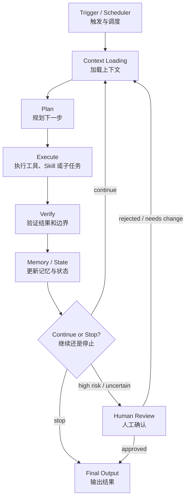
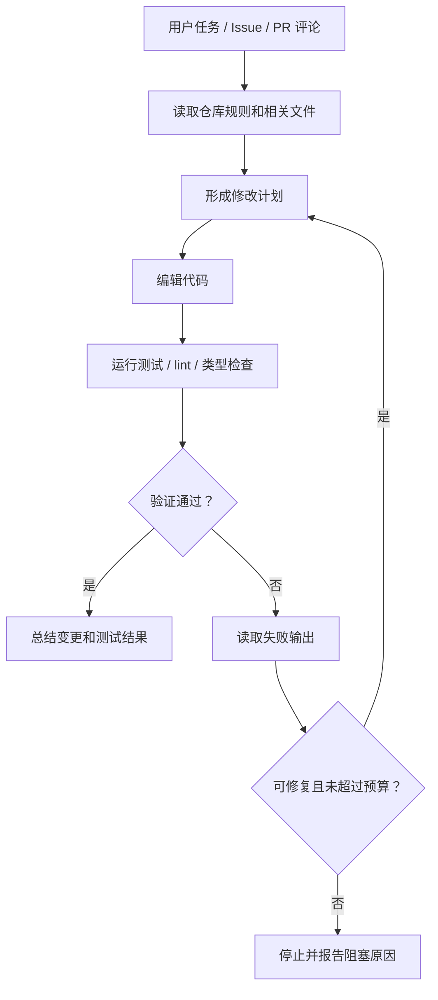
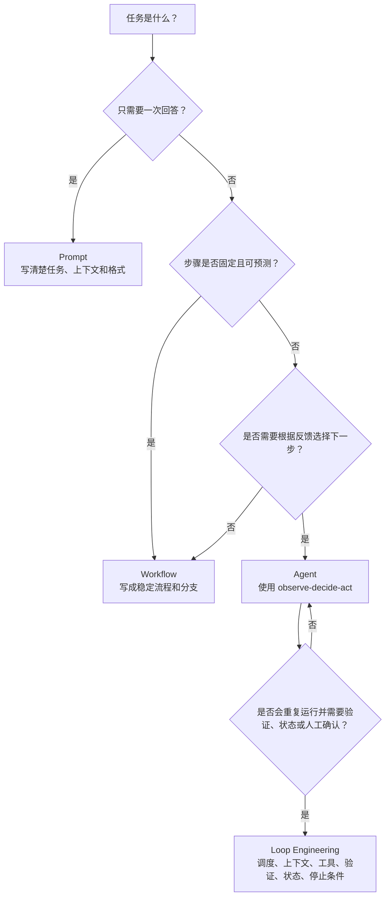

# Agent基础知识 13| Loop Engineering：别再只写提示词了，把 Agent 放进可验证的闭环

> Prompt Engineering 没有消失，它变成了 Agent Loop 里的一个组件。真正决定 Agent 能不能稳定工作的，是调度、上下文、工具、Skill、验证、状态、停止条件和人工确认共同组成的闭环工程。

前面 12 篇已经把 Agent 的关键模块拆开讲过：

```text
Workflow vs Agent：先判断是否真的需要 Agent。
Agent Loop：让系统观察、决策、行动、接收反馈。
Tool Use：让 Agent 能调用外部工具。
RAG：让回答基于资料和证据。
Memory：让系统保留状态、偏好和经验。
MCP：统一连接工具和数据源。
Agent Harness：提供权限、上下文、日志、测试和恢复能力。
Coding Agent：在代码库里展示真实工程闭环。
Subagent / Multi-Agent：隔离上下文并分工协作。
Skills：把稳定流程打包成可复用能力。
Browser / Computer Use：让 Agent 操作界面并处理失败恢复。
Evaluation / Trace / Safety：让系统可评测、可观察、可约束。
```

这一篇把它们收束到一个问题：

> **如果 Prompt Engineering 负责把一次模型调用写清楚，Loop Engineering 就负责把一类重复任务放进可运行、可验证、可复盘、可停止的 Agent 闭环里。**

这不是把 Prompt 否定掉，而是把 Prompt 放回它应该在的位置：它是循环中的指令和局部上下文，不是整个系统。

---

## 一、为什么只写提示词不够了？

### 1.1 Prompt Engineering 解决了什么

Prompt Engineering 关注的是一次模型调用：

```text
给模型什么角色；
提供哪些背景；
要求什么输出格式；
设置哪些限制；
用什么 few-shot 示例；
如何避免跑题。
```

它非常重要。一个模糊提示词会让模型输出不可控，一个好的提示词能显著提高任务完成质量。

但 Prompt 的边界也很明显。

| 问题 | 单靠 Prompt 的限制 |
| --- | --- |
| 任务需要多步执行 | Prompt 只能描述步骤，不能保证每一步真的执行并验证。 |
| 外部环境会变化 | Prompt 不负责调度、重试、刷新数据和处理工具错误。 |
| 需要查资料或调用工具 | Prompt 不能替代检索、权限、工具 schema 和失败处理。 |
| 需要长期复用 | Prompt 容易散落在聊天、README 和个人习惯里，不易版本化。 |
| 需要安全边界 | Prompt 能提醒模型，但不能替代权限控制、guardrail 和人工确认。 |
| 需要可评测 | Prompt 本身不提供 trace、指标、回归测试和失败样本。 |

所以，Prompt Engineering 更像“把单次请求说清楚”。

Agent 系统真正难的是：把任务持续做对。

---

### 1.2 一个简单例子

用户说：

```text
每天收盘后帮我整理电网设备方向的观察池，排除最近有明显负面新闻的标的，输出证据表和风险提示。
```

如果只写 Prompt，可能是：

```text
你是一个谨慎的投研助手。请根据最近市场数据，筛选电网设备方向股票，
排除负面新闻，输出观察池、证据和风险提示。
```

这能让模型生成一份像样的文本，但系统仍然不知道：

```text
每天什么时候触发？
从哪里取数据？
数据失败怎么办？
新闻检索结果如何去重？
候选池为什么入选？
风险提示是否一定存在？
是否需要人工确认？
结果如何保存？
下一次如何复用今天的状态？
如何评测输出有没有越界？
什么时候停止？
```

这些问题不属于 Prompt Engineering 的主要范畴。

它们属于 Loop Engineering。

---

## 二、什么是 Loop Engineering？

### 2.1 一句话定义

> **Loop Engineering 是把一类重复或多步任务设计成可调度、可观察、可验证、可记忆、可停止、可人工接管的 Agent 闭环。**

它关心的不只是模型怎么说，而是系统怎么运行：

```text
何时触发；
加载什么上下文；
如何规划；
调用哪些工具；
如何验证；
如何记录状态；
什么时候继续；
什么时候停止；
什么时候交给人。
```

一个完整闭环可以这样理解：



Prompt 在这个图里不是消失了，而是分布在多个位置：

```text
Context Loading 里有系统提示和任务说明；
Plan 里有规划指令；
Execute 里有工具调用说明；
Verify 里有评测和安全判断提示；
Final Output 里有报告模板。
```

但是，Prompt 不再独自承担全部责任。

---

### 2.2 Loop Engineering 解决什么问题

Loop Engineering 主要解决六类问题。

| 问题 | Loop Engineering 的回答 |
| --- | --- |
| 任务不是一次性问答 | 把任务拆成可重复执行的循环。 |
| 过程不可见 | 用 trace 记录观察、决策、动作、结果和状态。 |
| 工具调用容易失控 | 用 adapter、权限、schema、失败处理和 safety gate 包住工具。 |
| 输出难以验证 | 把 verifier、eval、证据引用和风险提示放进流程。 |
| 经验难以复用 | 用 Memory、Skill、项目知识和模板沉淀稳定流程。 |
| 高风险动作需要责任边界 | 用 human review 和 stop condition 明确什么时候不能自动继续。 |

这也是为什么现代 Agent 系统越来越像一个小型运行时，而不只是一个模型调用。

---

## 三、Agent Loop 和 Loop Engineering 有什么区别？

Agent Loop 是一种执行模式，Loop Engineering 是围绕这种执行模式做系统设计。

| 维度 | Agent Loop | Loop Engineering |
| --- | --- | --- |
| 关注点 | 单个 Agent 如何 observe -> decide -> act | 一类任务如何被设计成稳定闭环 |
| 粒度 | 一轮轮执行动作 | 调度、上下文、工具、状态、评测和人机协同 |
| 输出 | trace、结果、下一步 | 可运行流程、状态机、评测、治理边界 |
| 典型问题 | 下一步做什么？ | 什么时候触发、怎么验证、何时停止、谁来确认？ |
| 是否包含 Prompt | 包含本轮指令 | 包含多处 Prompt、工具说明、报告模板和评测规则 |

可以这么记：

```text
Agent Loop 是“车轮怎么转”。
Loop Engineering 是“整辆车如何上路、刹车、保养、验收和交接”。
```

---

## 四、Workflow、Agent、Harness 和 Loop Engineering 的关系

前面第 01 篇讲过，不是所有任务都需要 Agent。Loop Engineering 也一样，不是所有任务都要做复杂闭环。

| 概念 | 作用 | 和 Loop Engineering 的关系 |
| --- | --- | --- |
| Prompt | 描述本次模型调用的任务、上下文和输出格式 | 是闭环里的局部指令。 |
| Workflow | 固定步骤和分支的确定性流程 | 可以作为闭环中的稳定子流程。 |
| Agent | 能根据反馈选择下一步动作的系统 | 是闭环中负责判断和行动的核心执行者。 |
| Agent Loop | Agent 的 observe -> decide -> act 循环 | 是闭环的基本运行单元。 |
| Agent Harness | 权限、工具、上下文、日志、测试、恢复等工程底座 | 为闭环提供可控运行环境。 |
| Skill | 可复用流程能力包 | 把闭环中稳定的一段沉淀为可调用能力。 |
| Loop Engineering | 围绕重复任务设计触发、状态、验证、停止和人工确认 | 把上面这些组合成可长期运行的系统。 |

所以，Loop Engineering 不是一个替代概念，而是一个工程视角：如何把 Agent 的各个组件组织起来。

---

## 五、Loop Engineering 的核心组件

### 5.1 Trigger / Scheduler：什么时候开始

触发器决定闭环什么时候启动。

常见触发方式：

```text
用户发起任务；
定时任务；
文件变更；
PR / Issue 事件；
监控告警；
数据更新；
上一个节点完成。
```

没有 Trigger / Scheduler，Agent 就只能被动等待聊天输入。许多真实任务，例如日报、巡检、数据更新、回归测试，都需要自动或半自动触发。

---

### 5.2 Context Loading：每轮加载什么上下文

Agent 不应该把所有资料永远塞进上下文。

Context Loading 要回答：

```text
本轮任务需要哪些文件？
需要哪些历史记录？
需要哪些用户偏好？
需要哪些工具说明？
需要哪些 Skill 文档？
需要哪些检索片段？
哪些上下文必须压缩？
哪些上下文不能加载？
```

上下文加载不好，闭环会出现两类问题：

| 问题 | 后果 |
| --- | --- |
| 加得太少 | Agent 缺少关键信息，容易补脑。 |
| 加得太多 | token 成本高，注意力分散，旧信息污染决策。 |

---

### 5.3 Planning：下一步怎么拆

规划不一定是复杂的 Planner。它可以是：

```text
固定 checklist；
workflow 分支；
单步 next_action；
DAG；
多 Agent 分工；
人类审核队列。
```

关键是让系统知道：

```text
当前目标是什么；
已经完成了什么；
还有哪些依赖；
下一步为什么值得做；
失败时怎么退回或停止。
```

在 Learning_Agent 里，Lab 09 Research Planner DAG 就把前面几个 Lab 的能力编排成了有状态 DAG。

---

### 5.4 Execution：真正执行动作

执行层包括：

```text
调用工具；
运行脚本；
检索资料；
生成报告草稿；
调用 Skill；
调用子 Agent；
发起人工确认。
```

Execution 的核心原则是：动作必须有边界。

比如投研场景里，系统可以生成观察池证据，但不能把观察池变成买卖指令；可以调用 mock 或经过安全门的外部数据 provider，但不能默认保存真实响应或绕过人工确认。

---

### 5.5 Tool / Adapter：工具不是答案机器

Tool 是一个动作，Adapter 是把不同 provider 包到统一契约下的一层。

Loop Engineering 里，工具调用至少要记录：

```text
工具名；
provider；
入参；
返回摘要；
状态；
失败原因；
证据引用；
是否发送网络请求；
是否读取 key；
是否需要人工确认。
```

这正是 Lab 03 和 Lab 08 的教学重点：

```text
Lab 03 先用 mock tool_trace 展示工具调用。
Lab 08 再把 mock finance tools 和 optional external provider 放进统一 adapter contract。
```

---

### 5.6 Skill / Project Knowledge：把稳定流程沉淀下来

如果一段流程反复出现，就不应该每次靠临时 Prompt 重写。

它可以沉淀成：

```text
Skill；
项目规则；
报告模板；
测试样例；
禁用场景；
人工确认清单；
维护文档。
```

Skill 不是“更长的 Prompt”，而是把触发场景、步骤、输入输出、资源和验收标准打包成可复用能力。

Learning_Agent 的 Lab 06 / 07 就展示了从 Skill Registry 到 Skill Generation 的过程：先选择和禁用，再生成可审查草稿，而不是自动启用。

---

### 5.7 Verifier / Evaluation：每轮都要知道是否合格

闭环如果只会继续执行，就很容易放大错误。

Verifier / Evaluation 要判断：

```text
工具返回是否可用；
证据是否足够；
输出是否缺少来源；
是否缺风险提示；
是否出现禁止字段；
是否越过权限；
是否需要人工确认；
是否达到停止条件。
```

第 12 篇讲 Evaluation / Trace / Safety，Lab 10 Evidence Report 也把报告生成变成了可审查的过程：每个 section 都要有证据引用和生成 trace。

---

### 5.8 Memory / State：记住状态，但不能越界

Memory 和 State 让闭环不是每次从零开始。

它可以记录：

```text
用户偏好；
任务进度；
已完成节点；
失败原因；
证据版本；
上次人工确认结果；
长期禁用规则。
```

但 Memory 不能覆盖事实，也不能绕过安全边界。

比如投研场景里，用户偏好可以调整观察池视图，但不能删除原始证据、不能覆盖风险提示、不能把一次偏好当成长期交易授权。

---

### 5.9 Stop Condition：什么时候必须停

没有停止条件的 Agent Loop 很危险。

常见停止条件：

```text
任务完成；
达到 max_turn；
缺少必要信息；
工具连续失败；
证据不足；
风险规则触发；
预算用尽；
需要人工确认；
用户取消。
```

Stop Condition 的价值不是让系统“不智能”，而是防止它在不确定、无权限或高风险场景里继续放大损失。

---

### 5.10 Human Review：人不是补丁，而是边界

Human Review 不应该只出现在最后。

它可以是闭环里的正式节点：

```text
计划确认；
高风险动作确认；
报告审阅；
Skill 启用审批；
模拟组合确认；
异常恢复确认。
```

Human-in-the-loop 的核心是责任边界：什么可以自动做，什么只能生成草稿，什么必须等待人。

---

### 5.11 Cost / Budget：闭环也要算账

Loop Engineering 还要关心成本：

```text
token 成本；
工具调用成本；
检索成本；
外部 API 限流；
并发冲突；
重试次数；
延迟；
人工 review 成本。
```

一个闭环如果没有预算限制，可能在“努力完成任务”的过程中不断调用模型、检索、工具和外部服务，最后成本高于任务价值。

---

## 六、三个场景

### 6.1 Coding Agent Loop

一个 Coding Agent 的闭环通常是：



这里 Prompt 当然重要，但真正让 Coding Agent 有用的是：

```text
能读规则；
能找文件；
能最小范围修改；
能运行测试；
能根据失败输出修复；
能避免误删用户改动；
能在无法继续时停下来。
```

这就是典型 Loop Engineering。

---

### 6.2 Research / Content Loop

研究或内容类 Agent 不是“写一篇文章”这么简单。

更可靠的闭环是：

```text
明确问题；
检索资料；
筛选来源；
提取观点；
生成结构；
写草稿；
检查引用；
检查事实和边界；
交给人审阅；
根据反馈修改。
```

如果只靠 Prompt，模型容易写出流畅但来源不清的文章。加入 Loop Engineering 后，系统能把资料来源、引用片段、生成过程和风险说明都留下来。

---

### 6.3 Learning_Agent Labs 里的闭环

这个仓库的 Labs 本身就是一条从任务理解到证据报告的闭环。

```mermaid
flowchart LR
    L01["Lab 01<br/>Strategy Intake"] --> L02["Lab 02<br/>Agent Loop"]
    L02 --> L03["Lab 03<br/>Tool Use"]
    L03 --> L04["Lab 04<br/>RAG"]
    L04 --> L05["Lab 05<br/>Memory"]
    L05 --> L06["Lab 06<br/>Skill Registry"]
    L06 --> L07["Lab 07<br/>Skill Generation"]
    L07 --> L08["Lab 08<br/>Finance Provider Adapter"]
    L08 --> L09["Lab 09<br/>Research Planner DAG"]
    L09 --> L10["Lab 10<br/>Evidence Report"]
    L10 --> L11["Lab 11<br/>Simulation Portfolio & HITL"]
    L11 --> L12["Lab 12<br/>Evaluation & Safety"]
    L12 -. "评测与安全反馈" .-> L01
```



每个 Lab 只展示一个概念，但连起来看，就是一个 Loop Engineering 示例：

| Lab | 在闭环里的位置 |
| --- | --- |
| Lab 01 | 把自然语言任务结构化，并决定是否进入 Agent。 |
| Lab 02 | 展示最小 observe -> decide -> act。 |
| Lab 03 | 把工具调用变成可观察 `tool_trace` 和证据。 |
| Lab 04 | 用 RAG 给证据补上下文。 |
| Lab 05 | 用 Memory 调整观察视图，但不覆盖原始证据。 |
| Lab 06 | 选择合适 Skill，并禁用不安全能力。 |
| Lab 07 | 从稳定流程生成可审查 Skill draft。 |
| Lab 08 | 用 Adapter 解耦 mock 工具和 optional external provider。 |
| Lab 09 | 把能力组织成 Research Planner DAG。 |
| Lab 10 | 生成带证据引用和人工确认边界的报告。 |
| Lab 11 | 把高风险动作停在模拟组合和人工确认前。 |
| Lab 12 | 用 Evaluation / Safety 对整个系统做回归。 |

---

## 七、什么时候用 Prompt、Workflow、Agent 或 Loop？

不是所有任务都需要 Loop Engineering。

| 任务特征 | 更适合 |
| --- | --- |
| 一次性解释、改写、摘要 | Prompt |
| 步骤固定、规则明确、输入输出稳定 | Workflow |
| 需要根据中间结果选择下一步 | Agent |
| 任务会重复发生、要调度、要验证、要保留状态、要人工确认 | Loop Engineering |

一个简单判断图：



这张图的重点是：先选最简单能解决问题的形态。

如果一个任务只需要一次回答，就不要硬上 Agent；如果固定 workflow 能解决，也不要把它交给自由循环；只有任务确实需要反馈、状态、验证和持续执行时，Loop Engineering 才值得投入。

---

## 八、把一个 Prompt 升级成 Loop 设计

### 8.1 原始 Prompt

```text
帮我找最近 60 日趋势较强、回撤较低、没有明显负面新闻的电网设备方向股票，
生成候选观察池。
```

这句话作为任务描述是够的，但作为系统设计不够。

---

### 8.2 Loop 设计提示

更好的写法是让系统先设计闭环：

```text
请不要直接生成投资建议。

请把下面的投研请求设计成一个可审查的 Agent 闭环：

任务：
找最近 60 日趋势较强、回撤较低、没有明显负面新闻的电网设备方向股票，
生成候选观察池。

请输出：
1. StrategySpec：结构化任务字段。
2. routing_decision：说明走 workflow、agent、needs_clarification 还是 blocked。
3. research_plan：拆成哪些节点，节点依赖是什么。
4. required_tools：需要哪些 mock 或外部工具，以及每个工具的输入输出。
5. evidence_contract：每条候选证据必须包含来源、时间、字段和限制。
6. verification_rules：如何检查风险提示、证据缺口和禁止字段。
7. stop_conditions：什么时候必须停止、追问或等待人工确认。
8. final_output_schema：最终只输出观察池草稿、证据表、风险提示和人工确认项。

边界：
- 不输出买卖指令、目标价或收益承诺。
- 不自动执行交易或模拟组合动作。
- 真实 key 只能从环境变量读取。
- 缺少数据、证据不足或高风险时必须 fail closed。
```

这个提示词仍然是 Prompt Engineering，但它服务的是 Loop Engineering：先把任务转成可执行闭环，再让系统逐步运行。

---

## 九、Loop Engineering 的风险

### 9.1 成本膨胀

循环会自然增加成本：

```text
多轮模型调用；
更多上下文加载；
更多工具调用；
更多检索；
更多验证；
更多日志和存储。
```

所以闭环必须有预算：

```text
max_turn；
max_tool_calls；
timeout；
token budget；
重试上限；
人工确认阈值。
```

---

### 9.2 并发冲突

多个 Agent 或多个循环同时操作同一资源时，可能出现：

```text
重复写文件；
覆盖用户修改；
重复提交；
重复添加观察项；
状态版本冲突；
同一任务被两个 runner 处理。
```

解决方式包括锁、幂等 key、状态版本、dry-run、diff review 和人工确认。

---

### 9.3 错误放大

如果第一步检索错了，后续规划、报告和记忆都可能建立在错误基础上。

所以每轮都要验证，不要把“模型很自信”当成证据。

---

### 9.4 人类理解被系统吞掉

闭环越自动，越容易让人只看最终结果。

但 Agent 系统需要让人能看到：

```text
为什么这么做；
依据是什么；
哪里失败；
哪里不确定；
哪些节点等人工确认；
哪些内容只是草稿。
```

这就是 trace、evidence refs 和 report generation trace 的意义。

---

### 9.5 什么时候不该用 Loop

这些场景不适合上复杂闭环：

```text
一次性简单问答；
用户只要快速草稿；
任务规则清晰且固定；
没有可用验证信号；
外部工具不稳定且无降级方案；
高风险动作没有人工确认机制；
成本高于收益。
```

Loop Engineering 的目标不是让一切自动化，而是让值得自动化的重复任务变得可控。

---

## 十、这一篇和前 12 篇的关系

第 13 篇不是新增一个孤立概念，而是把前 12 篇组合起来：

| 前文概念 | 在 Loop Engineering 里的位置 |
| --- | --- |
| Workflow vs Agent | 判断是否需要闭环，避免过度 Agent 化。 |
| Agent Loop | 提供观察、决策、行动、反馈的基本循环。 |
| Tool Use | 提供执行动作和获取外部信息的能力。 |
| RAG | 为每轮决策和输出提供资料依据。 |
| Memory | 保存状态、偏好和历史经验。 |
| MCP | 标准化工具和数据源连接。 |
| Agent Harness | 提供权限、上下文、日志、测试和恢复底座。 |
| Coding Agent | 展示最成熟的工程闭环之一。 |
| Subagent / Multi-Agent | 在复杂任务中做上下文隔离和并行分工。 |
| Skills | 把稳定循环片段沉淀为可复用能力。 |
| Browser / Computer Use | 把界面操作也纳入观察、行动和恢复循环。 |
| Evaluation / Trace / Safety | 让闭环可评测、可审计、可停止。 |

如果说前 12 篇是在拆零件，那么这一篇是在看整机如何运转。

---

## 十一、最后的判断标准

当你想让 Agent 做一件事时，可以问自己：

```text
这只是一次回答，还是一个会重复发生的任务？
它是否需要根据中间结果改变路径？
它是否需要外部工具、资料或状态？
它是否需要验证、trace 和回归测试？
它是否存在成本、权限或安全风险？
它是否需要人工确认？
它是否有明确停止条件？
```

如果大多数答案都是“是”，你需要的就不只是一个更长的提示词，而是一套 Loop Engineering。

---

## 参考资料

- 用户提供文章：《提示词工程已死，Loop Engineering 来了！》
- [Anthropic: Building Effective Agents](https://www.anthropic.com/engineering/building-effective-agents)
- [OpenAI: A practical guide to building agents](https://openai.com/business/guides-and-resources/a-practical-guide-to-building-ai-agents/)
- [OpenAI Platform: Function Calling](https://platform.openai.com/docs/guides/function-calling)
- [OpenAI Agents SDK: Tracing](https://openai.github.io/openai-agents-python/tracing/)
- [Anthropic Claude Docs: Tool use](https://docs.anthropic.com/en/docs/agents-and-tools/tool-use/overview)
- [Anthropic Claude Code Docs](https://docs.anthropic.com/en/docs/claude-code/overview)
- [datawhalechina/Agent-Learning-Hub](https://github.com/datawhalechina/Agent-Learning-Hub)
