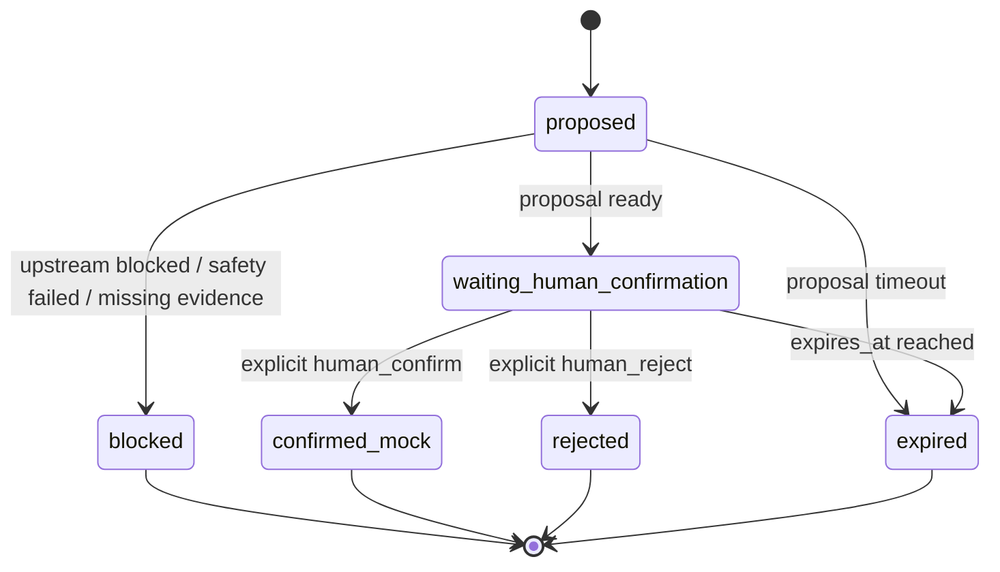

# Lab 11: Simulation Portfolio 设计

Lab 11 展示 Simulation Portfolio / Human-in-the-loop：在 Lab 10 Evidence Report 之后，如何把可审查证据报告转换成 mock 模拟组合提案，并把所有可能改变组合状态的动作停在人工确认边界前。

本 Lab 仍然是教学展示，不是投资建议系统，也不是交易系统。它只设计 mock simulation proposal、状态流转、证据引用、风险提示和人工确认门；不调用真实模型 API，不调用真实财经 API，不接真实账户，不真实加入自选股，不自动执行任何交易动作。

## 一、教学目标

Lab 11 要让读者看到：证据报告之后的下一步不是自动执行，而是把“可能进入模拟组合的想法”转换成可审查、可拒绝、可过期、可阻断的 mock proposal。

核心教学目标：

- 从 Lab 10 Evidence Report 进入 mock simulation proposal。
- 只生成模拟组合计划，不真实交易。
- 所有模拟加入、移除、调仓、撤销动作都必须等待人工确认。
- 状态机必须区分 `proposed`、`waiting_human_confirmation`、`confirmed_mock`、`rejected`、`blocked`、`expired`。
- 不能把模拟收益当成真实收益。
- 不能把 Evidence Report 的 `needs_human_review` 当成已确认。
- 不能把用户偏好、Skill draft 或 selected skill 当成交易授权。

Lab 11 不做：

- 不调用真实模型 API。
- 不调用真实财经 API。
- 不连接真实账户、自选股、资金、委托或交易接口。
- 不输出投资建议、收益承诺、目标价或自动执行动作。
- 不把 mock portfolio 呈现为真实账户或真实持仓。

## 二、和前面 Lab 的关系

| 上游 | 已提供内容 | Lab 11 如何使用 |
| --- | --- | --- |
| Lab 10 Evidence Report | `evidence_report` | 读取 9 个 report section，尤其是 `candidate_observation_pool`、`evidence_table`、`risk_and_limitations` 和 `human_review_checklist`。 |
| Lab 10 Evidence Report | `risk_disclosure` | 必须原样保留，并写入 `simulation_proposal`、`simulation_portfolio` 和 `final_output`。 |
| Lab 10 Evidence Report | `human_review_required` | 只能说明报告仍需人审，不能视为已确认。 |
| Lab 10 Evidence Report | `evidence_refs` | 每个 proposed position 和 proposed action 都必须引用 evidence refs；缺失时写入 `evidence_gaps`。 |
| Lab 10 Evidence Report | `report_generation_trace` | 用于说明 proposal 依赖哪些报告 section 和生成步骤。 |
| Lab 10 Evidence Report | `report_safety_review` | 如果安全审查 failed，Lab 11 必须 blocked。 |
| Lab 10 Evidence Report | `final_output` | 读取允许下一步和禁止动作，但不能扩大权限。 |

上游阻断规则：

- 如果 Lab 10 `status` 是 `blocked`，Lab 11 `status` 必须是 `blocked`。
- 如果 Lab 10 `report_safety_review.status` 是 `failed`，Lab 11 必须 `blocked`。
- 如果 Lab 10 缺少 `risk_disclosure`，Lab 11 必须 `blocked`。
- 如果 Lab 10 缺少 `evidence_refs`，不能生成正常 proposed position，只能写入 `evidence_gaps`。
- 如果 Lab 10 缺少 `human_review_required=true`，Lab 11 必须 `blocked`。

Lab 11 的职责边界：

- 只读取 Lab 10 的结构化输出。
- 只生成 mock simulation proposal。
- 只演示 mock 状态机和人工确认门。
- 不调用真实模型、真实财经 API、真实账户或真实 provider。

## 三、模拟组合状态设计

Lab 11 的状态必须表达“提案是否可审、是否等待确认、是否被拒绝、是否过期、是否因安全边界阻断”。

| 状态 | 含义 | 何时出现 | 允许的后续状态 |
| --- | --- | --- | --- |
| `proposed` | 已生成模拟提案，但还没有进入确认流程 | proposal builder 从合格 Evidence Report 生成提案时 | `waiting_human_confirmation`、`blocked`、`expired` |
| `waiting_human_confirmation` | 等待人工确认，默认正常路径终态 | 所有 proposed actions 都准备好，但尚未得到明确确认 | `confirmed_mock`、`rejected`、`expired` |
| `confirmed_mock` | 人工确认后的 mock 状态 | 只有显式 `human_confirm` 才能进入 | 后续实现可继续 mock 更新或进入 Lab 12 评测 |
| `rejected` | 人工拒绝 | 显式 `human_reject` | 终态或重新生成新 proposal |
| `blocked` | 上游报告、证据或安全边界不满足 | Lab 10 blocked、安全审查失败、缺风险提示或缺证据 | fail-closed 终态 |
| `expired` | 提案过期，需要基于新证据重建 | 超过 `expires_at` 或证据版本失效 | 终态或重新生成新 proposal |

状态机：



强制约束：

- 默认 demo 不能直接进入 `confirmed_mock`。
- 任何 `confirmed_mock` 都只能由显式 `human_confirm` 产生。
- `confirmed_mock` 也只是 mock，不代表真实账户动作。
- `blocked` 是 fail-closed 终态，不能继续生成正常 proposal。

## 四、动作设计

Lab 11 只把动作设计成 mock action，不把它们执行到真实账户或真实服务。

| action_type | 作用 | 默认状态 | 是否需要人工确认 | 说明 |
| --- | --- | --- | --- | --- |
| `create_simulation_proposal` | 从 Evidence Report 生成模拟组合提案 | `proposed` | true | 默认只生成这个动作和候选 action 列表。 |
| `add_to_mock_portfolio` | 提议把观察项加入 mock portfolio | `proposed` | true | 不自动执行，不接真实账户或自选股。 |
| `remove_from_mock_portfolio` | 提议从 mock portfolio 移除观察项 | `proposed` | true | 只能在 mock 状态机里表达。 |
| `rebalance_mock_portfolio` | 提议调整 mock 权重 | `proposed` | true | 只表达 proposed change，不执行。 |
| `cancel_simulation_proposal` | 取消尚未确认的提案 | `proposed` 或 `waiting_human_confirmation` | true | 用于演示撤销 proposal，不触发真实动作。 |
| `human_confirm` | 人工确认 mock proposal | `waiting_human_confirmation` -> `confirmed_mock` | true | 后续实现中必须是显式输入。 |
| `human_reject` | 人工拒绝 mock proposal | `waiting_human_confirmation` -> `rejected` | true | 保留拒绝原因。 |
| `expire_proposal` | 标记提案过期 | 任意未终态 -> `expired` | false | 用于防止旧证据继续被确认。 |

动作边界：

- 默认只生成 `create_simulation_proposal` 和 proposed actions。
- `add_to_mock_portfolio`、`remove_from_mock_portfolio`、`rebalance_mock_portfolio` 都只是 proposed action，不自动执行。
- `human_confirm` / `human_reject` 只在 mock 状态机里演示。
- 不接真实账户、不接真实资金、不接真实委托。
- 不允许使用 `buy`、`sell`、`recommendation`、`target_price` 作为字段名或输出语义。

## 五、组合对象数据契约

以下为文档级结构说明，后续实现时再落成 Python dataclass 或 dict schema。

### SimulationPortfolio

| 字段 | 说明 |
| --- | --- |
| `portfolio_id` | mock portfolio ID。 |
| `source_report_id` | 来源 Evidence Report ID。 |
| `status` | `waiting_human_confirmation`、`confirmed_mock`、`rejected`、`blocked` 或 `expired`。 |
| `positions` | `SimulationPosition` 列表，默认是 proposed view。 |
| `pending_actions` | `SimulationAction` 列表，所有高风险动作都必须等待人工确认。 |
| `risk_disclosure` | 从 Lab 10 继承的风险提示。 |
| `mock_data_notice` | 明确说明使用 mock 数据。 |
| `no_real_trade_notice` | 明确说明不连接真实账户、资金或交易。 |
| `human_review_required` | 固定为 true。 |
| `created_at` | 生成时间。 |
| `expires_at` | proposal 过期时间。 |

### SimulationProposal

| 字段 | 说明 |
| --- | --- |
| `proposal_id` | mock proposal ID。 |
| `source_report_id` | 来源 Evidence Report ID。 |
| `status` | `proposed`、`blocked` 或 `expired`。 |
| `candidate_count` | 进入 proposal 的候选观察项数量。 |
| `proposed_positions` | `SimulationPosition` 列表。 |
| `evidence_gaps` | 缺失证据、上游阻断或安全审查问题。 |
| `requires_human_confirmation` | 固定为 true。 |
| `blocked_reason` | 阻断原因。 |
| `limitations` | mock 数据、证据时效、人工复核和非投资建议限制。 |

### SimulationPosition

| 字段 | 说明 |
| --- | --- |
| `candidate_id` | 候选观察项 ID。 |
| `candidate_name` | 候选观察项名称。 |
| `theme` | 主题或方向。 |
| `proposed_weight` | mock 权重，仅用于演示，不代表真实配置建议。 |
| `weight_reason` | 权重来源于证据质量、风险旗标和 mock 规则，不代表收益判断。 |
| `evidence_refs` | 支撑该 proposed position 的证据引用。 |
| `risk_flags` | 风险旗标。 |
| `source_section` | 来源 report section，例如 `candidate_observation_pool`。 |
| `limitations` | 该 position 的限制和不确定性。 |

### SimulationAction

| 字段 | 说明 |
| --- | --- |
| `action_id` | mock action ID。 |
| `action_type` | `create_simulation_proposal`、`add_to_mock_portfolio`、`remove_from_mock_portfolio`、`rebalance_mock_portfolio`、`cancel_simulation_proposal`、`human_confirm`、`human_reject` 或 `expire_proposal`。 |
| `status` | `proposed`、`waiting_human_confirmation`、`confirmed_mock`、`rejected`、`blocked` 或 `expired`。 |
| `target_candidate_id` | 目标候选 ID。 |
| `proposed_change` | mock 变化描述，例如 proposed weight 或 removal reason。 |
| `reason_from_evidence` | 来自 Evidence Report 的证据化原因。 |
| `evidence_refs` | 支撑该 action 的证据引用。 |
| `requires_human_confirmation` | 是否需要人工确认，涉及组合状态变化时必须为 true。 |
| `blocked_reason` | 阻断原因。 |

### HumanConfirmationGate

| 字段 | 说明 |
| --- | --- |
| `required` | 是否需要人工确认，默认 true。 |
| `status` | `waiting_human_confirmation`、`confirmed_mock`、`rejected`、`blocked` 或 `expired`。 |
| `reason` | 为什么需要确认。 |
| `required_confirmations` | 必须明确确认的事项。 |
| `blocked_until_confirmed` | 确认前禁止继续的动作。 |
| `allowed_after_confirmation` | 人工确认后只允许进入 mock 状态更新。 |
| `not_allowed_without_confirmation` | 未确认时禁止动作。 |

### SimulationTraceEvent

| 字段 | 说明 |
| --- | --- |
| `step` | 步骤，例如 `read_evidence_report`、`build_proposal`、`open_human_confirmation_gate`。 |
| `status` | `completed`、`blocked`、`waiting_human_confirmation` 或 `degraded`。 |
| `input_sources` | 使用的上游字段，例如 `evidence_report.sections.candidate_observation_pool`。 |
| `output_object` | 生成或更新的对象，例如 `simulation_proposal`。 |
| `evidence_refs` | 本步骤使用或新增的证据引用。 |
| `warning_or_gap` | 警告、证据缺口或阻断原因。 |

### SimulationSafetyReview

| 字段 | 说明 |
| --- | --- |
| `status` | `passed` 或 `failed`。 |
| `issues` | 安全问题列表。 |
| `prohibited_key_paths` | 命中的禁止字段路径。 |
| `prohibited_semantic_paths` | 命中的禁止语义路径。 |
| `required_human_actions` | 必须由人工完成的动作。 |

## 六、人工确认边界

人工确认不是界面装饰，而是 Lab 11 的核心教学对象。

必须遵守：

- 没有人类确认，不能进入 `confirmed_mock`。
- 所有 simulation action 必须保留 `requires_human_confirmation=true`。
- 不能把 Evidence Report 的 `needs_human_review` 当成已确认。
- 不能把用户偏好当成交易授权。
- 不能把 Skill draft 或 selected skill 当成执行授权。
- 不能把模拟组合 proposal 当成真实交易建议。
- 不能把 mock portfolio 当成真实账户、真实收益或真实持仓。

`HumanConfirmationGate.required_confirmations` 至少应该包含：

- 复核 Evidence Report 的来源和限制。
- 确认 proposal 仅用于 mock simulation。
- 确认不会连接真实账户、资金或交易接口。
- 确认每个 proposed position 都有 evidence refs。
- 确认风险提示和 no-real-trade notice 保留。

## 七、安全边界

禁止字段：

- `buy`
- `sell`
- `recommendation`
- `target_price`

禁止语义：

- 确定收益。
- 稳赚。
- 必涨。
- 保证收益。
- 自动买入。
- 自动卖出。
- 自动调仓。
- 真实账户。
- 真实资金。
- 真实委托。

必须包含：

- `risk_disclosure`
- `mock_data_notice`
- `no_real_trade_notice`
- `human_review_required`
- `evidence_refs`
- `source_report_id`
- `human_confirmation_gate`

安全规则：

- 正常路径 `status` 应为 `waiting_human_confirmation`。
- blocked 上游只能生成 blocked simulation，不补脑。
- 缺证据时写入 `evidence_gaps`。
- 不允许输出任何真实交易动作。
- 不允许暗示模拟组合等于投资建议。
- 不允许把 mock 结果描述成真实收益、真实持仓或真实账户状态。

## 八、输出契约

最终 JSON 输出建议：

| 字段 | 说明 |
| --- | --- |
| `status` | `waiting_human_confirmation`、`blocked`、`rejected`、`expired` 或后续显式确认后的 `confirmed_mock`。 |
| `evidence_report_output` | Lab 10 输出摘要或完整 mock 输出。 |
| `simulation_proposal` | `SimulationProposal`。 |
| `simulation_portfolio` | `SimulationPortfolio`。 |
| `simulation_trace` | `SimulationTraceEvent` 列表。 |
| `human_confirmation_gate` | `HumanConfirmationGate`。 |
| `simulation_safety_review` | `SimulationSafetyReview`。 |
| `risk_disclosure` | 从 Lab 10 继承的风险提示。 |
| `final_output` | mock simulation 状态摘要、允许下一步、禁止动作和人工确认提示。 |
| `next_lab` | `Lab 12 Evaluation & Safety`。 |

正常路径建议：

```json
{
  "status": "waiting_human_confirmation",
  "simulation_proposal": {
    "status": "proposed",
    "requires_human_confirmation": true
  },
  "human_confirmation_gate": {
    "status": "waiting_human_confirmation",
    "required": true
  },
  "simulation_portfolio": {
    "status": "waiting_human_confirmation"
  }
}
```

blocked 路径建议：

```json
{
  "status": "blocked",
  "simulation_proposal": {
    "status": "blocked",
    "evidence_gaps": ["risk_disclosure missing or report_safety_review failed"]
  },
  "simulation_portfolio": {
    "status": "blocked"
  },
  "simulation_trace": [
    {
      "step": "read_evidence_report",
      "status": "blocked",
      "warning_or_gap": "upstream evidence report is not safe for simulation proposal"
    }
  ]
}
```

## 九、测试设计

Lab 11 实现时至少覆盖这些测试：

- normal evidence report 生成 `waiting_human_confirmation` proposal。
- blocked evidence report 生成 blocked simulation。
- `report_safety_review` failed 时 blocked。
- 每个 proposed position 有 `evidence_refs`。
- 每个 proposed action `requires_human_confirmation=true`。
- 未确认时不能进入 `confirmed_mock`。
- `human_confirm` 只能改变 mock 状态，不触发真实动作。
- `human_reject` 进入 `rejected`。
- expired proposal 不能继续 `confirmed_mock`。
- missing evidence 进入 `evidence_gaps`。
- 输出包含 `risk_disclosure`。
- 输出包含 `mock_data_notice` 和 `no_real_trade_notice`。
- 输出不包含 `buy`、`sell`、`recommendation`、`target_price`。
- 输出不包含稳赚、必涨、保证收益、自动买入、自动卖出、自动调仓。
- 不创建 `.agents/` 或 `.codex/`。
- 默认测试不依赖真实 key、真实模型、真实财经 API 或真实 provider 响应。

## 十、后续实现目录规划

下一轮实现时才创建目录：

```text
labs/11-simulation-portfolio/
|-- AGENTS.md
|-- README.md
|-- data/
|   `-- simulation_policy.json
|-- src/
|   |-- simulation_model.py
|   |-- proposal_builder.py
|   |-- simulation_safety.py
|   `-- run_lab.py
|-- demo/
|   `-- run_demo.py
|-- tests/
`-- outputs/
    `-- .gitkeep
```

后续实现分工建议：

- `simulation_model.py` 定义 `SimulationPortfolio`、`SimulationProposal`、`SimulationPosition`、`SimulationAction`、`HumanConfirmationGate` 和 `SimulationTraceEvent`。
- `proposal_builder.py` 从 Lab 10 输出生成 proposal、positions、actions 和 trace。
- `simulation_safety.py` 检查风险提示、人工确认、禁止字段和禁止语义。
- `run_lab.py` 调用 Lab 10 runner，输出 simulation proposal 和 human confirmation gate。
- README 写清输入、输出、demo、tests、不做什么、和 Lab 10 / Lab 12 的关系。
- AGENTS.md 固化 mock-only、HITL、no-real-trade 和禁止投资建议边界。
