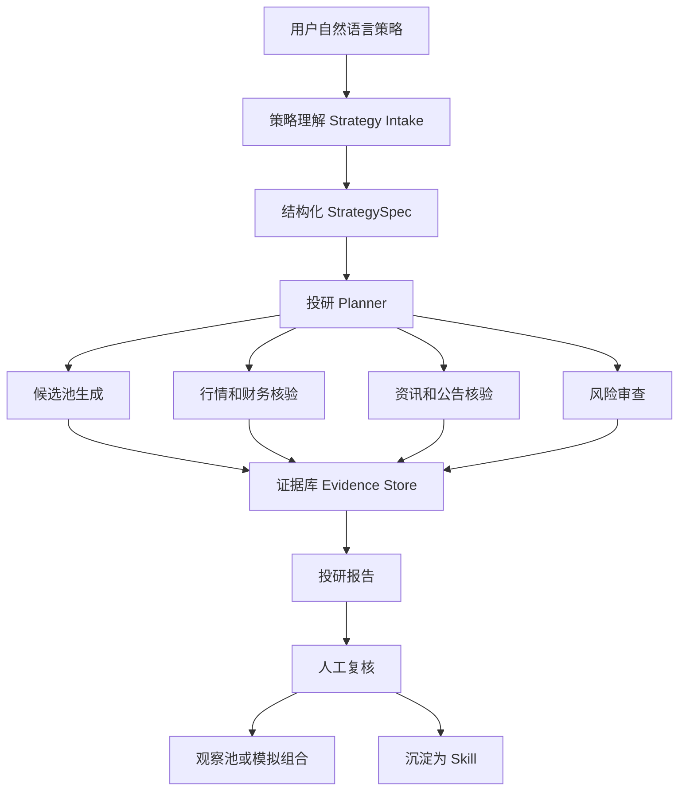
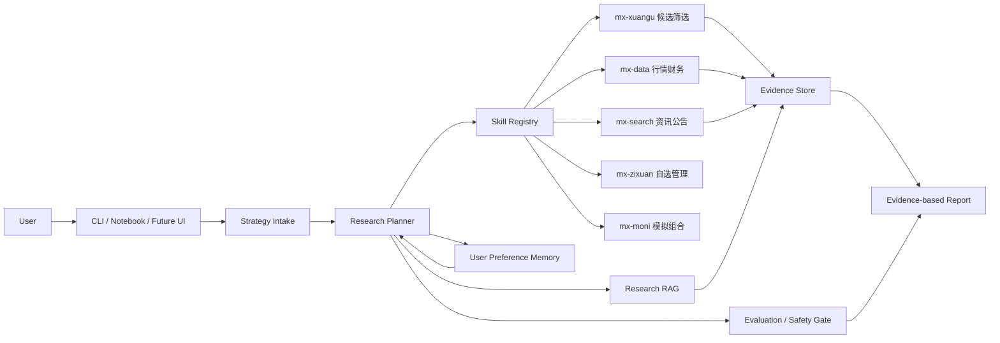
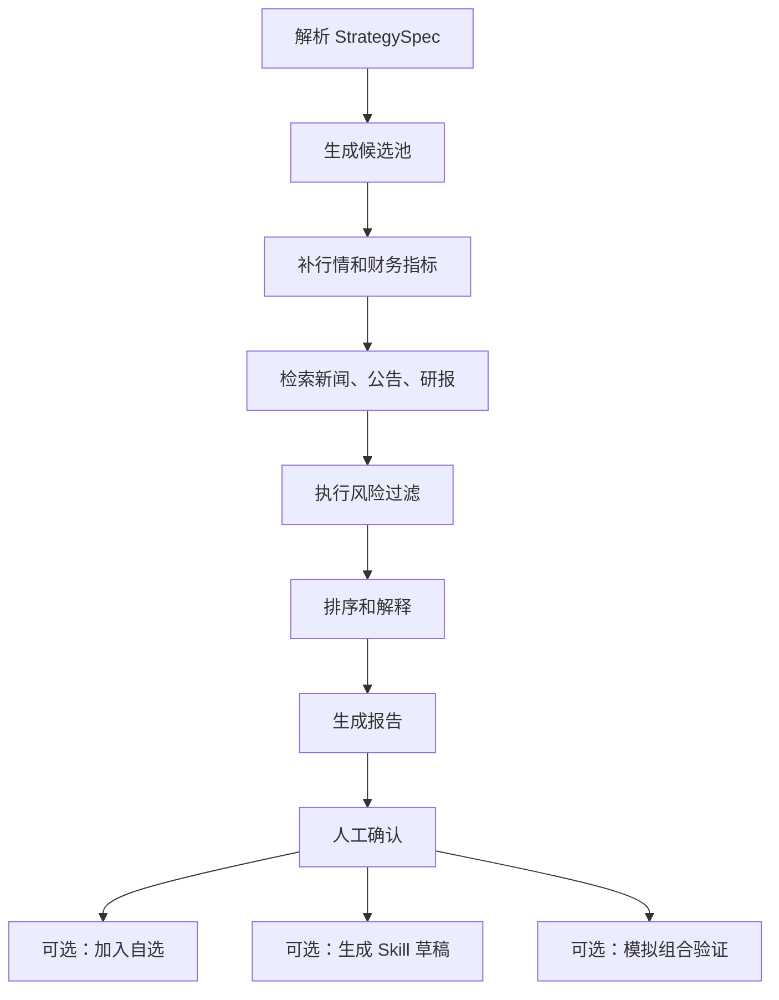

# 个性化投资调研 Agent 系统愿景

这个系统是 `Agent基础知识` 系列的主线落地场景：围绕一个真实但边界清晰的投研需求，把 Agent Loop、Tool Use、RAG、Memory、Skills、Evaluation 和 Safety 串起来。

## 一句话愿景

用户用自然语言描述投资研究想法，系统把它转成可执行的投研流程；当某个流程被反复使用并验证有效后，再固化成 Skill，由系统按需调用。

示例输入：

```text
找最近 60 日趋势较强、回撤较低、没有明显负面新闻的半导体和人工智能方向股票，生成候选观察池。
```

系统预期输出：

- 结构化策略说明：市场、主题、筛选条件、排除条件、风险偏好。
- 投研流程规划：候选池生成、行情核验、财务核验、新闻公告核验、风险审查、报告生成。
- 证据化报告：候选列表、数据来源、检索时间、关键证据、风险点、需要人工确认的问题。
- 可选后续动作：加入观察池、沉淀为 Skill、进入模拟组合验证。

## 系统边界

这个系统可以做：

- 把自然语言策略转为结构化投研任务。
- 调用东方财富妙想相关 Skills 获取候选、行情、财务、资讯和自选股信息。
- 基于证据生成候选股票、观察池和调研报告。
- 在报告中给出风险提示、数据来源和人工复核点。
- 使用模拟组合验证策略执行效果。

这个系统不做：

- 不承诺收益，不给确定性买卖结论。
- 不绕过人工确认执行交易。
- 不把模拟组合结果包装成真实投资建议。
- 不在仓库中提交真实 API Key、账户凭据、Cookie、Token 或个人隐私数据。

所有涉及股票候选、观察池或策略执行的输出，都必须包含风险提示：

```text
风险提示：以下内容仅用于学习和投研流程演示，不构成投资建议或收益承诺。市场有风险，真实交易前请结合自身风险承受能力独立判断。
```

## 核心用户流程



## 架构设计



## 模型与密钥

模型层采用小米 MiMo，运行时从环境变量读取：

- `MIMO_API_KEY`: 小米 MiMo API Key，由 Hermes 注入或读取后写入运行环境。
- `MIMO_BASE_URL`: 可选，MiMo 服务地址或兼容网关地址。
- `MIMO_MODEL`: 可选，默认模型名。

财经数据层采用东方财富妙想 Skills，运行时从环境变量读取：

- `MX_APIKEY`: 东方财富妙想 Skills API Key，由 Hermes 注入或读取后写入运行环境。
- `MX_API_URL`: 可选，模拟组合 API 基础地址。

仓库只提交 `.env.example`，真实密钥只存在于本地、Hermes 或受信任的运行环境中。

## 东方财富妙想 Skills 分工

| Skill | 系统角色 | 使用边界 |
| --- | --- | --- |
| `mx-xuangu` | 候选池生成 | 把自然语言筛选条件转成选股结果，适合生成初始候选 |
| `mx-data` | 行情、财务、公司信息核验 | 获取实时行情、历史行情、财务指标、估值、资金流等数据 |
| `mx-search` | 新闻、公告、研报、政策检索 | 获取时效性资讯和事件证据，避免模型凭旧知识判断 |
| `mx-zixuan` | 观察池管理 | 查询、添加、删除自选股，必须保留人工确认 |
| `mx-moni` | 模拟组合验证 | 只用于模拟交易和策略练习，不用于真实资金操作 |

## StrategySpec 草案

```json
{
  "market": "A股",
  "themes": ["半导体", "人工智能"],
  "horizon": "60d",
  "candidate_rules": [
    "近60日趋势较强",
    "最大回撤较低",
    "成交活跃度足够"
  ],
  "risk_filters": [
    "近期无重大负面新闻",
    "无明显监管或财务异常"
  ],
  "user_preferences": {
    "risk_level": "medium",
    "exclude_st": true,
    "max_candidates": 10
  },
  "output": "候选观察池和证据化报告"
}
```

## ResearchPlan 草案



## Skill 固化思路

当一个投研流程反复出现时，例如“主题候选池生成”“负面新闻筛查”“财报质量核验”，系统可以把流程沉淀成 Skill：

- 触发场景：用户什么时候应该用它。
- 输入参数：主题、时间窗口、风险偏好、候选数量。
- 步骤：调用哪些数据源、怎样汇总证据、怎样排序。
- 禁用场景：数据不足、用户要求收益保证、用户要求真实交易。
- 输出格式：候选池、证据表、风险提示、人工确认项。
- 评测样例：mock 数据、预期输出、风险提示检查。

这也是第 7 个 Lab 的重点：不是简单写提示词，而是把稳定流程升级成可复用能力包。

## 第一阶段最小闭环

第一阶段不追求真实交易或复杂 UI，只做一个可靠的最小闭环：

1. 用户输入自然语言策略。
2. 系统生成 `StrategySpec`。
3. 系统用 mock 数据执行候选筛选和风险过滤。
4. 系统生成带证据和风险提示的报告。
5. 系统通过测试检查：输出有证据、有来源、有风险提示、没有泄露密钥。

第二阶段再接入真实的 MiMo 和东方财富妙想 Skills，并保留 mock 测试。
